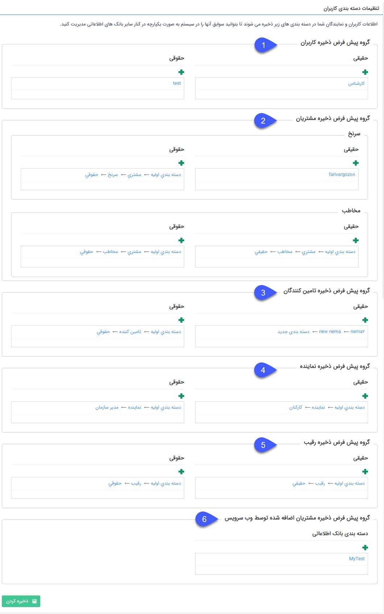

##  تعیین دسته‌‌‌بندی پیش‌فرض هویت 

در این قسمت مسیر پیشفرض ذخیره پروفایل هویت‌ها را که به صورت خودکار در پیام‌گستر ایجاد می‌شوند، مشخص می‌کنید.

**1. گروه پیش‌فرض ذخیره کاربران:** زمانی که کاربر (اپراتور سیستم) جدید در نرم‌افزار ایجاد گردد، پروفایل مرتبط با کاربر در دسته‌بندی تعیین شده در این بخش، ذخیره می‌گردد.

>   نکته: تعیین این دسته‌بندی، برای ایجاد کاربر جدید الزامی می باشد.

**2. گروه پیش‌فرض ذخیره مشتریان:** دسته‌بندی‌های تعیین شده در این قسمت برای ذخیره پروفایل هویت‌هایی است که از مسیرهای زیر ایجاد شده باشند:
- ثبت‌نام مخاطب در باشگاه مشتریان؛ 
- ایجاد کاربر از نوع مشتری در قسمت مدیریت اعضای باشگاه مشتریان؛
- ایجاد هویت چابک؛

درصورتی که کاربر از باشگاه مشتریان ثبت‌نام نماید، بر اساس نوع هویت پیش‌فرض انتخاب شده در تنظیمات کلی> سیستم، اطلاعات هویت در دسته‌بندی مخاطب/سرنخ حقیقی یا حقوقی قرار می‌گیرد. درصورتی که از مسیر مدیریت اعضای باشگاه مشتریان، تنها می‌توان از نوع مخاطب انتخاب نمود، بنابراین هویت ایجاد شده در دسته‌بندی‌های بخش **مخاطب** قرار می‌گیرد. 
درخصوص هویت‌های چابک، با توجه به نوع هویت تعیین شده در قسمت شخصی‌سازی آیتم‌ها، پروفایل در دسته‌بندی مرتبط با آن ذخیره می‌شود.

> نکته: تعیین این گزینه برای امکان ثبت نام مشتریان در باشگاه، الزامی است.

 > لازم به ذکر است در صورت ایجاد هویت بصورت چابک، دسته بندی هویت با توجه به نوع هویت ایجاد شده، از قسمت 2 و 3 تعیین میگردد.

**4. گروه پیش فرض ذخیره تامین کننده:** با ساختن یک دسته بندی در بانک اطلاعاتی و انتخاب آن در قسمت تنظیمات کاربران به عنوان گروه پیش فرض تامین کننده، پس از

ساختن هویت جدید از نوع تامین کننده، پروفایل متناظر با هویت و اطلاعات آن ها در این دسته بندی ذخیره می شود.

**5. گروه پیش فرض ذخیره نماینده:** با ساختن یک دسته بندی در بانک اطلاعاتی و انتخاب آن در قسمت تنظیمات کاربران به عنوان گروه پیش فرض نماینده،پس از ساختن هویت جدید از

نوع  نماینده، پروفایل متناظر با هویت و اطلاعات آن ها در این دسته بندی ذخیره می شود.

**6. گروه پیش فرض ذخیره رقیب:** با ساختن یک دسته بندی در بانک اطلاعاتی و انتخاب آن در قسمت تنظیمات کاربران به عنوان گروه پیش فرض رقیب، پس از ساختن هویت جدید از نوع

رقیب، پروفایل متناظر با هویت و اطلاعات آن ها در این دسته بندی ذخیره می شود.

**7. گروه پیش فرض ذخیره مشتریان اضافه شده توسط وب سرویس:** در صورتی که وب سرویسی برای ذخیره هویت نیز تهیه و فعال کرده باشید، هویت هایی که از این طریق ایجاد می شوند در این دسته بندی ذخیره می شوند.
