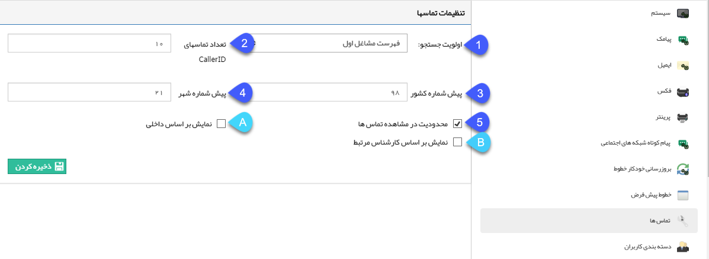

# تنظیمات نمایش تماس‌های ورودی 

یکی از تنظیماتی که لازم است برای سیستم تلفنی انجام شود، نحوه نمایش نماس‌های ورودی برای کاربران می‌باشد. 

**1.اولویت جستجو:** می‌توانید تعیین کنید که هنگام برقراری تماس یک مخاطب، نرم‌افزار جستجو در بانک مشاغل اول یا مشتریان من را در اولویت قرار دهد. [مشتریان من] شامل هویت‌هایی است که توسط شما در سیستم ذخیره شده باشند، از اینرو در صورتی که شماره‌ای به عنوان اطلاعات ارتباطی، هم در یکی از هویت‌های بانک مشاغل اول و هم در هویت ثبت شده توسط شما، ذخیره شده باشد؛ نمایش پروفایل تماس گیرنده، بر اساس اولویت تعیین شده در این بخش انجام می‌باشد.

**2. تعداد تماس‌ها نمایشگر تماس (CallerID):** حداکثر تعداد تماس‌هایی که در پنجره تماس‌های تلفنی دیده می‌شود را تعیین کنید.

**3. پیش شماره کشور:** عدد پیش‌شماره **کشور** خود را وارد کنید. به عنوان مثال عدد 98 پبش‌شماره کشور ایران است.

> نکته: با تعریف پیش شماره در این بخش درقسمت تعریف شماره تماس اطلاعات ارتباطی هویت‌ها، پیش شماره کشور بصورت پیش‌فرض نمایش داده خواهد شد.

**4. پیش شماره شهر:** عدد پیش‌شماره **شهر** خود را بدون ۰ وارد کنید.

**5. محدودیت مشاهده تماس‌ها:** با فعال کردن این گزینه پنجره تماس‌های تلفنی هر کاربر تنها تماس‌های مرتبط با او را نشان می دهد.

این امکان دوحالت دارد:

**A. نمایش بر اساس داخلی:** درصورتی که می‌خواهید هر کاربر تماس‌های ورودی وصل شده به داخلی خود را مشاهده نماید، این گزینه را فعال کنید.

**B.  نمایش بر اساس کارشناس مرتبط:** درصورتی که می‌خواهید هر کاربر تنها تماس‌های برقرار شده توسط هویت‌هایی که در پروفایل آن‌ها به عنوان یکی از مسئول‌های فروش، پشتیبانی و متفرقه تعیین شده است، را مشاهده نماید این گزینه را فعال کنید.

در صورتی که سیستم سانترال باشد عمال محدود کردن تماس‌ها براساس داخلی اعمال نمی‌شود چون در تماس‌های ورودی سانترال زمانی داخلی تشخیص داده می‌شود که تماس قطع شده باشد. 

در سیستم‌های تلفنی سانترال و خطوط مستقیم نمایش پنجره تماس فقط در حالت **محدود کردن تماس براساس کارشناس پروفایل** امکان پذیر است و نمایش تماس‌ها در سیستم‌های تلفنی ویپ امکان **محدود کردن تماس‌ها بر اساس داخلی** علاوه بر **محدود کردن تماس براساس کارشناس پروفایل** وجود دارد.

