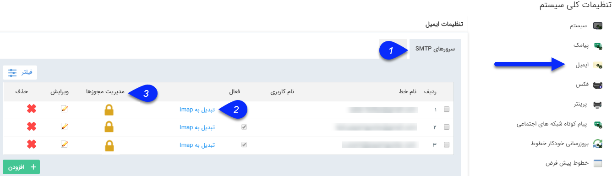

# مدیریت خطوط ایمیل

شما می‌توانید ایمیل‌های شخصی کاربران یا ایمیل‌های سازمانی خود را در سیستم تعریف کنید و از طریق نرم‌افزار ارسال ایمیل را انجام دهید. قبل از آموزش تعریف ایمیل جدید، موارد زیز را مطالعه نمایید.

- پروتکل‌های قابل پشتیبانی

ایمیل‌ها در پیام‌گستر در سه پروتکل IMAP-SMTP-POP3 قابل پیاده‌سازی هستند که قابلیت‌های هر کدام در این قسمت به طور کامل شرح داده شده است.

-  تنظیم ایمیل‌های IMAP-SMTP-POP3

در این بخش تنظیمات هر پروتکل به بررسی شده و لازم است برای تعریف ایمیل در نرم‌افزار اطلاعات مورد نیاز تهیه گردد.
 

برای تنظیم ایمیل‌های جدید، از تنظیمات کلی > ایمیل اقدام نمایید.

**1.سرورهای SMTP:** در این بخش می‌توانید خطوط ارسال ایمیل از طریق سرورهای SMTP را مدیریت کنید. شما می‌توانید از طریق کلیه ارائه دهندگان سرویس SMTP ایمیل خود را ارسال نمائید. برای مثال اگر می‌خواهید ایمیل‌های خود را از طریق Gmail شخصی و یا شرکت خود ارسال نمایید، کافیست با ایجاد یک خط جدید و درج تنظیمات مربوطه، ایمیل‌های خود را از طریق Gmail ارسال کنید.

**2.تبدیل به Imap:**
در صورتی که سرور دریافت ایمیلی در نرم افزار به صورت pop3 تعریف شده باشد، با کلیک روی این گزینه به Imap تبدیل می‌شود.

> نکته: توجه کنید که سرور pop3 امکان تبدیل به Imap دارد اما سرور‌های Imap به pop3 تبدیل نمی‌شوند.

**3.مدیریت مجوزها:** از این قسمت می‌توانید سطوح دسترسی کاربران مختلف به خط مورد نظر را مشخص کنید.

با کلیک بر روی این قسمت لیست مجوزهای تعریف شده برای کاربر  بر روی این خط را می‌توانید مشاهده کنید، همچنین با کلیک بر روی دکمه افزودن می‌توانید، مجوز جدیدی برای خط تعریف کنید.

**سه دسترسی زیر قابل تخصیص می باشند:**

**ارسال:** دسترسی ارسال از این خط را به کاربر می‌دهد.

**دریافت:** دسترسی به صندوق دریافت روی این خط را به کاربر می‌دهد.

**لیست سیاه:** امکان دسترسی به لیست سیاه را به کاربر می‌دهد.

> نکته: در صورت اینکه هیچ گونه مجوزی روی یک خط تعریف نکنید، این خط به صورت عمومی لحاظ می‌گردد و همه کاربران سیستم به آن دسترسی کامل دارند، به محض اینکه شما برای کاربر خاصی روی این خط مجوز تعریف می‌کنید، تنها کاربر مورد نظرتان به این خط دسترسی دارد.

