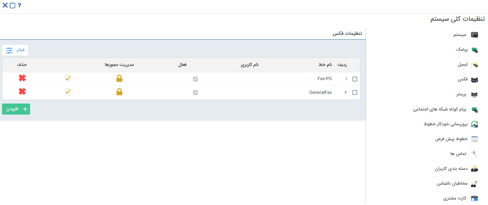

## صفحه اصلی خطوط فکس 

در این قسمت می‌توانید خطوطی که جهت ارسال فکس از آنها استفاده می کنید را تنظیم نمایید.

برای ارسال فکس می توان سرویس دهنده‌های مختلفی را تعریف نمود، که هر کدام از آن ها تنظیمات جداگانه‌ای دارد .

در این صفحه لیست خطوط فکس تعریف شده در نرم افزار را مشاهده می‌کنید.

همچنین امکان ویرایش، حذف و تعیین مجوزهای خطوط فکس تعریف شده در این بخش وجود دارد.

**مدیریت مجوزها:** با کلیک بر روی این قسمت لیست مجوز‌های تعریف شده برای کاربر در این قسمت را میتوانید مشاهده کنید، همچنین با کلیک بر روی دکمه افزودن می‌توانید، مجوز جدیدی برای خط تعریف کنید.

سه دسترسی زیر قابل تخصیص می‌باشند:

ارسال: دسترسی ارسال از این خط را به کاربر می‌دهد.

دریافت: دسترسی به صندوق دریافت روی این خط را به کاربر می‌دهد.

لیست سیاه: امکان دسترسی به لیست سیاه را به کاربر می‌دهد.

نکته : در صورت اینکه هیچ گونه مجوزی روی یک خط تعریف نکنید، این خط به صورت عمومی لحاظ میگردد و همه کاربران سیستم به آن دسترسی کامل دارند، به محض اینکه شما برای کاربر خاصی روی این خط مجوز تعریف میکنید، تنها کاربر مورد نظرتان به این خط دسترسی دارد.

v