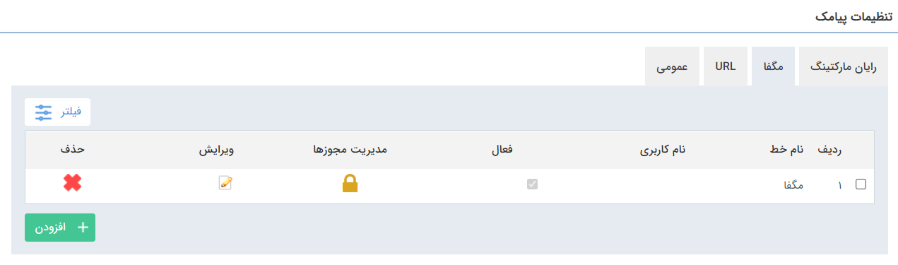
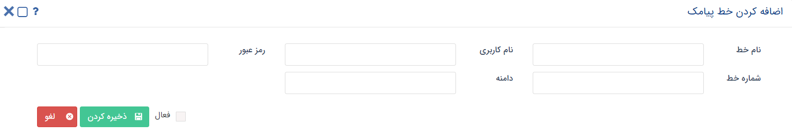

# تعریف خطوط مگفا

در صورت استفاده از سرویس‌های شرکت مگفا برای ارسال پیام‌کوتاه، می‌توانید تنظیمات مربوط به خط مگفای خود را در این قسمت وارد کرده و برای ارسال پیام‌های‌کوتاه خود استفاده نمایید.

فقط کافی است اطلاعات خط خود را در قسمت **افزودن** وارد نمایید.

> **نکته:** منظور از نام کاربری و رمز عبور ، نام کاربری و رمز عبور وب سرویس است که از قسمت امنیت در پنل مگفا می‌توانید تهیه کنید.

