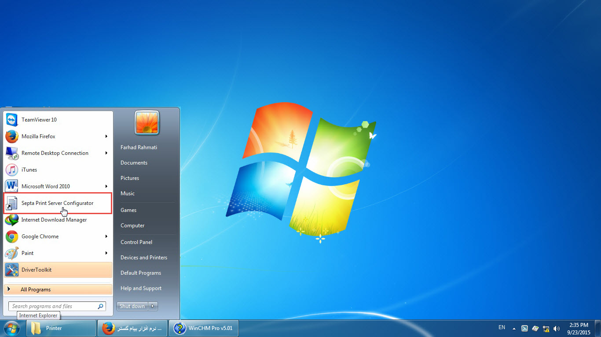
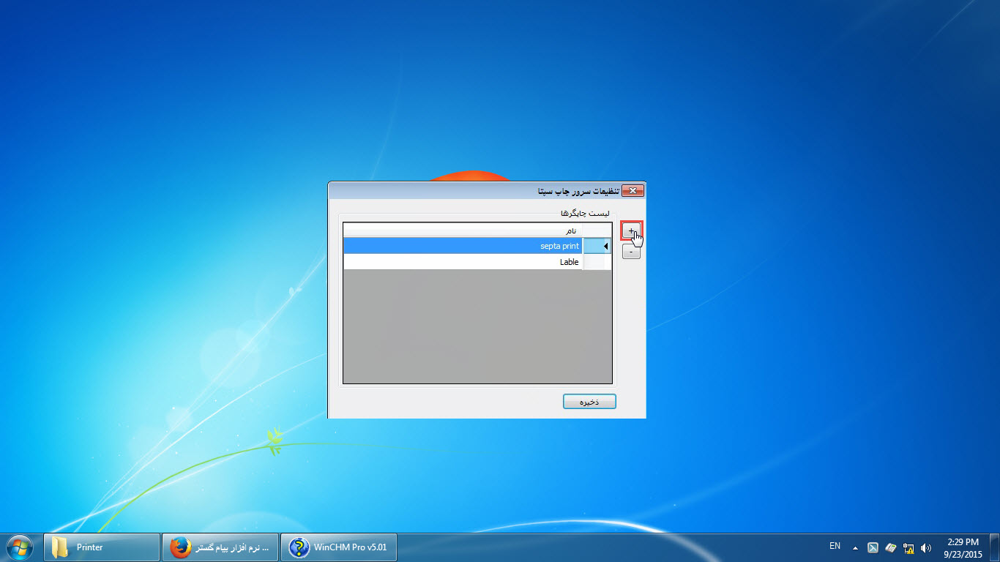
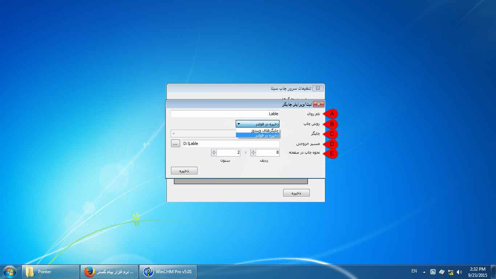

## **تنظیم سپتا پرینت**

از طریق برنامه Septa Print Server Configuration برای تنظیم نوع چاپ اقدام کنید.

با کلیک بر روی اضافه کردن، می توانید روال جدیدی برای چاپ تعیین کنید.

در گام بعد طبق روال زیر تنظیمات چاپگر را اضافه کنید.

A. نام روال: نامی برای تنظیمات چاپگر انتخاب کنید.

B. روش چاپ: روش چاپ ( چاپگر ویندوزی و یا چاپ چندتایی) را انتخاب کنید.

C. چاپگر: اگر روش چاپ به صورت چاپگر ویندوزی انتخاب شده باشد، در این قسمت نام چاپگر مورد نظر را باید انتخاب کنید. 

D. مسیر خروجی: اگر روش چاپ به صورت ذخیره در فولدر (برای چاپ چند تایی) تعیین شده باشد، در این قسمت باید مسیر فولدری که فایل های چاپ در آن ذخیره میشوند را انتخاب کنید.

E. نحوه چاپ در صفحه: در قسمت نحوه چاپ تعداد ردیف و ستون را وارد نمایید. به طور مثال در حالت 8*2، برگه A4، به 8 خانه مساوی تقسیم خواهد شد.

> نکته 1: در هنگام استفاده از چاپ چندتایی، در مرحله تنظیم متن باید صفحه wordخود را به اندازه ای کوچک نمایید که به اندازه یک قسمت از تقسیم بندی باشد.

> نکته 2: چاپ چندتایی مستقیم به پرینتر فرستاده نمی شود و در فولدری که در قسمت مسیر خروجی وارد نموده اید به صورت فایل قرار می گیرد و این فایل ها را می توانید به پرینتر ارسال نمایید.

