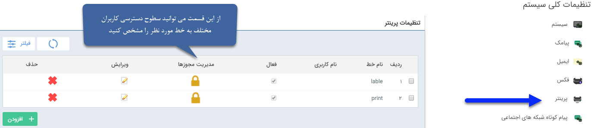
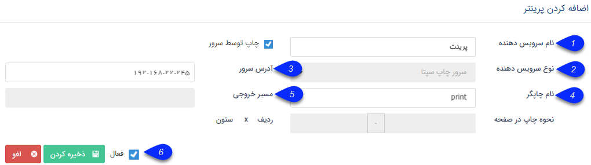

## ** تعریف پرینتر**
تنظیمات مرتبط با چاپگر های متصل به نرم افزار را در این قسمت انجام دهید.

چاپ به دو صورت چاپ صفحه ای و چاپ چندتایی در یک صفحه امکان پذیر است. از چاپ چندتایی در یک صفحه، برای مواردی مانند چاپ لیبل ( Label) استفاده می شود.

 برای تنظیمات چاپ بایستی از طریق دکمه افزودن اقدام نمود.ابتدا تنظیمات مربوط به پرینت بایستی ابتدا از طریق برنامه Septa Print Server Configuration  بایستی صورت گیرد.
 
 
 
 
1. نام سرویس دهنده: به پرینتری که تعریف می کنید نامی اختصاص دهید

2.نوع سرویس دهنده: می‌توانید نوع سرویس استفاده  برای پرینتر را تعیین نمایید.

3.آدرس سرور: باید آدرس سرور یا  IP آن را در این قسمت وارد کنید .

6.چک باکس فعال می‌توانید این خط را از این قسمت فعال و غیر فعال بکنید.

