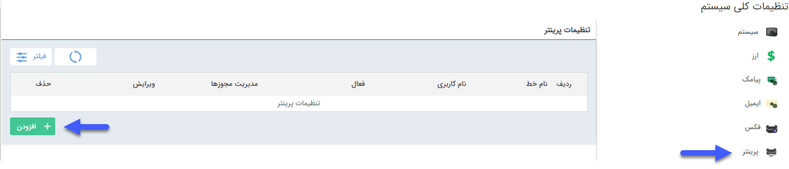

## **تعریف پرینتر**

**مسیر دسترسی: تنظیمات > تنظیمات کلی > پرینتر**

تنظیمات مرتبط با چاپگر های متصل به نرم افزار را در این قسمت انجام دهید.

برای تنظیمات چاپ، بایستی از طریق دکمه افزودن اقدام کنید.

پس از انتخاب دکمه افزودن، صفحه‌ی زیر باز می‌شود. 
 
 
 
 

1.نام سرویس دهنده: به پرینتری که تعریف می کنید نامی اختصاص دهید.

2.نوع سرویس دهنده: می‌توانید نوع سرویس مورد استفاده  برای پرینتر را تعیین نمایید.

3.آدرس سرور: باید آدرس سرور یا  IP آن را در این قسمت وارد نمایید .

4.نام چاپگر: نام چاپگر مورد نظر را انتخاب کنید. ( پس از تنظیم سپتا پرینت، نام چاپگر قابل انتخاب است. برای تنظیم سپتا پرینت به صفحه [تنظیم سپتا پرینت]( https://github.com/1stco/PayamGostarDocs/blob/master/help2.5.4/Settings/General-settings/printer/printer.md) مراجعه کنید)

5.چک باکس فعال: می‌توانید این خط را از این قسمت فعال یا غیر فعال نمایید.

