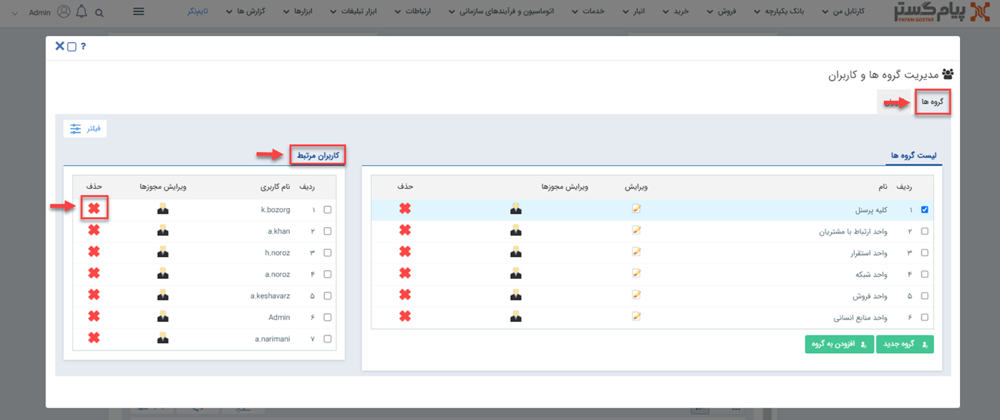
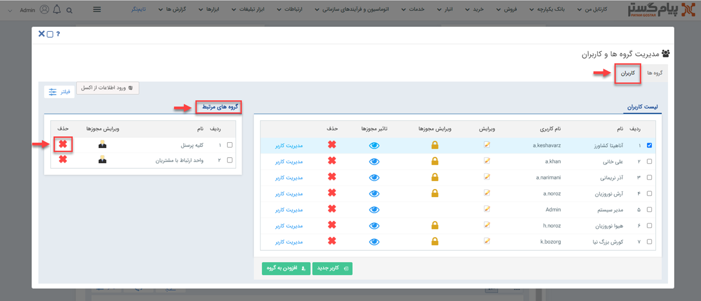
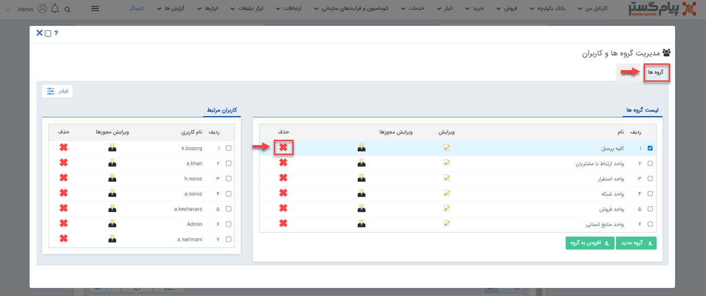

# حذف کاربر از گروه و حذف گروه 

برای حذف کاربر از گروه‌های کاربری دو روش پیش رویتان است: 
**1. از صفحه‌ی گروه:** در این روش شما باید از منوی سه‌خط (همبرگری)، مسیر **تنظیمات** > **مدیریت گروه‌ها و کاربران** > **گروه‌ها** را طی کرده و با کلیک بر روی نام گروه مدنظر که می‌خواهید برخی اعضا آن را حذف کنید، لیست کاربرهایش را در کادر **کاربران مرتبط** مشاهده نمایید. در مرحله‌ی بعدی کاربر را انتخاب کرده و بر روی علامت ضربدر (×) روبه‌روی آن کلیک کنید؛ به این ترتیب آن کاربر از لیست پرسنل گروه منتخب حذف خواهد شد.

**2. از صفحه‌ی کاربر:** در این روش شما باید از منوی سه‌خط (همبرگری)، مسیر **تنظیمات** > **مدیریت گروه‌ها و کاربران** > **کاربران** را طی کرده و با کلیک بر روی نام کاربر مدنظر که می‌خواهید آن را از گروه خاصی حذف کنید، لیست گروه‌هایی که او در آن‌ها عضو بوده را در کادر **گروه‌های مرتبط** مشاهده کنید. در مرحله‌ی بعدی گروه را انتخاب کرده و بر روی علامت ضربدر (×) روبه‌روی آن کلیک کنید؛ به‌این‌ترتیب آن گروه از لیست گروه‌های کاربر منتخب، حذف خواهد شد.

درصورتی‌که بخواهید یکی از گروه‌های درج‌شده در سیستم را حذف کنید باید در صفحه‌ی مدیریت گروه‌ها، بر روی علامت ضربدر (×) روبه‌روی گروه منظور خود، کلیک کنید. 

