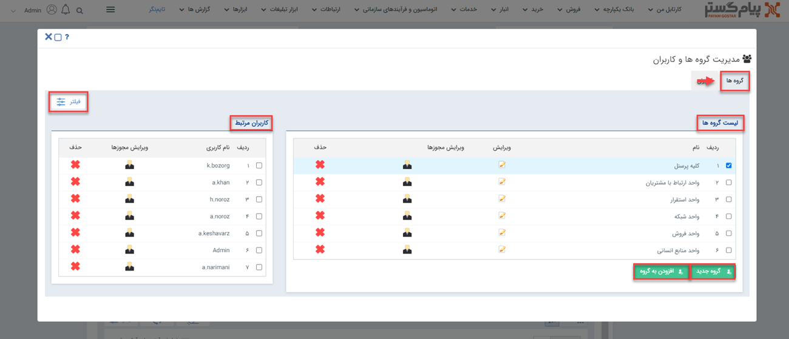

# صفحه اصلی مدیریت گروه های کاربری

برای ایحاد، ادیت و یا حذف هر کدام از گروه‌های کاربری در نرم‌افزار، می‌بایست به صفحه‌ی اصلی مدیریت گروه‌های کاربری بروید و از آن‌جا  برای هدف‌تان اقدام نمایید. به‌این‌منظور باید از منوی سه‌خط (همبرگری) بالای صفحه، مسیر **تنظیمات** > **مدیریت گروه ها و کاربران** > **گروه ها** را طی کنید. 

در صفحه‌ی **گروه‌ها**، لیست تمامی گروه‌های کاربری ثبت شده در نرم‌افزار را مشاهده می‌کنید. شما با کلیک بر روی هر گزینه می‌توانید آن گروه را انتخاب نموده و تغییرات مدنظر را روی آن اعمال کنید.  
 **ویرایش گروه**: این امکان برای‌تان فراهم شده که با کلیک بر روی آیکون *ویرایش* بتوانید نام گروه و کلید کاربر را ادیت کرده و فعال یا غیرفعال بودن گروه را مشخص نمایید.  
**ویرایش مجوزهای گروه**: برای مشاهده و ادیت لیست مجوزهای اختصاص داده شده به پرسنل هر گروه، باید بر روی آیکون *ویرایش مجوزها* کلیک کنید و از این طریق می‌توانید لیست کامل مجوز دسترسی‌های عمومی و موجودیت‌ها را بررسی کرده و تصمیم بگیرید که هر گروه نیاز به داشتن کدام دسترسی برای چارت کاری خود دارد و مجوزهای مورد نیاز را برای گروه فعال نموده و یا مجوزهای اضافی را برای پرسنل گروه غیرفعال کنید. 
**حذف گروه**: درصورتی‌که تمایل به حذف یکی از گروه‌های کاربری داشتید، می‌توانید از *علامت ضربدر* (×) استفاده کرده و اطلاعات آن گروه را به‌کل از نرم‌افزار پاک کنید. 
**ایجاد گروه جدید**: شما می‌توانید برای ایجاد گروه از گزینه‌ی *گروه جدید* استفاده کنید و با افزودن نام و کلیدکاربر و تعیین فعال یا غیرفعال بودن، گروه کاربری جدیدی را به سیستم اضافه کنید.  
**افزودن عضو به گروه**: همچنین اگر بخواهید برای یکی از گروه‌ها، عضودهی انجام دهید، یکی از راه‌هایی که می‌توانید برای رسیدن به این منظور از آن استفاده کنید، کلیک روی گزینه‌ی *افزودن به گروه* است. 
**فیلتر**: گاهی اوقات تعداد گروه‌های ثبت شده در سیستم آن‌قدر زیاد بوده که شما برای پیدا کردن گروه مدنظرتان باید زمان زیادی را صرف کنید، در این شرایط می‌توانید از *فیلتر* برای رسیدن سریع‌تر به هدف‌تان استفاده کنید. این امکان برای‌تان فراهم شده که جستجو خود را با توجه به نام گروه و فعال یا غیرفعال بودن فیلتر نمایید. 
**کاربران مرتبط هر گروه**: پس از انتخاب هر گروه، لیست پرسنل و اعضای آن، در کادر *کاربران مرتبط* برای‌تان نمایش داده می‌شود و می‌توانید از آن قسمت با کلیک بر روی آیکون *ویرایش مجوزها*، تمامی مجوزهایی که آن کاربر به‌خصوص در این گروه را دارد، مشاهده و ادیت نمایید و یا حتی با زدن علامت ضربدر (×)، آن کاربر را از گروه منتخب حذف نمایید.
