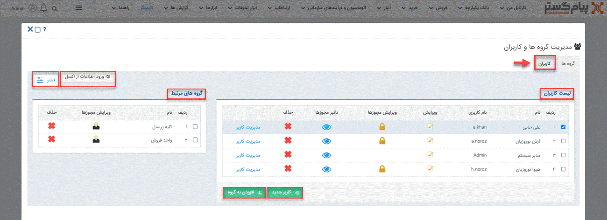

# صفحه اصلی مدیریت کاربران

برای ایحاد، ادیت و حذف هر گونه کاربری در نرم‌افزار، می‌بایست به صفحه‌ی اصلی مدیریت کاربران رفته و از آن‌جا  برای هدف‌تان اقدام نمایید. به‌این منظور باید از منوی سه‌خط (همبرگری) بالای صفحه، مسیر **تنظیمات** > **مدیریت گروه ها و کاربران** > **کاربران** را طی کنید. 

در پیج **کاربران**، لیست تمامی کاربران تعریف شده در سیستم قابل مشاهده است. شما با کلیک بر روی **نام** و **نام کاربری** می‌توانید هر یک از کاربران را انتخاب نموده و در گام بعدی با کلیک بر روی سایر آیکون‌ها اطلاعات دیگر مربوط به آن کاربر را مشاهده و ادیت نمایید. 
شما با کلیک بر روی آیکون **ویرایش** می‌توانید به تمامی اطلاعات فردی کاربر اعم از نام، نام‌خانوادگی، موبایل، ایمیل، تصویر کاربر، رمز تلفنی و... دست پیدا کنید و در صورت نیاز آن را ادیت و ذخیره نمایید. 
ستون بعدی مربوط به **ویرایش مجوزها** بوده و با استفاده از این آیکون می‌توانید لیست کامل مجوز تمامی ماژول‌های مربوط به آن کاربر را مشاهده و در صورت نیاز هر گونه مجوزی را برایش فعال و یا غیرفعال کنید. لیست تمامی مجوزهایی که برای  کاربر مدنظر فعال کرده‌اید را می‌توانید در آیکون بعدی هم که **تاثیر مجوزها** بوده، مشاهده نمایید. 
این امکان برای شما فراهم شده که با زدن علامت ضربدر (×) کاربر مدنظرتان را از نرم‌افزار حذف کنید. گفتنی است که اگر کاربر منظور، فعالیت خاصی در سیستم انجام داده باشد که با حذف آن، بخشی از گزارشات و سوابق با مشکل روبه‌رو شود، سیستم امکان حذف آن را به شما نمی‌دهد و باید کاربری آن را از بخش ویرایش، غیرفعال نمایید. 
شما با کلیک بر روی **مدیریت کاربر** می‌توانید به کنسول مدیریت کاربر دست پیدا کرده و به بررسی اطلاعات کاربری فرد هم‌چون رمز عبور، آخرین ورود، تاریخ به‌روزرسانی و... بپردازید و در نهایت با کلیک بر روی **ورود به سایت** وارد حساب کاربری‌اش شوید. 
گزینه‌ی **کاربر جدید** برای ایجاد یک کاربر جدید مورد استفاده قرار می‌گیرد، همچنین شما می‌توانید با استفاده از **ورود اطلاعات از اکسل**، پروسه‌ی افزودن کاربر به نرم‌افزار را با کمک اکسل سرعت ببخشید. 
 گزینه‌ی **افزودن به گروه** را باید پس از انتخاب کاربر، برای اضافه شدن آن به گروه مدنظرتان که از قبل آن را ساخته‌اید، استفاده نمایید.  
در صورتی که تعداد کاربران زیاد باشد پیدا کردن کاربر هدف‌تان کمی دشوار می‌شود، در این شرایط می‌توانید از **فیلتر** کمک بگیرید و با استفاده از فیلدهای نام کاربری، نوع کاربر، نام، شرکت، دپارتمان و وضعیت بتوانید راحت‌تر کاربرتان را در لیست پیدا کنید. 
شما برای بررسی عضویت هر یک از کاربران در گروه‌های ایجاد شده در نرم‌افزار، باید پس از انتخاب کاربر، لیست گروه‌هایی که فرد در آن عضو بوده را در کادر **گروه‌های مرتبط** مشاهده نمایید. گفتنی است که شما با کلیک بر روی آیکون **ویرایش مجوزها**  می‌توانید به لیست کامل مجوزهایی که به افراد آن گروه داده شده، دسترسی داشته و در صورت نیاز آن‌ها را ادیت نمایید. حال اگر بخواهید که کاربر مدنظرتان را از یک گروه حذف نمایید، می‌توانید با کلیک بر روی علامت ضربدر (×) به هدف‌تان برسید. 
