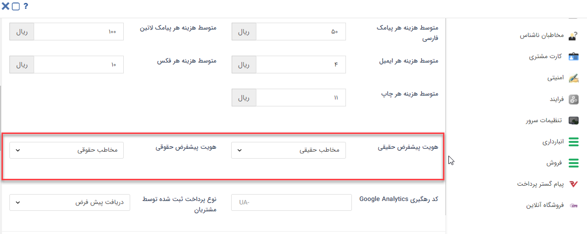

# تعیین نوع هویت پیش فرض

در این قسمت هویت پیش‌فرض حقیقی و حقوقی را از بین هویت‌های ایجاد شده در شخصی‌سازی CRM اننتخاب نمایید.
این هویت‌ها برای ایجاد مخاطب و سرنخ جدید از طریق ثبت‌نام در باشگاه مشتریان یا تعریف کاربر در بانک اطلاعاتی، استفاده می‌شود. 

