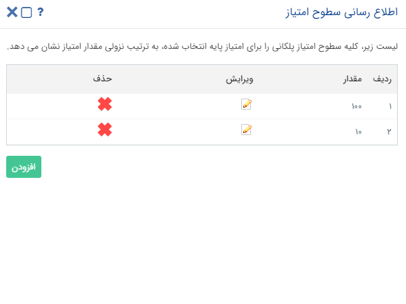

# سطوح امتیاز
**مسیر دسترسی : مدیریت انواع پروفایل > سطوح امتیاز**

بخش سطوح امتیاز:
در این قسمت سطح امتیاز پلکانی لازم برای ایجاد فرم ورود مشخص می شود. در واقع اگر جمع امتیازات کسب شده توسط هویت مرتبط به این سطح برسد، فرم ورود به امتیاز ایجاد می شود و در صورتی که برای فرم مربوطه چرخه ای طراحی شده باشد در کارتابل مالک قرار گرفته و پیگیری های لازم جهت دریافت پاداش صورت می گیرد.

