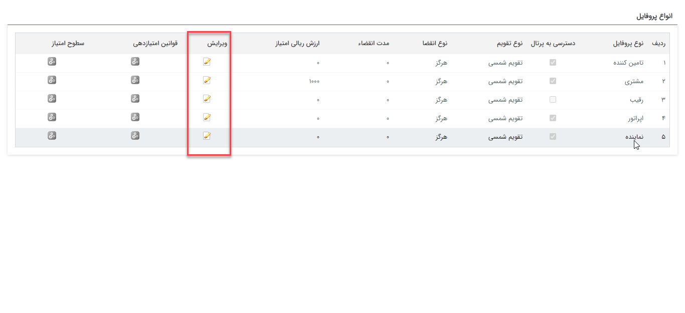

## تنظیمات امتیاز هر پروفایل 

>  مسیر دسترسی:  **تنظیمات** >**مدیریت انواع پروفایل** > **ویرایش** 

در بخش مدیریت انواع پروفایل 5نوع پروفایل موجود قابل مشاهده می‌باشد و می‌توان برای هر کدام تنظیمات امتیاز را تعریف کرد. 

**انواع پروفایل:**

تامین کننده ، رقیب، اپراتور، نماینده و مشتری

A. نوع پروفایل: نوع پروفایل هویتی که روی آن امتیاز را تعریف می کنید را نمایش می دهد.

B. انقضا: مدت زمان مجاز برای منقضی شدن امتیاز را انتخاب کنید. توجه داشته باشید که فقط در صورتی امکان مشخص کردن مدت انقضا به صورت دستی وجود دارد که نوع انقضا روی "روز مشخص" باشد.

C. نوع تقویم: نوع تقویم را به صورت شمسی و یا میلادی مشخص کنید.

D. ارزش ریالی امتیاز: ارزش ریالی مرتبط با سطوح امتیاز را در این قسمت مشخص کنید.

E. با فعال کردن این گزینه،در صورتیکه نوع پروفایل مورد نظر مشتری باشد،امتیاز مشتری در پنل باشگاه مشتریان نمایش داده می شود.

F. ایجاد فرم ورود به امتیاز: در صورتی که پروفایل مرتبط به سطح امتیاز تعریف شده برسد فرمی از نوعی که در این قسمت انتخاب می شود ایجاد می شود و هر یک از مقادیر مجموع امتیاز و پایه امتیاز و سطوح امتیاز در فیلدهای مرتبطی که به آن ها در این قسمت نگاشت شده قرار می گیرند.

 G. ایجاد فرم خروج از امتیاز: در صورتی که پروفایل مرتبط از سطح امتیاز خارج شود فرمی از نوعی که در این قسمت انتخاب می شود ایجاد می شود و هر یک از مقادیر مجموع امتیاز و پایه امتیاز و سطوح امتیاز در فیلدهای مرتبطی که به آن ها در این قسمت نگاشت شده قرار می گیرند.
 
 
