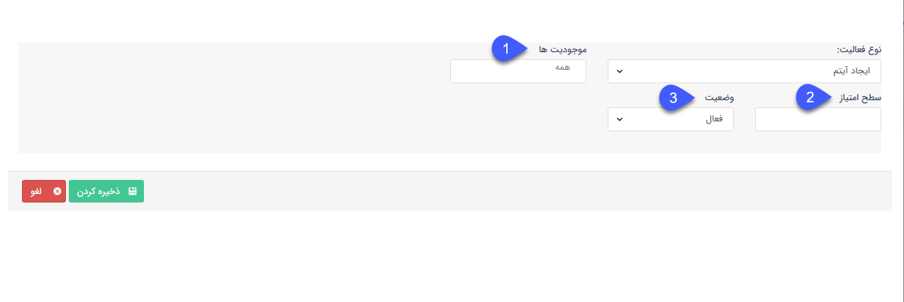

## ایجاد آیتم

>  مسیر دسترسی:  **تنظیمات** >**مدیریت انواع پروفایل** > **قوانین امتیازدهی** > **نوع فعالیت** > **ایجاد آیتم**

در این روش باید یک نوع آیتم CRM را انتخاب کنیم. در این مورد انواع آیتم انتخاب شده بر دو نوع مالی و غیر مالی تقسیم می شوند.

a. موجودیت ها: آیتم و زیرنوع آیتمی که هویت مرتبط به ازای آن امتیاز کسب می کند را انتخاب کنید.

b. سطح امتیاز: امتیاز کسب شده به ازای محصول انتخابی را مشخص کنید.

c. وضعیت: فعال یا غیرفعال بودن امتیاز برای این محصول را مشخص کنید.

**چنانچه آیتم انتخاب شده مالی باشد:**

_  کاربر مشخص می کند که به ازای هر چند مبلغ ریال، از آن آیتم مربوط، چند امتیاز کسب می شود.

_  آیتم مالی باید حتما در وضعیت تایید باشد تا کسب امتیاز صورت گیرد.

**چنانچه آیتم انتخاب شده غیر مالی باشد:**

_       با ذخیره آیتم کسب امتیاز صورت می گیرد.

_     در صورت حذف آیتم، به میزان امتیاز کسب شده آن، امتیاز مصرفی ثبت خواهد شد.

_      در صورت ویرایش آیتم مالی با توجه به میزان تغییرات (کاهش یا افزایش  مبلغ) کسب یا کاهش امتیاز به ثبت می رسدl

