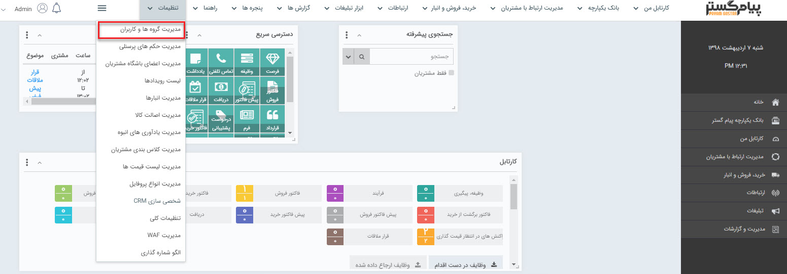

## مدیریت گروه ها و کاربران

با استفاده از این بخش، می توانید به تعداد کاربرانی که تهیه نموده اید نام کاربری فعال و به تعداد نامحدود کاربر غیرفعال بسازید. همچنین می توانید دسترسی کاربران را به قسمت های مختلف نرم افزار مشاهده کرده و در صورت نیاز آن ها را ویرایش کنید.

توجه داشته باشید که در صورت تهیه ماژول باشگاه مشتریان، می توانید برای مشتریان خود، کاربری باشگاه مشتریان ایجاد نمایید. برای اطلاعات بیشتر قسمت باشگاه مشتریان را مطالعه کنید.

> نکته: توجه داشته باشید که تعداد محدودیت کاربران در پیام گستر بر اساس تعداد نام کاربری فعال است.

> نکته : برای دسترسی به منو مدیریت گروه و کاربران بایستی مجوز مدیریت کاربران را داشته باشید.

این منو شامل 3 دسته از تنظیمات به صورت ذیل است:

[1. کاربران](https://github.com/1stco/PayamGostarDocs/blob/master/help%202.5.4/Settings/Manage-groups-and-users/users/users.md)

[2. گروه ها](https://github.com/1stco/PayamGostarDocs/blob/master/help%202.5.4/Settings/Manage-groups-and-users/Groups/Groups.md)

[3. مجوزها](https://github.com/1stco/PayamGostarDocs/blob/master/help%202.5.4/Settings/Manage-groups-and-users/permissions/permissions.md)

