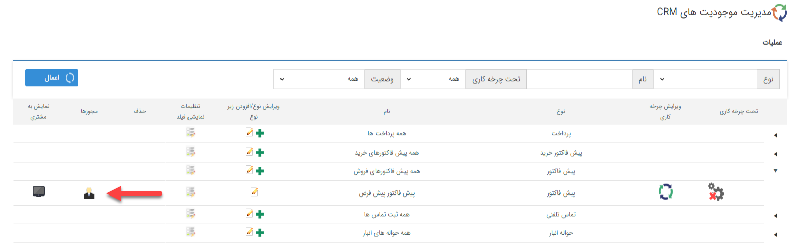

# تعیین دسترسی کاربران

در این مقاله به موضوعات زیر می‌پردازیم:
- [اهمیت تعیین دسترسی کاربران.](#TheImportanceOfPermision)
- [چه کسی و بر چه اساسی دسترسی کاربران را تعیین می‌کند؟](#HowToDeterminePermision)
- [از چه مسیرهایی می‌توانیم به کاربران دسترسی استفاده از نرم‌افزار را بدهیم؟](#TheWaysTDeterminePermision)
- [اولویت عملکرد نرم‌افزار نسبت به مجوزهای داده شده، کدام است؟](#OrderOfPermision)
- [معرفی صفحه مجوزها و نحوه استفاده از آن](#PermisionPage)
## اهمیت تعیین دسترسی کاربران{#TheImportanceOfPermision}
همانطور که در سازمان‌ها با توجه به چارت و سطوح سمت‌ها، هر فرد دسترسی‌ و اختیارات مشخصی دارد؛ در نرم‌افزار هم باید متناسب با نقش پرسنلی افراد دسترسی کاربران تعیین شود. 
به عنوان مثال در تیم فروش، مدیر فروش و کارشناسان فروش امکان صدور پیش‌فاکتور فروش را دارند ولی تنها مدیر فروش صلاحیت تأیید یا رد پیش‌فاکتور فروش را خواهد داشت. 

## چه کسی و بر چه اساسی دسترسی کاربران را تعیین می‌کند؟{#HowToDeterminePermision}
قبل از پیاده‌سازی CRM تیم مشاور، راهبر و مدیران واحدها باید لیست فرآیندهای سازمانی را به همراه نقش هر یک از افراد تعیین کنند و با توجه به **مسئولیت‌هایی که هر فرد به عهده دارد** دسترسی‌ به بخش‌های مختلف نرم‌افزار را تخصیص دهند. 
تعیین دسترسی‌ها توسط **راهبر** نرم‌افزار انجام می‌شود و مسئولیت به روز نگه داشتن آن بر عهده او می‌باشد.

# به چه روش‌هایی می‌توانیم به کاربران دسترسی استفاده از نرم‌افزار را بدهیم؟{#TheWaysTDeterminePermision}
مسیرهای مختلفی برای تخصیص مجوز به کاربران وجود دارد که شامل : 

- از مسیر **مدیریت گروه‌ها و کاربران** > **کاربران** > **ویرایش مجوزها** 
   در این قسمت امکان ایجاد گروه کاربری، لیست کاربران، تخصیص و ويرايش مجوز کاربر/گروه و ویرایش اطلاعات کاربران وجود دارد. **پیشنهاد می‌کنیم که مجوزها را هرگز روی کاربران به صورت انفرادی اعمال نکنید. از اعمال مجوز به صورت گروهی، سمت و دپارتمان استفاده کنید.**

 

- از مسیر **مدیریت گروه‌ها و کاربران** > **‌گروه‌ها** > **ویرایش مجوزها** 
- از مسیر **مدیریت شعب، دپارتمان‌ها و سمت‌ها** 
   در این صفحه می‌توانید با توجه به چارت سازمانی به ازای  شعب،دپارتمان و سمت‌های تعریف شده مجوز‌ها را تعیین کنید، پس از تعریف مجوزها می‌توانید در صفحه [ مدیریت حکم های پرسنلی ](https://github.com/1stco/PayamGostarDocs/blob/master/help%202.5.4/Settings/Personnel-command-management/Personnel-command-management.md) با توجه به چارت سازمانی حکم‌ها را به کاربران مربوطه تخصیص دهید، در این صورت کاربران با توجه به حکم پرسنلی تخصیص یافته از دسترسی‌های تعریف شده بر روی شعب،دپارتمان و سمت برخوردار خواهند شد.  
   **برای نظم و ساماندهی به مجوزها، بر روی شعب، دپارتمان‌ها و سمت مجوزها را تخصیص دهید.**
  
  - از مسیر **شخصی‌سازی CRM** > **مجوز روی هر آیتم** 
   در صفحه شخصی‌سازی می‌توانید به ازای هر  یک از زیر نوع‌ها مجوز دسترسی موجودیت‌ها را برای **کاربر**، **گروه** و **سمت‌های**  مورد نظر  تعیین  کنید. 

   برای مطالعه بیشتر به بخش[ شخصی سازی-مجوزهای آیتم ](https://github.com/1stco/PayamGostarDocs/blob/master/help%202.5.4/Settings/Personalization-crm/Overview/General-information/Item-permissions/Item-permissions.md)مراجعه کنید.

## اولویت عملکرد نرم‌افزار نسبت به مجوزهای داده شده کدام است؟{#OrderOfPermision}
هر مجوز سه حالت دارد:
- **خاموش/خنثی** با رنگ **خاکستری**
- **دارد** با رنگ **سبز**
- **ندارد** با رنگ **قرمز** 
 به صورت پیشفرض تمامی مجوزهای نرم افزار بر روی حالت "خاموش" است.

بدلیل اینکه مجوزها را می‌توان از چند طریق به کاربران اختصاص داد، لازم است بدانید که یک مجوز به صورت زیر عمل می‌کند:
- مجوزی که روی **کاربر** اختصاص داده شده باشد، اولویت بالاتری از سایر مجوز‌ها دارد.
- درصورت تخصيص مجوز **از مسيري غير از کاربر** باشد، مجوز **ندارد** بر مجوز **دارد** ارجعیت دارد.

> **نکته** 
> بهینه‌ترین روش، تخصیص دسترسی روی **شعب، دپارتمان‌ها و سمت‌ها** است. زیرا مدیریت و به روز نگه داشتن مجوزها بر اساس چارت سازمانی در طولانی مدت راحت‌تر و قابل کنترل خواهد بود. 
> بنابراین پیشنهاد می‌شود دسترسی‌هایی که همه کاربران در سطح عمومی سازمان باید داشته باشند را روی شعبه (مثل دسترسی به ثبت فرم مرخصی)، دسترسی‌های مشترک بین هر واحد را روی دپارتمان (مثل ثبت پیش‌فاکتور فروش که در سطح مدیر و کارشناس یکسان است) و دسترسی‌های مجزا بر اساس سطح سازمانی را روی سمت (مثل مشاهده گزارش‌های فروش که باید فقط مدیر فروش مشاهده کند) تعیین کنید.

## معرفی صفحه مجوزها و نحوه استفاده از آن{#PermisionPage}

مجوزها در دو دسته **دسترسی عمومی** جهت دسترسی‌های کلی در سطح نرم‌افزار و دسته **دسترسی موجودیت‌ها** جهت دسترسی‌های جزئی روی آیتم‌های ساخته شده، تقسیم شده‌است. 
از هر مسیری که وارد محیط مجوزها شوید، اولین صفحه پیش روی شما، صفحه **تنظیمات دسترسی** می‌باشد.

1. **دسترسی عمومی:** در این قسمت مجوزهای دسترسی به بخش‌های عمومی نرم افزار را می توانید تعیین کنید.

2. **دسترسی موجودیت‌ها:** در این قسمت مجوزهای روی موجودیت‌های ( آیتم‌های) نرم افزار (اعم از فاکتور، پیش‌فاکتور، فرم، مخاطبان، سرنخ‌ها و ...) تنظیم می‌شود.

3. **جستجوی مجوز:** نام مجوز را می توانید از این قسمت جستجو کنید.

4. **ترتیب بندی مجوزها:** می‌توانید ترتیب نمایش مجوزها را مشخص کنید. (برای مثال روی حالت "دارد"، ابتدا مجوزهایی که روی حالت "دارد" قرار دارند نمایش داده می‌شوند)

5.  **انتخاب مجوز:** با کلیک بر روی هر گزینه می‌توان برای آن بخش مجوز تعیین نمود. ( برای مثال اگر روی انبارداری کلیک کنید، قسمت مجوزهای انبارداری را برای شما نمایش می‌دهد.)

6.  **تغییر گروهی مجوزها:**  میتوان از این بخش تمامی مجوز های این گروه را تغییر داد.

- **کلید سبز:** تمامی مجوزهای آن گروه را بر روی حالت سبز یا همان **دارد** قرار می‌دهد.
- **کلید آبی:** تمامی مجوزهای آن گروه را بر روی حالت **خاموش**  قرار می‌دهد.
- **کلید قرمز**: تمامی مجوزهای آن گروه را بر روی حالت قرمز یا همان **ندارد** قرار می‌دهد.

