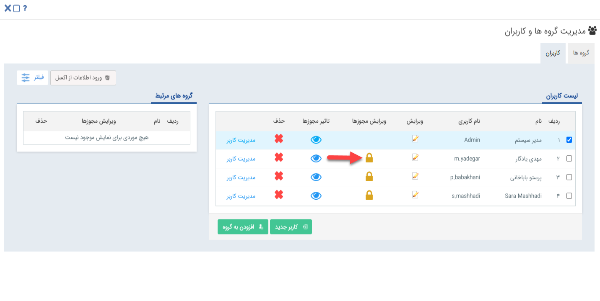
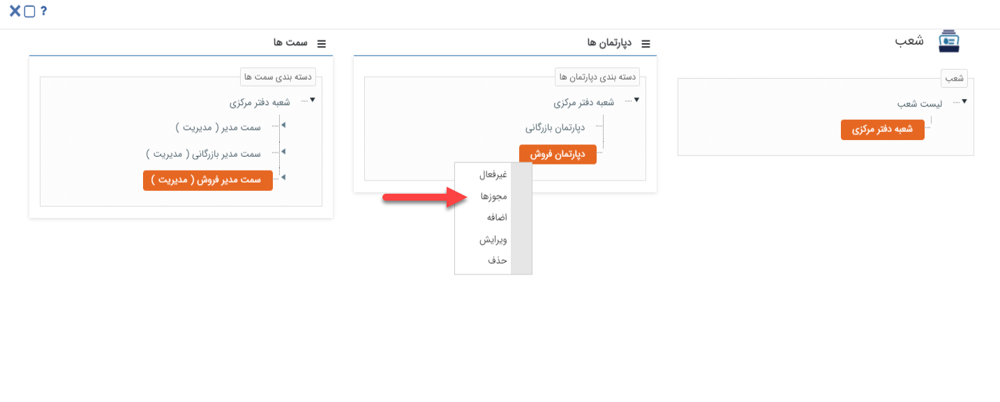
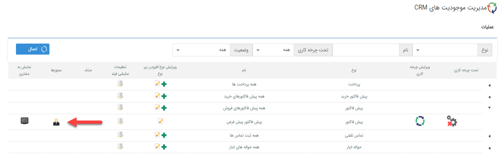
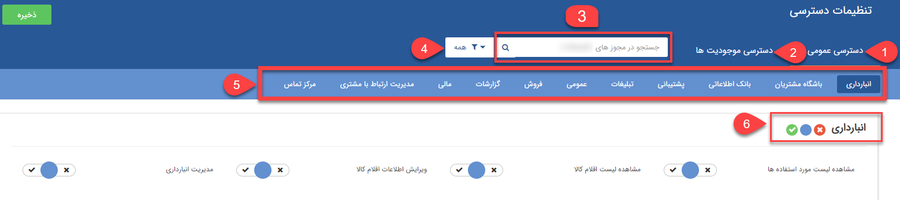

# تعيين دسترسي کاربران

  امکان تخصیص مجوز بر روی کاربر از مسیر‌های مختلفی از نرم‌افزار میسر می‌شود:   
 
###  1-مدیریت گروه‌ها و کاربران 
در این قسمت امکان ایجاد گروه کاربری، لیست کاربران، تخصیص و ويرايش مجوز کاربر/گروه و ویرایش اطلاعات کاربران وجود دارد.

 

### 2-مدیریت شعب، دپارتمان و سمت

 

در این صفحه می‌توانید با توجه به چارت سازمانی به ازای  شعب،دپارتمان و سمت‌های تعریف شده مجوز‌ها را تعیین کنید، پس از تعریف مجوزها می‌توانید در صفحه [ مدیریت حکم های پرسنلی ](https://github.com/1stco/PayamGostarDocs/blob/master/help%202.5.4/Settings/Personnel-command-management/Personnel-command-management.md) با توجه به چارت سازمانی حکم ها را به کاربران مربوطه تخصیص دهید، در این صورت کاربران با توجه به حکم پرسنلی تخصیص یافته از دسترسی‌های تعریف شده بر روی شعب،دپارتمان و سمت برخوردار خواهند شد.

### 3-شخصی‌سازی آیتم‌ها

در صفحه شخصی سازی می‌توانید به ازای هر  یک از زیر نوع‌ها مجوز دسترسی موجودیت‌ها را برای کاربر، گروه و سمت‌های  مورد نظر  تعیین  کنید. 
 
   برای مطالعه بیشتر به بخش[ شخصی سازی-مجوزهای آیتم ](https://github.com/1stco/PayamGostarDocs/blob/master/help%202.5.4/Settings/Personalization-crm/Overview/General-information/Item-permissions/Item-permissions.md)مراجعه کنید.

>نکته: بدلیل اینکه مجوزها را می‌توان از چند طریق به کاربران اختصاص داد، همیشه در نظر داشته باشید که یک مجوز به این صورت کار میکند مجوزی که به خود کاربر اختصاص داده شده باشد، ارجعیت بالاتری از سایر مجوز‌ها دارد. درصورت تخصيص مجوز از مسيري غير از "کاربر" باشد، مجوز "ندارد" بر مجوز "دارد" ارجعیت دارد.

> نکته : هر مجوز سه حالت "ندارد" با رنگ قرمز، "خاموش" با رنگ خاکستری و "دارد" با رنگ سبز را به خود می گیرد. به صورت پیشفرض تمامی مجوزهای نرم افزار بر روی حالت "خاموش" است.

#### مجوزها در دو دسته "دسترسی عمومی" جهت دسترسی‌های کلی در سطح نرم‌افزار و دسته "دسترسی موجودیت‌ها" جهت دسترسی‌های جزئی روی آیتم‌های ساخته شده، تقسیم شده‌است.

**1. دسترسی عمومی:** در این قسمت مجوزهای دسترسی به بخش‌های عمومی نرم افزار را می توانید تعیین کنید.

**2. دسترسی موجودیت‌ها:** در این قسمت مجوزهای روی موجودیت‌های ( آیتم‌های) نرم افزار (اعم از فاکتور، پیش‌فاکتور، فرم، مخاطبان، سرنخ‌ها و ...) تنظیم می‌شود.

**3. جستجوی مجوز:** نام مجوز را می توانید از این قسمت فیلتر کنید.

**4. ترتیب بندی مجوزها:** می‌توانید ترتیب نمایش مجوزها را مشخص کنید. (برای مثال روی حالت "دارد"، ابتدا مجوزهایی که روی حالت "دارد" قرار دارند نمایش داده می‌شوند)

**5.  انتخاب مجوز:** با کلیک بر روی هر گزینه می‌توان برای آن بخش مجوز تعیین نمود. ( برای مثال اگر روی انبارداری کلیک کنید، قسمت مجوزهای انبارداری را برای شما نمایش می‌دهد.)

**6.  تغییر گروهی مجوزها:**  میتوان از این بخش تمامی مجوز های این گروه را تغییر داد.

- .**کلید سبز:** تمامی مجوزهای آن گروه را بر روی حالت سبز یا همان "دارد " قرار می‌دهد

- .**کلید آبی:** تمامی مجوزهای آن گروه را بر روی حالت "خاموش " قرار می‌دهد

- .**کلید قرمز**: تمامی مجوزهای آن گروه را بر روی حالت قرمز یا همان "ندارد " قرار می‌دهد

