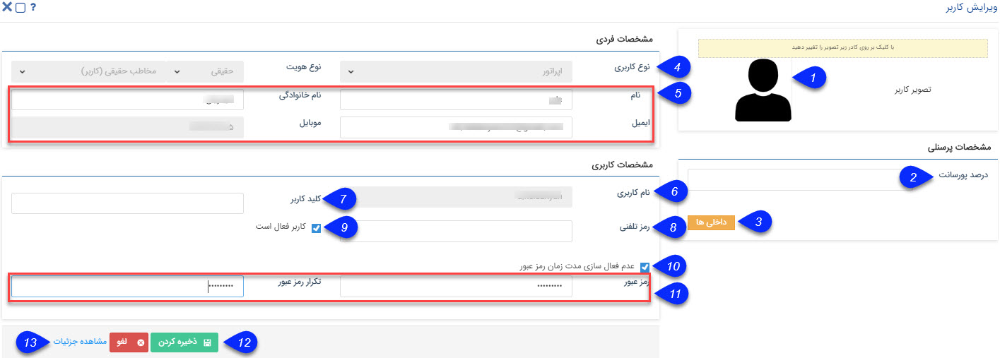

## ایجاد کاربر جدید 

نحوه ساخت کاربر به شرح زیر می‌باشد :

1. تصویر کاربری: تصویر کاربر را با کلیک بر روی تصویر عوض کنید. (هر کاربر نیز می تواند در قسمت پروفایل من تصویر کاربری خود را عوض کند.)

2. درصد پورسانت:اگر قرار باشد کاربر پورسانتی از فروش هایی که انجام می دهد (فاکتورها و قراردادهایی که در پیام گستر با نام او ثبت می شود) را دریافت کند، برای در نظرگیری درصد پور سانت کاربر، میتوان درصد آن را در این فیلد وارد کنید.

3. داخلی ها: داخلی های کاربر مورد نظر را تعریف کنید. توجه داشته باشید که این داخلی ها در قسمت[ مدیریت سیستم های تلفنی ](https://github.com/1stco/PayamGostarDocs/blob/master/help%202.5.4/Basic-Information/Telephone-systems/telephone-systems-Management/telephone-systems-Management.md)تعیین می شوند.

4. نوع کاربری: کاربر می تواند به سه نوع باشد:

اپراتور: کاربر عادی نرم افزار محسوب می شود.
نماینده: مانند کاربر عمل می کند.
مشتری: فقط دسترسی به[ پنل باشگاه مشتریان](http://septadocs.1st.co.com/payamgostar/documents/%D8%A8%D8%A7%D8%B4%DA%AF%D8%A7%D9%87-%D9%88%D9%81%D8%A7%D8%AF%D8%A7%D8%B1%DB%8C?selectedId=3b54ff85-aa22-4620-716f-08d8a996e9ef&menuItemType=2#) دارد. (توجه کنید که این نوع از کاربران جزء کاربران فعال شما محسوب نمی شوند.)

5. اطلاعات کاربر: نام و نام خانوادگی و اطلاعات تماسی هویت حقیقی و نام شرکت و اطلاعات تماس هویت حقوقی  که قصد تعریف کاربری برای ان را دارید در این قسمت وارد کنید. توجه داشته باشید از آن جا که نرم افزار برای ارسال پیام های مختلف (از جمله پیام های داخل فرآیند، یا زمانی که یک وظیفه یا درخواست تایید) نیاز به اطلاعات تماسی کاربر دارد، نیاز است که این اطلاعات با دقت و صحیح لحاظ شوند.

6. نام کاربری : نام کاربری تعیین کنید. این نام باید به زبان انگلیسی و حداقل 5 کاراکتر باشد. توجه داشته باشید پس از ایجاد کاربر، نام کاربری او قابل ویرایش نیست.

7. کلید کاربر: برای مباحث ارتباط از طریق وب سرویس برنامه نویسان از این فیلد استفاده می کنند و کاربردی برای کاربران ندارد.

8. کاربر فعال است:با غیر فعال کردن کاربر،امکان انتخاب این کاربر در لیست کاربران وجود ندارد، همچنین یکی از سقف کاربران مجاز شما آزاد می شود و می توانید کاربر دیگری را به نرم افزار اضافه کنید. (به جای حذف کاربرانی که از مجموعه شما رفته اند یا دیگر نیازی به استفاده از پیام گستر ندارند - مانند جابه جایی عنوان شغلی و ...- از غیر فعال کردن این گزینه استفاده کنید.)

> نکته : لازم به ذکر است در صورتیکه حساب کاربری از این بخش فعال گردد و کاربر ایجاد گردد، حتی در صورت تعریف قالب پیام برای فعالسازی سیستم، کاربر پیام فعالسازی را دریافت نمیکند چون در این بخش شما به صورت دستی آن را فعال کرده اید.

10. عدم فعال سازی مدت زمان عبور : با فعال کردن این گزینه رمز عبور این کاربر در نرم افزار، هیچ زمانی منقضی نمی شود.

برای تنظیم مقدار پیشفرض زمان  منقضی شدن رمز عبور، به قسمت [امنیتی ](https://github.com/1stco/PayamGostarDocs/blob/master/help%202.5.4/Settings/General-settings/security/security.md)مراجعه کنید.

11. رمز عبور: رمز عبور کاربر را تعیین کنید. (تعداد حروف رمز عبور، امکان منقضی شدن رمز عبور و الزام رمز پیچیده بودن آن را در قسمت [امنیتی ](https://github.com/1stco/PayamGostarDocs/blob/master/help%202.5.4/Settings/General-settings/security/security.md)میتوانید تنظیم کنید.)

12. ذخیره: با استفاده از این کلید کاربر ایجاد شده ذخیره می شود.

13. مشاهده جزییات: لینک هویتی که در بانک اطلاعاتی به نام این کاربر ایجاد شده است در این قسمت نمایش داده می شود.

> نکته : لازم به ذکر است که با ایجاد کاربر هویتی مرتبط با آن کاربر در بانک اطلاعاتی ایجاد میگردد که مسیر ذخیره آن از طریق[ دسته بندی کاربران ](https://github.com/1stco/PayamGostarDocs/blob/master/help%202.5.4/Settings/General-settings/User-category/User-category.md)مشخص می شود .  

