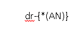

# تنظیمات الگوی شماره‌گذاری آیتم‌ها

یکی دیگر از وظایف راهبر نرم‌افزار، تنظیم الگوی شماره‌گذاری آیتم‌هاست. آیتم‌های هویت، انواع فاکتورها، پیش‌فاکتورها، قراردادها، دریافت و پرداخت‌ها نیاز به الگوی شماره دارند که باید از قبل این الگو تنظیم شده باشد تا در بخش تنظیمات شخصی‌سازی هر آیتم استفاده شود. 

## ایجاد یک الگوی شماره 

برای تعریف قالب شماره‌دهی از مسیر **تنظیمات** > **الگو شماره‌گذاری** اقدام نمایید. در این قسمت می‌توانید یک قالب شماره‌گذاری جدید تعریف کنید، الگوهای موجود را ویرایش کنید و یا بر اساس نام و الگو فیلتر و جستجو کنید.

> **نکته:** در لیست قالب‌های تعریف شده، تنها امکان حذف و ویرایش قالب‌هایی وجود دارد که تا به حال در آیتمی‌ برای شماره‌گذاری استفاده نشده است.

مسیر دیگر ایجاد الگوی شماره‌گذاری، **صفحه شخصی‌سازی آیتم** می‌باشد. هنگام ایجاد یک آیتم جدید می‌توانید از همان صفحه یک الگوی شماره‌گذاری جدید تعریف کنید. 
دقت داشته باشید درصورتی که از یک آیتم مثلا فاکتور فروش ایجاد شده باشد، دیگر امکان تغییر الگوی شماره‌گذاری آن وجود ندارد.

با کلیک بر روی دکمه افزودن صفحه زیر برای تعریف قالب شماره جدید نمایش داده می‌شود.

## مراحل ایجاد الگوی شماره‌گذاری
1. ساختار قالب مورد نظر خود را در قسمت **الگوی شماره‌گذاری** وارد کنید.
2. برای الگوی خود یک **مقدار اولیه** تعیین کنید. دقت کنید این مقدار نمی‌تواند کمتر از صفر باشد و تعداد ارقام آن باید با محدودیت ارقامی که در الگو تعریف کرده‌اید یکسان باشد.

> **نکته:**
>اولین شماره‌ای که به آیتم اختصاص داده می‌شود، یکی پس از مقدار اولیه تعریف شده می‌باشد برای نمونه اگر مقدار اولیه 001 تعریف شود، اولین شماره‌ی آیتمی‌ که از این الگو استفاده می‌کند 002 خواهد بود.

3. این الگو را برای هر آیتمی که ساخته‌اید نامش را در **عنوان** بنویسید. مثلا: الگوی شماره گذاری فاکتور فروش
4. در صورتی که بخواهیم با تغییر سال، عدد سال یک واحد افزایش پیدا کند و شماره از ابتدای مقدار اولیه الگو پیروی کند، باید چک باکس **تغییر سال** فعال شود. در غیر این صورت با تغییر سال یک واحد به سال اضافه می‌شود و شماره از ادامه شماره‌های قبلی پیروی می‌کند.

## پارامترهای اصلی الگوی شماره‌گذاری

ساختار اصلی الگوی شماره‌گذاری‌ای که شما تعریف می‌کنید، می‌تواند ترکیبی از اعداد، حروف و سال شمسی یا میلادی باشد بنابراین لازم است از پارامترهای اصلی درنظر گرفته شده در الگو شماره‌گذاری استفاده کنید:

**پارامتر (AN)** 
این بخش از الگوی شماره‌گذاری به **شماره‌دهی متوالی (پی در پی)** شماره آیتم مرتبط است. یعنی از آخرین شماره موجود چه به صورت دستی و چه به صورت خودکار شماره بعدی را ثبت می‌کند. 

> **نکته** 
>دقت داشته باشید که تنها با این پارامتر است که امکان شماره‌دهی متوالی وجو دارد و اگر الگوی شما این پارامتر را نداشته باشد، هنگام شماره‌دهی به آیتم یک مقدار ثابت درج می‌شود که حتی به صورت دستی هم امکان تغییر به شماره دیگر نیست زیرا فیلد شماره تنها از الگوی شماره‌گذاری تبعیت می‌کند.

**1. پارامتر (MIYY)**
برای نمایش سال میلادی در قالب شماره‌گذاری استفاده میشود.

**2. پارامتر (SHYY)**
 برای نمایش سال شمسی در الگوی شماره گذاری استفاده میشود.

## اصول ایجاد الگوی شماره‌گذاری

رعایت موارد زیر را برای ایجاد الگوی شماره‌گذاری الزامی است:

**استفاده از آکولاد {}**
 هر پارامتر سیستمی‌ یا پارامترهایی که توسط شما در قالب تعریف می‌گردد، بایستی در داخل آکولاد تعریف گردد.

مثال:

	{*(AN)}

**تعیین تعداد کاراکتر الگوی شماره گذاری**
. برای تعریف هر پارامتر در داخل آکولاد بایستی تعداد کاراکتر آن مطابق روش‌های زیر مشخص کرد:

ا. تعریف الگوی شماره‌گذاری با تعداد کاراکتر محدود

  تعداد برای این حصول ، پس از آکولاد میتوانید با کاراکتر underline  تعداد کاراکتر‌های مجاز  قالب شماره دهی را تعیین نمایید..

مثال:

در صورت استفاده از سه underline ،تعداد 3 کاراکتر برای این قالب در نظر گرفته خواهد شد.

	{___(AN)}

> **نکته**
>لازم به ذکر است در این حالت، برای فیلد **مقدار اولیه** بایستی حداکثر سه کاراکتر تعریف گردد.

مثال:
 در صورت تعریف مقدار اولیه 000 برای الگو مثال بالا، شماره آیتم‌ها از 001 الی 999 خواهد بود و پس از شماره 999 **آیتم جدید دیگری ذخیره نخواهد شد**.

ب. تعریف قالب شماره دهی با تعداد کاراکتر‌های نامحدود 

با استفاده از کاراکتر * محدودیتی برای تعداد کاراکتر الگوی شماره‌گذاری در نظر گرفته نخواهد شد و  در این صورت شما می‌توانید **مقدار اولیه را با تعداد کاراکتر دلخواه مقدار دهی کنید**.

مثال:
برای نمونه ، در قالب شماره دهی  زیر با وارد کردن * پیش از (AN) و  تعریف مقدار اولیه 0 برای این قالب،  شماره آیتم‌ها از 1 الی بی نهایت خواهد بود.

	{*(AN)}

 **نوشتن پارامترها در پرانتز ()**
برای استفاده از پارامترهای سیستمی‌نام پارامتر بایستی داخل پرانتز تعریف گردد. مانند نوشتن پارامتر AN > (AN) 

**نوشتن کاراکترهای اضافی در الگو**
در صورتی که شماره آیتم شما شامل کاراکترهای حرف یا عدد باشد، بایستی این کاراکتر در الگو تعریف شود.

مثال: 
فرض کنید می‌خواهید از کاراکتر dr- به صورت ثابت در شماره آیتم‌های خود استفاده کنید برای همین باید به روش زیر الگوی خود را تعریف کنید.

در صورت تعریف این الگو با مقدار اولیه 1، شماره اولین آیتم با این الگو به این صورت خواهد بود.

**درج پارامتر دلخواه در الگوی شماره‌گذاری**
در صورت اینکه بخواهید از یک پارامتر دلخواه در قالب شماره دهی استفاده کنید که این پارامتر در شماره قابل ویرایش باشد، بایستی الگوی زیر  را تعریف نمایید.

با فرض تعریف این الگو برای یک قالب، مقدار پیش فرض A به جای این پارامتر در شماره آیتم‌ها نمایش داده میشود که به صورت دستی قابل ویرایش است .

**استفاده از هر پارامتر تنها یک‌بار در الگوی شماره‌گذاری**
از یک نوع پارامتر سیستمی‌ **نمیتوان** به دفعات در یک قالب استفاده کرد.

مثال:
نمیتوان از پارامتر (SHYY) بیش از یکبار در یک قالب استفاده کرد.

**امکان استفاده از چند پارامتر متفاوت همزمان در یک الگوی شماره‌گذاری**
امکان استفاده از چند پارامتر سیستمی‌باهم وجود دارد.

مثال:
میتوان در یک قالب هم از پارامتر میلادی هم از پارامتر شمسی در یک قالب استفاده کرد.

**الزام به تعیین تعداد کاراکتر با * یا Underline، هنگام استفاده از پارامترهای SHYY و MIYY**
لازم به ذکر است در تعریف پارامتر‌های شمسی و میلادی به منظور مشخص نمودن تعداد کاراکترهای آن پارامتر،  بایستی  چهار underline  و یا * در داخل آکولاد قبل از پارامتر قرارگیرد

مثال: 

	{*(MIYY)}
    یا 
	{____(MIYY)}

>**نکته**
>در صورت استفاده از پارامترهای SHYY  و MIYY  در قالب شماره دهی، هنگام شماره دهی دستی آیتم می‌توان از سال 1357 الی یک سال پس از سال جاری، آیتم را شماره گذاری کرد.

**استفاده از کاراکتر جدا کننده در الگوی شماره‌گذاری، به جز . و +**
بین هر دو پارامتر استفاده شده در قالب شماره‌گذاری، بایستی از یک کاراکتر برای جدا کردن آنها استفاده کرد. این کاراکتر می‌تواند بصورت دلخواه **(به جز کاراکتر . و +)** انتخاب شود.

مثال: 

	{____(MIYY)}/{*(AN)}

### چند نمونه الگوی شماره‌گذاری با ساختار متنوع:

فرض کنید می‌خواهید آیتم‌های مورد نظرتان به شکل زیر شماره‌گذاری شوند، بنابراین برای هر شماره طبق الگوی نوشته شده، پیش بروید.

**شماره:  002**

    {__(AN)}
	مقدار اولیه: 1

**شماره: 100-1398/1**

     100-{____(SHYY)}/{*(AN)}
	 مقدار اولیه: 0

**شماره:100-1398-DR/1**

    100-{____(SHYY)}-DR/{*(AN)}
	مقدار اولیه: 0

**شماره: 100-1398-B/4**
   
    100-{____(SHYY)}-{_(H:B)}/{*(AN)}
	مقدار اولیه: 3

>**نکته**
>در مثال اخر در تعریف الگو شماره گذاری از پارامتر دلخواه با نام H  و با مقدار پیش فرض B استفاده شده است (که می‌توان هر پارامتری را با نام و مقدار پیش فرض دلخواه تعریف کرد)
هنگام استفاده از این الگو، در شماره آیتم مقدار B بعنوان مقدار پیش فرض نمایش داده می‌شود که بصورت دستی می‌توانید این پارامتر را ویرایش و حرف حرف دیگری را جای آن بنویسید.

**استفاده از یک الگوی شماره‌گذاری در چند آیتم CRM**
امکان استفاده از یک قالب برای آیتم‌های مختلف وجود دارد و ترتیب افزایش شماره هر الگو با آیتم‌های ذخیره شده افزایش می‌یابد. عملکرد سیستم برای ترتیب شماره‌های یک الگو برای **چند آیتم** به این صورت است که هر آیتمی که آخرین بار شماره گرفته باشد، آیتم بعدی که همین الگو برایش انتخاب شده باشد، عدد بعدی شماره آیتم قبلی را می‌گیرد. لازم به ذکر است که در این روش کلیه شماره‌های یک قالب بین آیتم‌های مختلف اختصاص یافته است. از طرف دیگر در کلیه نمونه‌های یک نوع آیتم، شماره‌ها ممکن است پشت سر هم نباشند. 

**برای نمونه:**اگر یک الگویی تعریف کنیم که قالب شماره‌گذاری آن A_{*(AN)} و مقدار اولیه برای آن 1000 تعریف شده باشد و این الگو در هویت حقوقی و پیش فاکتور فروش استفاده شده باشد، زمانی که اول هویت ذخیره شود و بعد از آن پیش فاکتور فروش، شماره A_1001 به هویت و شماره A_1002 به پیش فاکتور پیش فرض اختصاص می‌یابد.
 
> **نکته:**
>در صورتی که شماره ای به آیتم اختصاص پیدا کند و آن آیتم حذف گردد، شماره تخصیص یافته شده به آن آیتم را فقط میتوان به صورت **دستی** به آیتم دیگری تخصیص داد.

**عدم امکان تغییر الگوی شماره‌گذاری در شخصی‌سازی آیتم ذخیره شده**
در صورت انتخاب یک الگوی شماره‌گذاری برای یک زیر نوع آیتم در بخش شخصی سازی، اگر از آن نوع آیتم ایجاد شده باشد و شماره گرفته باشد، دیگر امکان تغییر الگوی شماره‌گذاری و انتخاب قالب دیگر برای آن آیتم وجود ندارد.

> **نکته:**
>باید در نظر داشت که اگر الگویی به آیتمی‌اختصاص داده شود نمیتوان به آن آیتم به صورت دستی شماره ای خارج ار الگو تخصیص داد.

> **نکته:**
>لازم به ذکر است فعالیت تبدیل نوع برای آیتم‌های مالی و یا تبدیل هویت ،اگر آیتم و یا هویت شماره داشته باشد، تنها در صورتی تبدیل نوع انجام می‌شود که **الگوی شماره‌گذاری** آیتم مبدا و مقصد یکسان باشد.

##  ویرایش الگوی شماره‌گذاری
در صورت ویرایش قالب شماره دهی، تمامی‌آیتم‌هایی که از این الگو استفاده کرده اند طبق الگوی جدید ویرایش می‌شوند.

مثال:

    الگوی شماره‌گذاری فعلی
	{____(SHYY)}/{*(AN)}

حالا می‌خواهیم الگوی بالا را به الگوی شماره‌گذاری زیر تغییر دهیم:

    {____(MIYY)}/{*(AN)}

شماره آن آیتم بصورت زیر ویرایش خواهد شد:

اگر از یک الگو در شماره‌گذاری آیتم‌ها استفاده شده باشد هنگام ویرایش آن الگو، فیلدی به نام **مقدار نهایی فعلی** خواهید دید که اخرین شماره ایجاد شده در سیستم را نمایش می‌دهد.

 به عنوان مثال اگر عدد اولیه  100 باشد و طبق این الگو آیتمی‌ایجاد شود، شماره 101 به آن اختصاص پیدا می‌کند بنابراین در فیلد مقدار نهایی عدد 101 نمایش داده می‌شود. 
به علاوه با استفاده از این قابلیت می‌توان مقدار نهایی فعلی را نیز ویرایش نمود. دقت کنید که اگر می‌خواهید عددی کوچکتر از مقدار نهایی فعلی را وارد کنید، **عدد جدید نباید قبلا استفاده شده باشد**. مثلا اگر عدد مقدار نهایی در حال حاضر 150 باشد و  بخواهید به عدد 120 تغییر دهید، 120 نباید قبلا استفاده شده باشد. در نظر داشته باشید در این حالت بعد از ادامه شماره‌گذاری و رسیدن به عدد 150 خطای تکراری بودن داده می‌شود و می‌توان برای رفع این مساله از دو طریق عمل نمود:

1. این شماره را به صورت دستی به عدد 151 تغییر دهید.
2. مجددا عدد 150 را در بخش الگوی شماره گذاری به عنوان مقدار نهایی تعیین نمایید تا شماره 151 برای آیتم جدید در نظر گرفته شود.

کاربرد فیلد مقدار نهایی برای وقتی است که شماره گذاری از ترتیب الگوی انتخابی پیروی نمی‌کند. به عنوان مثال شماره گذاری بصورت دستی انجام شده و در واقع فاصله‌ای بین شماره‌ها بوجود آماده است. برای استفاده از اعدادی که در این فاصله هستند و به عبارتی استفاده نشده‌اند، می‌توان از فیلد مقدار نهایی در الگوی شماره‌گذاری استفاده کرد.

## نکات مربوط به شماره‌گذاری دستی آیتم‌ها
موارد زیر در مورد وارد کردن شماره دستی باید درنظر گرفته شوند:

1. در صورتی که کاربر شماره‌ای را به صورت دستی وارد کند، تنها در صورتی ذخیره می‌شود که شماره وارد کرده در تمام آیتم‌های دارای این قالب تکراری نباشد.
2. در صورتی که آخرین شماره در یک آیتم به صورت دستی وارد شده باشد، شماره‌گذاری‌های بعدی این آیتم، از آخرین شماره‌ای که کاربر به صورت دستی وارد کرده بوده، ادامه می‌یابد.
مثلا اگر اخرین شماره آیتم در یک الگوی شماره‌گذاری 100 باشد و ما به صورت دستی به آیتم جدید شماره 105 بدهیم، آیتم بعدی که به صورت خودکار شماره‌گذاری می‌شود شماره‌اش 106 خواهد شد.

> **نکته:**
>کاربر برای شماره دهی دستی آیتم‌ها نیاز به **مجوز شماره‌گذاری** روی آن نوع ایتم را دارد .
