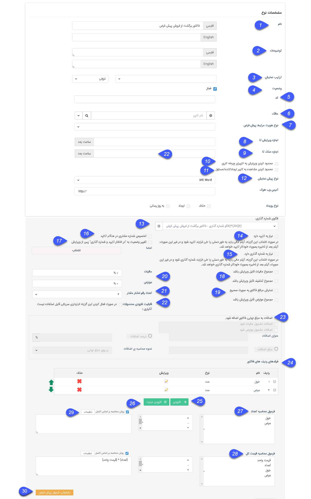
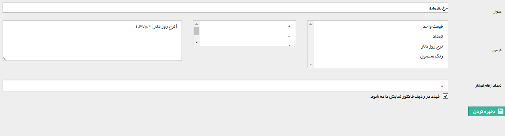

## مدیریت فاکتورها 

> مسیر دسترسی: **تنظیمات** < **شخصی سازی crm** < **مدیریت فاکتورها**

از این قسمت می توانید تنظیمات مرتبط با پیش فاکتورها، فاکتورها و فاکتورهای برگشتی را مشخص نمایید.

لطفا ابتدا[ تنظیمات مشترک آیتم های سیستم](https://github.com/1stco/PayamGostarDocs/blob/master/help%202.5.4/Settings/Personalization-crm/Overview/General-information/Shared-information-of-system%20items/Shared-information-of-system%20items.md) و آیتم های [حقوقی/مالی](https://github.com/1stco/PayamGostarDocs/blob/master/help%202.5.4/Settings/Personalization-crm/Overview/General-information/Legal%20-financial-items/Legal%20-financial-items.md)  را در این خصوص مطالعه فرمایید.

فروش: پیش فاکتور، فاکتور فروش و فاکتور برگشت از فروش مرتبط با بحث فروش کالا و خدمات هستند.

پیش فاکتور: این نوع فقط برای اعلام قیمت است و مبلغ کل آن به عنوان بدهی برای مخاطب حساب نشده و کالایی را نیز از انبار خارج نمیکند.(اما تعداد کالای درج شده در پیش فاکتور فروش به عنوان موجودی فریز شده محسوب خواهد شد)

فاکتور فروش: بعد از ذخیره این نوع برای یک مخاطب و تایید آن، به مبلغ این فاکتور مخاطب در نرم افزار بدهکار می گردد. (در صورت فعال نبودن ماژول انبارداری پیشرفته، کالاهای لحاظ شده در فاکتور از موجودی انبار محصولات کسر می گردد در غیر این صورت باید برای خروج کالا حواله خروج صادر گردد.)

فاکتور برگشت از فروش: پس از برگشت یک فاکتور فروش، با صدور این نوع فاکتور برای آن، به مقدار مبلغ کل کالاهایی که در این فاکتور برگشت داده میشوند، مشتری بستانکار حساب خواهد شد و تعداد کالاهای مرجوعی (نکته: در صورت وجود ماژول انبار داری پیشرفته باید برای برگشت کالاها رسید مرجوعی صادر کرد) به انبار اضافه می گردد. (امکان صدور فاکتور برگشت تنها برای فاکتورهای تایید شده امکان پذیر است.)

خرید: پیش فاکتور خرید، فاکتور خرید و فاکتور برگشت از خرید مرتبط با بحث خرید کالا و خدمات هستند.

پیش فاکتور خرید: این نوع فقط برای استعلام قیمت است و مبلغ کل آن به عنوان بستانکاری برای مخاطب محاسبه نشده و کالایی را نیز به انبار وارد نمیکند.

فاکتور خرید: بعد از ذخیره این نوع برای یک مخاطب، به مبلغ این فاکتور مخاطب در نرم افزار بستانکار می گردد. (در صورت فعال نبودن ماژول انبارداری پیشرفته، کالاهای لحاظ شده در فاکتور به موجودی انبار محصولات اضافه می گردد، در غیر این صورت باید برای ورود کالا رسید انبار صادر گردد.)

فاکتور برگشت از خرید: پس از برگشت یک فاکتور خرید، با صدور این نوع فاکتور برای آن، به مبلغ کل کالاهایی که در این فاکتور برگشت داده میشوند، مشتری بدهکار حساب خواهد شد و تعداد کالاهای مرجوعی نیز از انبار خارج می گردد. (امکان صدور فاکتور برگشت تنها برای فاکتورهای تایید شده امکان پذیر است.)

به طور پیش فرض، یک فاکتور، پیش فاکتور و فاکتور برگشتی در سیستم با قالب پیش فرض قرار داده شده است. که می توان تغییرات لازم را بر روی فیلدها و قالب نمایشی آن اعمال کرد. همچنین با انتخاب آیکون + هم می توانید انواع جدیدی را  برای سیستم طراحی نمایید.

### تنظیم فاکتور

علاوه بر تنظیمات عمومی، تنظیمات اختصاصی فاکتورها به شرح زیر می باشد. (عکس زیر از تنظیمات یک پیش فاکتور فروش درج شده است)

1. نام: مي توانيد نام فاکتور را به دلخواه خود تعيين کنيد.

2. توضیحات: توضیحات مرتبط با فاکتور را مشخص کنید.

3. ترتیب نمایش : با این امکان، میتوانید لیست آیتم‌ها را براساس فیلد مورد نظر خود مرتب‌سازی کنید.
فیلدهایی که امکان مرتب سازی آیتم ها براساس آن ها وجود دارد تنها فیلد های اضافه شده ی از نوع عدد ،شناسه خودکار،تاریخ شمسی و تاریخ میلادی که دارای الزام می باشند که 
 به موجودیت های اصلی و زیر نوع موجودیت ها افزوده گردیده است.
نکته :  اگر مقادیر فیلد انتخاب شده برای مرتب سازی، در بین آیتم ها یکسان باشد، حالت نمایش این آیتم ها در لیست، براساس تاریخ ایجاد و به صورت نزولی خواهد بود .  
برای نمونه فرض کنید به آیتم فرم یک فیلد با عنوان تاریخ مرخصی اضافه کرده ایم و ترتیب نمایش فرم را براساس این فیلد تنظیم کرده ایم.
 اگر فرم هایی با یک تاریخ مرخصی یکسان وجود داشته باشند، ترتیب نمایش بین این چند فرم در لیست براساس تاریخ ایجاد و به صورت نزولی میباشد.
نکته :  قابل ذکر است تنها لیست آیتم ها براساس این ترتیب نمایش تعریف شده، مرتب سازی میگردد، و در سایر بخش ها مانند بانک یکپارچه و تب سوابق هویت و ... چینش آیتم ها به صورت قبل است.
نکته :  قابل ذکر است که ترتیب نمایش آیتم ها در لیست ها بصورت پیش فرض براساس تاریخ ایجاد آیتم و نزولی است

4. فعال: با غير فعال کردن فاکتور، اجازه ذخيره آن را از کاربران خواهيد گرفت. به اين معني که کاربران ديگر نمي توانند مورد جديدي از این نوع فاکتور را ذخيره کنند.

5. کد: مي توانيد کد دلخواه (براي مثال کد ايزو (ISO) سازماني) را در اين قسمت وارد کنيد. اين کد فقط شامل اعداد و حروف مي تواند باشد.

6. مالک: به قسمت<a href="file%3A%2F%2F%2FC%3A%5CUsers%5CH.abasi%5CDesktop%5Chelp%5Cmd%20help%5CSettings%5CPersonalization-crm%5COverview%5CGeneral-information%5CItem-owner%5CItem-owner.md" target="_blank">  مالک آیتم  </a>مراجعه کنيد.

7. نوع هویت مرتبط پیش فرض: در این قسمت می توانید نوع هویت پیش فرض برای ایجاد هویت مرتبط با آیتم را که از روش چابک ایجاد میشود را انتخاب کرد..

8. اجازه ويرايش تا: در صورتي که فيلد "اجازه ويرايش تا" را با يک مقدار عددي به ساعت پر نماييد. تنها تا مدت زمان عددي قبل از اين  مقدار اجازه ويرايش به ايجاد کننده آيتم داده خواهد شد (اين محدوديت براي کاربراني که اجازه ویرایش آن آيتم را دارند صدق نمی کند و مجوز ویرایش بی تاثیر می شود). در صورت خالي بودن فيلد، اجازه ويرايش براي کاربر ايجادکننده آيتم آزاد است.

9. اجازه حذف تا: در صورتي که فيلد " اجازه حذف تا" را با يک مقدار عددي به ساعت پر نماييد. تنها تا مدت زمان عددي قبل از اين  مقدار اجازه حذف به ايجادکننده آيتم داده خواهد شد (اين محدوديت براي کاربراني که اجازه حذف آن آيتم را دارند صدق نمي کند). در صورت خالي بودن فيلد، اجازه حذف براي کاربر ايجادکننده آيتم آزاد است .

10. محدود کردن ويرايش به کاربران چرخه کاري: زماني معني پيدا مي کند که بر روي اين فرم، فرآيند تعريف و فعال شده باشد و در غير اين صورت تاثيري نخواهد داشت.  در صورت فعال شدن گزينه، تنها کاربراني مي توانند اين

 فرم را ويرايش کنند که در فرآيند يا چرخه کاري نقش داشته باشد. ( فقط کاربری که مسئول کارتابل است می تواند آیتم را ویرایش کند،اگر مسئول یکی از مراحل دیگر باشد هم اماکن ویرایش ندارد، بافعال کردن این گرسنه حتی اگر کاربر ایجاد کننده باشد و یا مجوز ویرایش هم داشته باشد ، نمی تواند آیتم را ویرایش کند )

11. محدود کردن مشاهده به کاربر ايجاد کننده/ مسئول:  با فعال کردن اين گزينه تنها کاربر ايجاد کننده و يا مسئول آيتم (مثلا در فرصت کاربري که در فيلد "تخصيص داده شده يه" وارد مي شود به عنوان مسئول فرصت شناخته
 مي شود) مي توانند آيتم را مشاهده کنند
 
 12. نوع پيش نمايش: مي توان فرمت پيش نمايش مرتبط با اين آيتم را به صورت وورد (قابل ويرايش پس از پيش نمايش گرفتن) يا تصویر یا PDF تنظيم کرد.

13. الگوی شماره گذاری: الگوی فاکتور را از بین الگوهایی که قبلا ساخته شده اند انتخاب کنید یا الگوی جدیدی به آن اختصاص دهید. <a href="file%3A%2F%2F%2FC%3A%5CUsers%5CH.abasi%5CDesktop%5Chelp%5Cmd%20help%5CSettings%5CNumbering-template%5CNumbering-template.md" target="_blank">( نحوه شماره گذاری</a> )

14. نیاز به تایید دارد: در صورتی که در روال کاری شرکت شما،  آیتم مربوطه پس از ثبت شدن توسط کارشناسان باید به تایید شخص دیگری برسد (با ورود به کارتابل مربوطه)،می توانید از این گزینه استفاده کنید. با انتخاب این

 گزینه، پیش نمایش  آیتم مربوطه تا زمان تایید شدن امضا نخواهد داشت و در محاسبات مالی نرم افزار لحاظ نخواهد شد (مشتری را بدهکار/بستانکار نخواهد کرد). در صورت غیر فعال بودن این گزینه، این آیتم به محض ثبت تایید خواهد شد.

15. نیاز به شماره گذاری دارد:  در صورتی که می خواهید آیتم مربوطه پس از ثبت شدن توسط کارشناسان برای شماره گذاری وارد کارتابل کاربرانی که مجوز شماره گذاری آن را دارند گردد،می توانید از این گزینه استفاده کنید . در صورت غیر فعال بودن این گزینه، این آیتم به محض ثبت، شماره گذاری خواهد شد.

16. تخصیص شماره مشتری در هنگام تایید: در صورت فعال بودن این گزینه، در صورتی که هویت مرتبط با آیتم شماره مشتری نداشته باشد، به محض تایید شدنآیتم مربوطه سیستم به صورت خودکار به این هویت، شماره مشتری اختصاص خواهد داد. (به طور مثال اگر می خواهید مخاطبان شما، پس از تایید شدن اولین فاکتور فروش صادر شده برای آن ها، شماره مشتری دریافت کنند، می توانید در تنظیمات فاکتور فروش این گزینه را فعال کنید)

17. تغییر وضعیت به "در انتظار تایید و شماره گذاری" پس از ویرایش:با فعال کردن این گزینه، اگر این  آیتم پس از تایید، توسط کاربری که دارای مجوز "ویرایش پس از تایید" باشد ویرایش شود، دوباره به حالت در انتظار برمی گردد و باید توسط یکی از کاربرانی که مجوز مربوطه را دارد، تایید و شماره گذاری شود.   

18. مجموع فاکتور عوارض/مالیات/تخفیف قابل ویرایش باشد: با فعال کردن اين گزينه، هنگام صادر کردن اين نوع از فاکتور مي توان مجموع عوارض/ماليات/تخفیف کالا ها را ويرايش کرد

19. نمایش مبالغ فاکتور به صورت صحیح:  با فعال کردن این گزینه تمامی مبالغ فاکتور به صورت صحیح نمایش داده می شوند.

نکته:  صدور حواله/رسید انبار خودکار: در صورتی که از انبارداری سریالی استفاده می کنید، در ویرایش فاکتور ها  تنظیماتی اضافه میگردد که می توانید، تنظیماتی اعمال کنید که به صورت خودکار پس از تایید شدن یک فاکتور خرید، رسید انبار مرتبط با آن نیز صادر شود و پس از تایید شدن یک فاکتور فروش، حواله انبار مرتبط با آن نیز برای خروج کالا از انبار صادر گردد. به همین دلیل در تنظیمات فاکتور خرید و فاکتور فروش این موارد را مشاهده می کنید، در صورت فعال نمودن صدور تراکنش انبار خودکار، باید نوع تراکنش را نیز مشخص نمایید. در هنگام صدور هر فاکتور نیز باید مشخص کنید که محصولات از کدام انبار خارج شوند (یا اینکه به کدام انبار اضافه گردند)

> نکته : توجه داشته باشید در لیست نوع رسید انبار خودکار، رسیدهای از نوع معمولی و در لیست نوع حواله انبار خودکار، حواله های از نوع فروش نمایش داده می شوند و قابل انتخاب هستند. برای آشنایی با انواع تراکنش های انبار به قسمت انبار ها مراجعه کنید.

  20. مالیات/ عوارض: درصد مالیات/عوارض را برای این نوع از فاکتور بر حسب درصد می توانید تعیین کنید.

21. تعداد رقم اعشار مقدار: تعداد رقم اعشاری که برای مقدار محصول نمایش داده می شود را می توان تعیین کرد. مثلا در صورتی که محصولات بر اساس وزن فروخته می شوند می توانید با استفاده از سه رقم اعشار، میزان گرم محصول فروخته شده را نیز مشخص کنید

22. قابلیت اضافه کردن محصول تکراری: در صورت فعال بودن این گزینه، می توان یک محصول را با چند قیمت مختلف در فاکتور وارد کرد. در غیر اینصورت با اضافه کردن محصول تکراری، مقدار آن به ردیف موجود در فاکتور اضافه می گردد.

نکته : برای افزودن محصول تکراری در پیش فاکتور/فاکتور نام محصول نیز بایستی ابتدا ویرایش شود و سپس با دکمه افزودن، آن محصول در ردیف فاکتور جداگانه ای درج میگردد.

23. اضافات: در صورت نیاز می توانید یک مبلغ اضافات به فاکتور های خود اضافه نمایید، این هزینه می تواند هزینه بسته بندی، ارسال یا ... باشد. در صورت فعال نمودن اضافات برای فاکتور، باید نحوه محاسبه آن که می تواند مبلغ ثابت (قابل تغییر در هنگام صدور فاکتور) و یا درصدی از مبلغ فاکتور (مبلغ نهایی، مبلغ قبل از تخفیف یا مبلغ قبل از مالیات/عوارض) باشد را مشخص نمایید.

همچنین امکان  اعمال مالیات و عوارض بر روی اضافات  وجود دارد

که با فعال کردن چک باکس اضافات مشمول مالیات شود از این بخش، مبلغ مالیات تعلق گرفته به اضافات محاسبه و در محاسبات مبالغ فاکتور این مبلغ لحاظ میگردد همچنین با فعال کردن چک باکس اضافات مشمول عوارض گردد، مبلغ عوارض تعلق گرفته به اضافات در محاسبات فاکتور محاسبه و اعمال میگردد.

نکته : لازم به ذکر است در صورت اینکه نوع اضافات از نوع درصد انتخاب شود و نحوه محاسبه اضافات روی گزینه مبلغ نهایی قرار گیرد امکان اعمال مالیات و عوارض بر روی اضافات وجود ندارد.

24. فیلدهای ردیف های فاکتور: با استفاده از این گزینه می توانید به ردیف های فاکتور فیلد هایی از نوع عدد و یا متن یا عبارت دلخواه را اضافه کنید و از آن در فرمول محاسبه تعداد و یا فرمول محاسبه قیمت کل استفاده کنید.

25. افزودن : در این قسمت فیلدهای ردیف فاکتور از نوع عدد یا متن را میتوانید ایجاد کنید.

26. افزودن عبارت: عبارت نیز یک فیلد ردیف فاکتور محسوب می شود، با این تفاوت که می تواند بر اساس فرمولی از فیلدهای ردیف فاکتور محاسبه شود. یعنی می توان فیلدی به ردیف فاکتور اضافه کرد که مقدارش با فرمولی براساس فیلد های دیگر محاسبه شود .

27. فرمول محاسبه تعداد: می توانید برای تعداد کالاها فرمول دلخواه خود را تنظیم کنید، با استفاده از این گزینه، فیلد تعداد در هنگام صدور این نوع از فاکتور غیر فعال می گردد. (برای مثال [طول]*[عرض] برای کالاهایی که بر حسب متر مربع حساب می شوند.)

28. فرمول محاسبه قیمت کل : می توانید فرمول محاسبه قیمت کل برای یک کالا را به دلخواه خود ویرایش کنید. (برای مثال در تصویر بالا تعداد در قیمت واحد و سپس در نرخ روز دلار ضرب می شود تا قیمت کل به دست آید.در این مثال می توان قیمت واحد را بر اساس دلار وارد کرد و قیمت کل را بر اساس ریال در اختیار داشت)

در این قسمت می توان برای اعمال فرمول محاسبه تعداد و قیمت کل، از فایل اکسل استفاده کرد.29
بدین منظور، ابتدا باید "چک باکس " روش محاسبه بر اساس اکسل " فعال گردد و گزینه تنظیمات انتخاب شود.
در این بخش می بایست فایل اکسلی که شامل فرمول تعریف شده می‌باشد، پیوست گردد.

ورودی‌ها:
در بخش کد فیلد، فیلدی را که مقدارش به عنوان ورودی به اکسل در نظر گرفته می شود، انتخاب می کنیم و در قسمت سلول نیز تعیین می کنیم مقدار فیلد انتخاب شده باید برای "کدام" یک از سلول های اکسل لحاظ شود. لازم به ذکر است در این حالت می توان از فیلدهای اضافه ردیف فاکتور به عنوان ورودی استفاده نمود. به علاوه، در محاسبه‌ی قیمت کل، فیلد تعداد و قیمت واحد نیز به عنوان ورودی قابل انتخاب می‌باشند.

خروجی:
سلول اکسلی که در آن فرمول موردنظر تعریف شده است باید انتخاب شود، این خروجی در فیلدی که فرمول نویسی برای آن انجام ‌می‌شود(تعداد یا قیمت کل) نمایش داده می‌شود.
مثال: برای قیمت کل پیش فاکتور فرمول زیر در اکسل تعریف شده است.

اگر قیمت واحد سلول B1 اکسل و تعداد محصول سلول C1 درنظر گرفته شود و هر دو به عنوان ورودی باشند، طبق فرمول بالا در صورتیکه مقدار قیمت واحد ضرب در تعداد بزرگ تر از 1000 باشد، این مقدار در 0.95 ضرب می‌شود و در خروجی که همان قیمت کل است نمایش داده می‌شود و در غیر این صورت اگر مقدار قیمت واحد ضرب در تعداد کوچیک تر از 1000 باشد همان مقدار قیمت واحد ضرب در تعداد در قیمت کل نمایش داده می‌شود.

30. بازخوانی فرمول پیش فرض : فرمول های محاسبه تعداد و قیمت کل را به حالت پیش فرض سیستم باز می گرداند.

