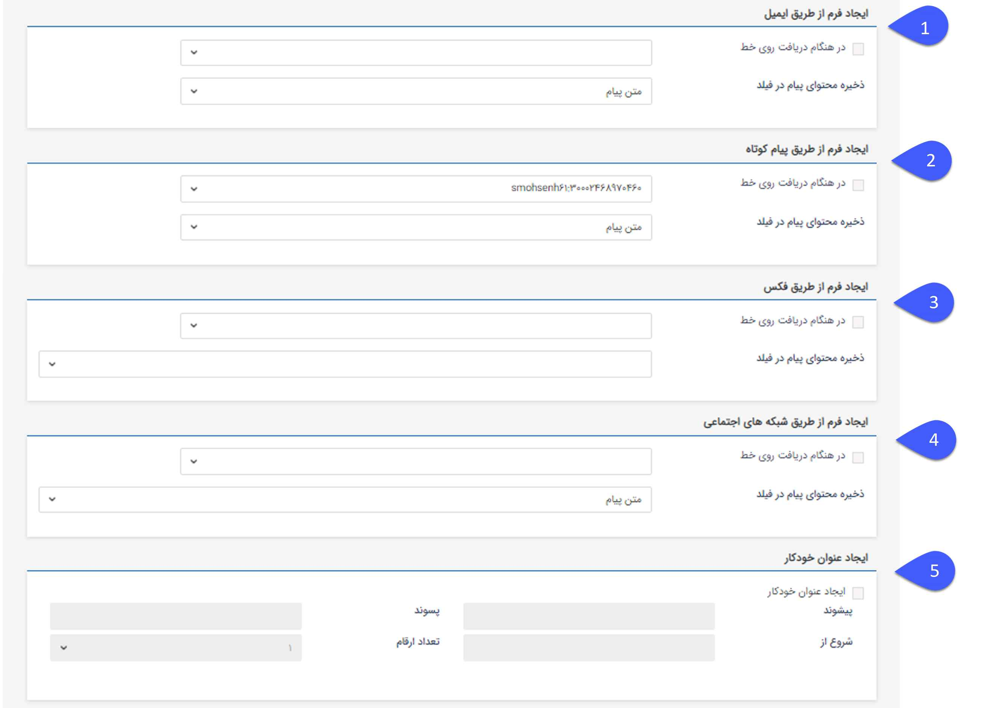

# تنظیم ایجاد فرم از طریق پیام‌ها

در شخصی سازی هر نوع فرم با فعال کردن چک باکس "ایجاد فرم از طریق ایمیل / پیام‌کوتاه / فکس" و تعیین خط دریافتی برای آن‌ها با دریافت هر ایمیل، فکس و یا پیام کوتاه بر روی خط مورد نظر،  فرم مربوطه در پروفایل شخص ارسال کننده‌ی پیام ایجاد می‌گردد.

### همچنین در این بخش باید فیلدی برای ذخیره محتوای ایمیل، فکس و یا پیام کوتاه ارسال شده انتخاب گردد:

**1**. برای ذخیره محتوای ایمیل در یک فیلد، نوع فیلد باید Html انتخاب شود.

**2**. برای ذخیره محتوای پیام کوتاه در یک فیلد، نوع فیلد باید متن انتخاب شود.

**3**. برای ذخیره محتوای فکس در یک فیلد، نوع فیلد باید فایل انتخاب شود.

**4**. برای ذخیره محتوای شبکه‌های اجتماعی در یک فیلد، نوع فیلد باید فایل انتخاب شود

**5.ایجاد عنوان خودکار:** در صورت نیاز برای ایجاد شدن عنوان خودکار بعد از ذخیره فرم، چک باکس را فعال کرده و اطلاعات مورد نظر را وارد کنید.

> نکته: در صورتی که مشخصات ارسال کننده مانند شماره فکس، ایمیل و یا موبایل آن در پروفایل ثبت نشده باشد، هیچ فرمی فعال نخواهد شد و تنها از طریق لیست های دریافت قابل پیگیری خواهد بود. امادر صورتی که ماژول مخاطبان ناشناس را تهیه نموده باشید و از قسمت تنظیمات، تنظیمات کلی، مخاطبان ناشناس آن را فعال نموده باشید (برای اطلاعات بیشتر به لینک مخاطبان ناشناس  مراجعه نمایید.). دریافت های ایمیل، فکس و پیام کوتاه که از شماره ناشناس صورت گرفته شده باشد به صورت یک مخاطب، در دسته بندی مشخص شده در تنظیمات [مخاطبان ناشناس](https://github.com/1stco/PayamGostarDocs/blob/master/help%202.5.4/Settings/General-settings/Anonymous-audience/Anonymous-audience.md) ثبت می شوند و فرمی در آن مخاطب ایجاد می گردد.

