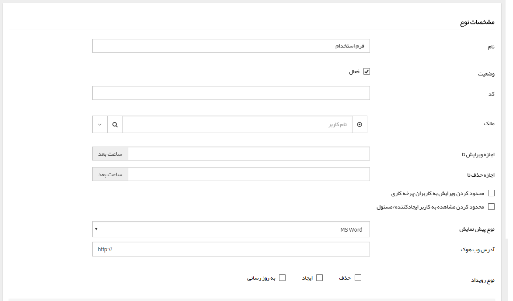

## شخصی سازی فرم‌ها

در صفحه شخصی سازی فرم‌ها می‌توانید فرم جدیدی را تنظیم و فرم های ساخته شده را ویرایش نمایید. فرم یک قالب خام در نرم افزار پیام گستر است که این امکان را برای شما فراهم می سازد تا کلیه فرم های سازمان را در نرم افزار پیاده سازی نمایید، فرم هایی مانند رضایت سنجی، دریافت فکس، فرم ثبت سفارش، فرم مرخصی و غیره.

 لطفا ابتدا قسمت[ اطلاعات کلی ](https://github.com/1stco/PayamGostarDocs/blob/master/help2.5.4/Settings/Personalization-crm/Overview/General-information/General-information.md) را در این خصوص مطالعه فرمایید.

#### فرم جدید

با ایجاد یک فرم جدید علاوه بر[ تنظیمات مشترک آیتم های سیستم  ](https://github.com/1stco/PayamGostarDocs/blob/master/help%202.5.4/Settings/Personalization-crm/Overview/General-information/Shared-information-of-system%20items/Shared-information-of-system%20items.md)می توانید تنظیماتی اعمال کنید که این فرم توسط مخاطبان شما ثبت شود، ثبت فرم توسط مخاطبان می تواند از طریق [فرم عمومی](https://github.com/1stco/PayamGostarDocs/blob/master/help2.5.4/Settings/Personalization-crm/Form-management/General-form.md) یا [دریافت پیام از طریق رسانه های مختلف (پیام کوتاه، ایمیل و فکس)](https://github.com/1stco/PayamGostarDocs/blob/master/help2.5.4/Settings/Personalization-crm/Form-management/Create-forms-through-incoming-message.md) باشد.

