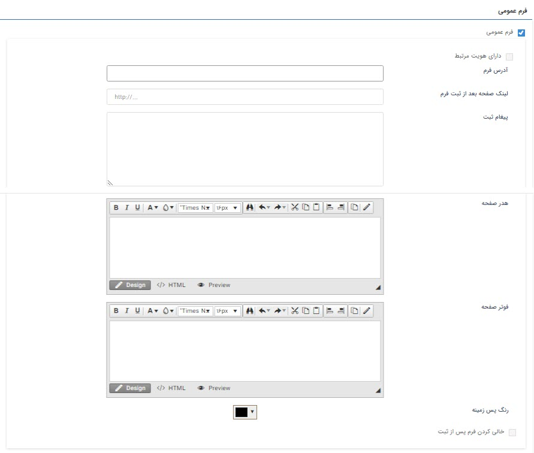
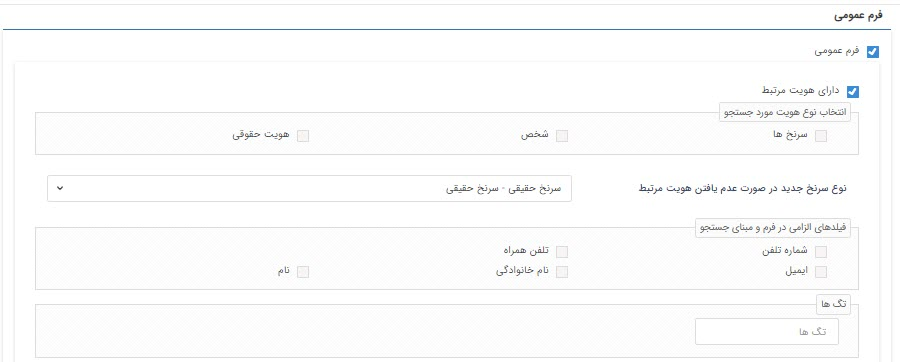

# تنظیمات فرم عمومی

در شخصی‌سازی فرم‌ها، این امکان وجود دارد فرمی تهیه کنید که سرنخ‌ها و مخاطبانتان خارج از نرم‌افزار و از طریق سایت، اطلاعاتی را ثبت کنند. مثلا برای فرم‌های نظرسنجی، استخدام، ثبت سفارش و یا ثبت‌نام قابلیت **فرم عمومی** بهترین ابزار است. 
برای ایجاد یک فرم عمومی از مسیر **تنظیمات** > **شخصی‌سازی CRM** > **مدیریت فرم‌ها** اقدام کنید. ایجاد یک فرم عمومی در بخش اول تنظیمات مشترکی مثل سایر آیتم‌ها دارد که باید طبق مراحل زیر اطلاعات را تکمیل کنید.
### تنظیمات مشترک شخصی‌سازی فرم
1. **نام**: یک عنوان مناسب برای فرم انتخاب کنید. با توجه به نوع زبان نرم‌افزار (فارسی، انگلیسی ..)، نام فرم را تکمیل کنید. مثلا  «فرم نظرسنجی پس از فروش»
2. **توضیحات**: توضیحاتی برای این فرم ثبت کنید که راهنمایی برای راهبر نرم‌افزار باشد. به عنوان مثال توضیحاتی راجع به کاربرد، تنظیمات لحاظ شده و یا استثنائاتی که وجود دارد را بنویسید.
3. **ترتیب نمایش**: در این قسمت تعیین می‌کنید لیست این فرم بر اساس فیلدی که انتخاب می‌کنید (تاریخ ایجاد، فیدل عددی شماره ..) به صورت صعودی یا نزولی نمایش داده شود.
4. **وضعیت**: اگر چک باکس فعال را پر کنید این فرم جز فرم‌های قابل استفاده و مشاهده در لیست فرم‌ها قرار خواهد گرفت.
5. **کد**: این کد به منزله شناسه منحصربه فرد این فرم در جدول دیتابیس و گزارش‌ساز استفاده می‌شود.
6. **مالک**: برای مواقعی که روی این فرم فرآیند پیاده‌سازی شده باشد، کاربری که در این فیلد انتخاب می‌کنید می‌تواند در صورت نیاز مراحل فرآیند را ویرایش کند.
7. **مخفی کردن مرتبط با**: اگر این چک باکس فعال باشد، پس از ذخیره فرم هنگام مشاهده نام پروفایل مرتبط با این آیتم مخفی می‌شود و هیچ کاربری حتی ادمین هم نام پروفایل مرتبط با فرم را نمی‌بیند.
8. **اجازه ویرایش تا/ اجازه حذف تا**: اگر به این دو فیلد مقدار دهید مثلا 1 ساعت، تعیین می‌کنید کهتحت هیچ شرایطی کاربران امکان ویرایش یا حذف این فرم را نداشته باشند. حتی کاربری که مجوزهای ویرایش آیتم و حذف آیتم را داشته باشد.
9. **محدود کردن ویرایش به کاربران چرخه‌کاری**:
10. **محدود کردن مشاهده به کاربر ایجاد کننده/مسئول**:
11. **نوع پیش نمایش**: اگر برای این فرم قالب چاپ طراحی کرده باشید، در این قسمت می‌توانید مشخص کنید که کاربران با چه فرمتی (عکس، فایل Word و فایل pdf) فایل پیش‌نمایش را خروجی بگیرند.
12. **آدرس وب هوک**: 
13. **نوع رویداد**:
14. **مخفی کردن عنوان فرم**: اگر این چک باکس فعال باشد، پس از ذخیره فرم هنگام مشاهده آن فیلد عنوان مخفی خواهد شد.
### تنظیمات فرم عمومی
با فعال کردن **چک باکس فرم عمومی**، به این نوع فرم آدرسی (URL) اختصاص داده می‌شود که می‌توانید از این آدرس در سایت خود (یا ارسال آدرس برای مخاطبان) برای اهداف استفاده کنید. در اصل این فرم برای مواقعی که می‌خواهید مخاطبان یا سرنخ‌هایتان بدون ورود به نرم‌افزار اطلاعاتی را تکمیل کنند، کاربرد دارد.

###### تنظیمات هویت مرتبط فرم عمومی
- **ذخیره فرم بدون پروفایل مرتبط**
   اگر چک باکس **دارای هویت مرتبط** را فعال نکنید فرم در هر صورت بدون هیچ هویتی و تنها با فیلدهای اضافه‌ای که در آن تنظیم کرده‌اید، ذخیره می‌شود و می‌توانید آن را در لیست فرم‌ها مشاهده کنید. 
- **ذخیره فرم با پروفایل مرتبط**
   برای اینکه فرم عمومی شما حتما با یک پرفایل مرتبط ذخیره شود، لازم است چک باکس **دارای هویت مرتبط** را فعال کنید. در این‌ صورت هنگام ذخیره فرم در سایت، فیلدهای اطلاعات هویتی و تماسی بر اساس نوع هویت تعیین شده (حقیقی یا حقوقی) در قسمت **نوع سرنخ جدید در صورت عدم یافتن هویت مرتبط** نمایش داده می‌شود. 
> **نکته** 
> هویتی که از طریق فرم عمومی ذخیره می‌شود تنها به صورت **سرنخ حقیقی یا حقوقی** بوده که باید از قبل زیرنوع سرنخ مورد نظر خود را در بخش شخصی‌سازی CRM ایجاد کرده باشید.

- **الزامی کردن اطلاعات تماسی**
   زمانی که یکی یا همه فیلدهای نام شرکت/سازمان، شماره تلفن، تلفن همراه و ایمیل را الزامی کنید هنگام ذخیره فرم عمومی، این فیلدها به صورت ستاره‌دار نمایش داده شده و بدون تکمیل این اطلاعات فرم ذخیره نخواهد شد. 
   از طرفی هر کدام از این فیلدها که الزامی باشند، مبنای جستجوی هویت در سیستم خواهد بود در صورتی که هویت تکراری با یکی از این اطلاعات یافت شود، فرم در سابقه هویت موجود در سیستم ذخیره خواهد شد و دیگر سرنخ جدید نخواهد ساخت. 
- **تنظیمات جستجوی پروفایل مرتبط**
   **انتخاب نوع هویت مورد جستجو** ‌به کمک گزینه می‌توانید تعیین کنید اطلاعاتی که سرنخ شما هنگام ذخیره فرم عمومی ذخیره کرده است، در کدام یک از انواع هویت (سرنخ‌ها، شخص و هویت حقوقی) جستجو شود. در نتیجه‌ی جستجو، اگر هویت مرتبط اطلاعاتش قبلا در سیستم موجود بود فرم عمومی در سوابق آن ذخیره می‌شود. می‌توانید از گزینه‌های **سرنخ‌ها**، **شخص** و **هویت حقوقی** یک یا هر سه گزینه را انتخاب نمایید. 

> **نکته**
> مسیر [دخیره اطلاعات سرنخ‌هایی](https://github.com/1stco/PayamGostarDocs/blob/master/help2.5.4/Settings/General-settings/User-category/User-category.md) از طریق فرم عمومی ایجاد می‌شوند، که در قسمت **تنظیمات کلی** > **دسته‌بندی کاربران** > **گروه پیش فرض ذخیره مشتریان** > **سرنخ** تعیین می‌شود.

- **تگ‌گذاری روی فرم‌های ذخیره شده**
  از قسمت **تگ‌ها** می‌توانید برای هویت‌های مرتبط با فرم عمومی ذخیره شده، تگ تعیین کنید که در جستجوی پیشرفته یا گزارشات از آن استفاده کنید. 
- **عمومی آدرس فرم** 
   این آدرس URL را باید در اختیار مخاطبان و سرنخ‌های خود قرار دهید تا با مراجه و ذخیره فرم، اطلاعات آن‌ها را جمع‌آوری کنید. 
- **عمومی لینک صفحه بعد از ثبت فرم**
  بهتر است صفحه‌ای را طراحی کنید و آدرس URL آن را در این قسمت وارد کنید که مخاطب شما پس از ذخیره فرم به آن صفحه ارجاع داده شود. به عنوان مثال صفحه نتیجه ثبت فرم نظرسنجی. 
- **پیغام ثبت موفقیت آمیز فرم**
   می توانید در این قسمت متنی را جهت نمایش به مخاطب پس از ثبت موفق فرم، تنظیم کنید. 
- **هدر صفحه**
  می‌توانید یه کمک متن html هدر صفحه فرم عمومی خود را طراحی کنید. 
- **فوتر صفحه**
   می‌توانید به کمک متن html فوتر صفحه فرم عمومی خود را طراحی کنید. 
- **رنگ پس زمینه**
   برای صفحه فرم عمومی خود می‌توانید یک رنگ پس زمینه انتخاب کنید. 
- **خالی کردن فرم پس از ثبت** 
   در صورت فعال بودن این گزینه، پس از ثبت موفق فرم، مقادیر وارد شده در فیلدهای آن خالی می شوند تا بتوانید فرم جدیدی ثبت کنید. توجه داشته باشید برای استفاده از این قابلیت، باید "لینک صفحه بعد از ثبت فرم"را خالی بگذارید. در غیر این صورت پس از ثبت فرم، به لینک تعیین شده هدایت می شوید و امکان ثبت فرم جدید وجود ندارد.

> **نکته** 
> توجه داشته باشید در صورت فعال بودن چرخه کاری روی فرم، در هنگام ثبت، فیلدهایی که در وضعیت (کارتابل یا فعالیت) اولیه فرایند، روی حالت نمایش تنظیم شده اند، به مخاطب نمایش داده خواهند شد.

