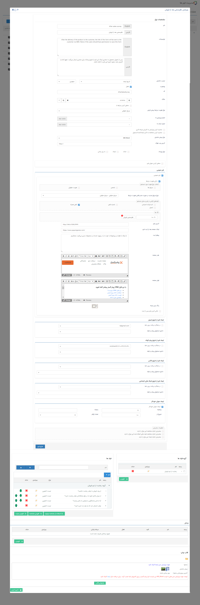
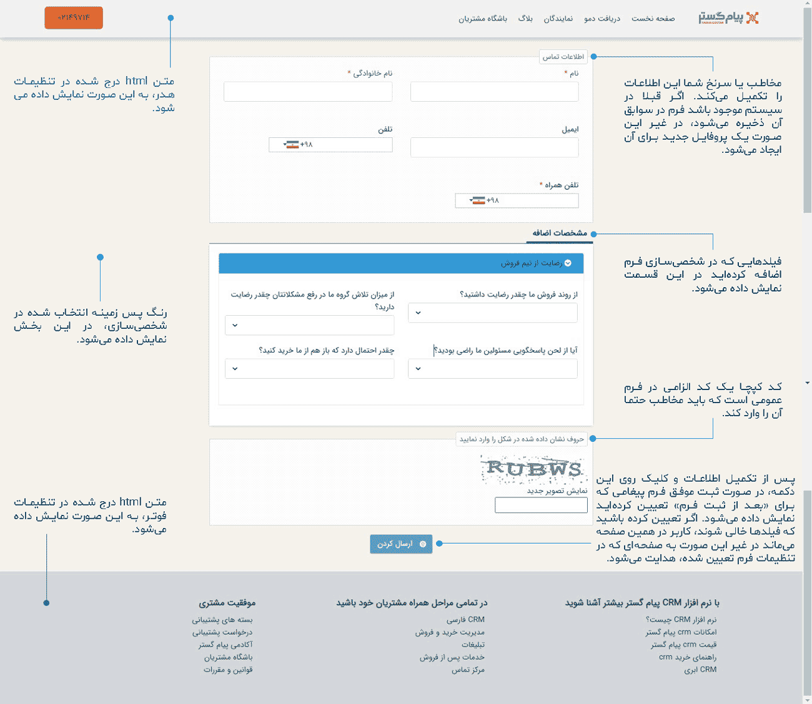

# تنظیمات فرم عمومی

در شخصی‌سازی فرم‌ها، این امکان وجود دارد فرمی تهیه کنید که سرنخ‌ها و مخاطبانتان خارج از نرم‌افزار و از طریق سایت، اطلاعاتی را ثبت کنند. مثلا برای فرم‌های نظرسنجی، استخدام، ثبت سفارش و یا ثبت‌نام قابلیت **فرم عمومی** بهترین ابزار است.
### تنظیمات مشترک شخصی‌سازی فرم
برای ایجاد یک فرم عمومی از مسیر **تنظیمات** > **شخصی‌سازی CRM** > **مدیریت فرم‌ها** اقدام کنید. ایجاد یک فرم عمومی در بخش اول تنظیمات مشترکی مثل سایر فرم‌ها دارد که جزئیات آن را در مقاله [شخصی‌سازی فرم](https://github.com/1stco/PayamGostarDocs/blob/master/help2.5.4/Settings/Personalization-crm/Form-management/2.6.0/Form-customize-setting.md) می‌توانید مطالعه کنید.

### تنظیمات اختصاصی فرم عمومی
با فعال کردن **چک باکس فرم عمومی**، به این نوع فرم آدرسی (URL) اختصاص داده می‌شود که می‌توانید از این آدرس در سایت خود (یا ارسال آدرس برای مخاطبان) برای اهداف مختلف استفاده کنید. در اصل این فرم برای مواقعی که می‌خواهید مخاطبان یا سرنخ‌هایتان بدون ورود به نرم‌افزار اطلاعاتی را تکمیل کنند، کاربرد دارد.

##### تنظیمات هویت مرتبط فرم عمومی
برای استفاده از فرم عمومی می‌توانید تعیین کنید که هنگام ذخیره، فرم پروفایل مرتبط داشته باشد. این امکان وجود دارد که اگر هویت مرتبط از قبل در سیستم موجود باشد، فرم در سوابق آن ذخیره شود و در غیر این صورت سرنخ جدید به ازای فرم ثبت شده ایجاد می‌گردد. 
- **ذخیره فرم بدون پروفایل مرتبط** 
   اگر چک باکس **دارای هویت مرتبط** را فعال نکنید فرم در هر صورت بدون هیچ هویتی و تنها با فیلدهای اضافه‌ای که در آن تنظیم کرده‌اید، ذخیره می‌شود بنابراین صفحه‌ای که مخاطب شما از فرم مشاهده می‌کند به شکل زیر خواهد بود (فیلدهای اطلاعات تماسی را ندارد).

فرم‌های عمومی‌ای که ذخیره می‌شوند را در قسمت **اتوماسیون و فرآیندهای سازمانی** > **فرم‌ها** > **زیرنوع مورد نظر** می‌توانید مشاهده کنید. لازم به ذکر است همانطور که در تصویر زیر مشاهده می‌کنید فرم عمومی بدون هویت مرتبط در لیست فرم‌ها نیز پروفایل مرتبط نخواهد داشت.

- **ذخیره فرم با پروفایل مرتبط** 
   برای اینکه فرم عمومی شما حتما با یک پرفایل مرتبط ذخیره شود، لازم است چک باکس **دارای هویت مرتبط** را فعال کنید. در این‌ صورت هنگام ذخیره فرم در سایت، فیلدهای اطلاعات هویتی و تماسی بر اساس نوع هویت تعیین شده (حقیقی یا حقوقی) در قسمت **نوع سرنخ جدید در صورت عدم یافتن هویت مرتبط** نمایش داده می‌شود. 

> **نکته** 
> هویتی که از طریق فرم عمومی ذخیره می‌شود تنها به صورت **سرنخ حقیقی یا حقوقی** بوده که باید از قبل زیرنوع سرنخ مورد نظر خود را در بخش شخصی‌سازی CRM ایجاد کرده باشید.

اگر نوع هویت را **سرنخ حقوقی** انتخاب کنید صفحه‌ای که مخاطب شما در سایت مشاهده می‌کند به شکل زیر خواهد بود.

و در صورت انتخاب نوع **سرنخ حقیقی**، اطلاعات تماسی هویت در فرم عمومی همراه با نام و نام خانوادگی خواهد بود.

- **الزامی کردن اطلاعات تماسی** 
   زمانی که یکی یا همه فیلدهای نام، نام خانوادگی، نام شرکت/سازمان، شماره تلفن، تلفن همراه و ایمیل را الزامی کنید هنگام ذخیره فرم عمومی، این فیلدها به صورت ستاره‌دار نمایش داده شده و بدون تکمیل این اطلاعات فرم ذخیره نخواهد شد. 
   از طرفی هر کدام از این فیلدها که الزامی باشند، مبنای جستجوی هویت در سیستم خواهد بود در صورتی که هویت تکراری با یکی از این اطلاعات یافت شود، فرم در سابقه هویت موجود در سیستم ذخیره خواهد شد و دیگر سرنخ جدید ساخته نخواهد شد.
- **تنظیمات جستجوی پروفایل مرتبط** 
   از طریق **انتخاب نوع هویت مورد جستجو** می‌توانید تعیین کنید اطلاعاتی که سرنخ شما هنگام ذخیره فرم عمومی تکمیل کرده است، در کدام یک از انواع هویت (سرنخ‌ها، شخص و هویت حقوقی) جستجو شود. در نتیجه‌ی جستجو، اگر هویت مرتبط اطلاعاتش قبلا در سیستم موجود بود فرم عمومی در سوابق آن ذخیره می‌شود در غیراینصورت یک سرنخ جدید با این اطلاعات ایجاد می‌کند. لازم به ذکر است می‌توانید از گزینه‌های **سرنخ‌ها**، **شخص** و **هویت حقوقی** یک یا هر سه گزینه را انتخاب نمایید. 

> **نکته** 
> مسیر [دخیره اطلاعات](https://github.com/1stco/PayamGostarDocs/blob/master/help2.5.4/Settings/General-settings/User-category/User-category.md) سرنخ‌هایی که از طریق فرم عمومی ایجاد می‌شوند، در قسمت **تنظیمات کلی** > **دسته‌بندی کاربران** > **گروه پیش فرض ذخیره مشتریان** > **سرنخ** تعیین می‌شود.

- **تگ‌گذاری روی فرم‌های ذخیره شده** 
  از قسمت **تگ‌ها** می‌توانید برای هویت‌های مرتبط با فرم عمومی ذخیره شده، تگ تعیین کنید که در جستجوی پیشرفته یا گزارشات از آن استفاده کنید.
- **آدرس فرم عمومی**  
   این آدرس URL را باید در اختیار مخاطبان و سرنخ‌های خود قرار دهید تا با مراجعه و ذخیره فرم، اطلاعات آن‌ها را جمع‌آوری کنید.
- **لینک صفحه بعد از ثبت فرم عمومی** 
  بهتر است صفحه‌ای را طراحی کنید و آدرس URL آن را در این قسمت وارد کنید که مخاطب شما پس از ذخیره فرم به آن صفحه ارجاع داده شود. به عنوان مثال صفحه نتیجه ثبت فرم نظرسنجی.
- **پیغام ثبت موفقیت آمیز فرم** 
   می توانید در این قسمت متنی را جهت نمایش به مخاطب پس از ثبت موفق فرم، تنظیم کنید.
- **هدر صفحه** 
  می‌توانید با متن html هدر صفحه فرم عمومی خود را طراحی کنید.
- **فوتر صفحه** 
   می‌توانید با متن html فوتر صفحه فرم عمومی خود را طراحی کنید.
- **رنگ پس زمینه** 
   برای صفحه فرم عمومی خود می‌توانید یک رنگ پس زمینه انتخاب کنید.
- **خالی کردن فرم پس از ثبت**  
   در صورت فعال بودن این گزینه، پس از ثبت موفق فرم، مقادیر وارد شده در فیلدهای آن خالی می شوند تا بتوانید فرم جدیدی ثبت کنید. توجه داشته باشید برای استفاده از این قابلیت، باید "لینک صفحه بعد از ثبت فرم"را خالی بگذارید. در غیر این صورت پس از ثبت فرم، به لینک تعیین شده هدایت می شوید و امکان ثبت فرم جدید وجود ندارد.

> **نکته** 
> توجه داشته باشید در صورت فعال بودن چرخه کاری روی فرم، در هنگام ثبت، فیلدهایی که در وضعیت (کارتابل یا فعالیت) اولیه فرایند، روی حالت نمایش تنظیم شده اند، به مخاطب نمایش داده خواهند شد.

در نهایت پس از اعمال تغییرات مورد نظر خود، آیتم فرم را ذخیره نمایید. فرمی که ایجاد کرده‌اید برای مخاطب/سرنخ شما به شکل زیر خواهد بود.

