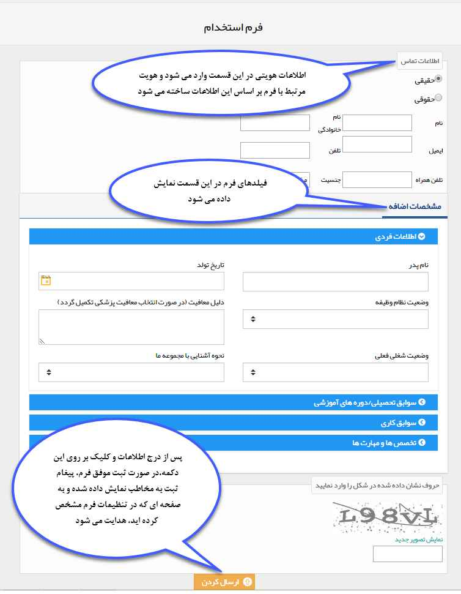

# تنظیمات فرم عمومی

با فعال کردن چک باکس "فرم عمومی"، به این نوع فرم آدرسی اختصاص داده می‌شود که می‌توانید از این آدرس در سایت خود (یا ارسال آدرس برای مخاطبان) برای اهداف مختلف مثل فرم نظرسنجی، ثبت‌نام، ثبت سفارش یا استخدام استفاده کنید. 
برای ایجاد یک فرم عمومی در قسمت **تنظیمات** > **شخصی‌سازی CRM** > **مدیریت فرم‌ها** یک زیرنوع فرم ایجاد کنید. 
### شخصی‌سازی فرم عمومی 
. برای اینکه قابلیت عمومی شدن فعال شود، باید یکبار زیرنوع ساخته شده ذخیره شود تا آدرس UR به آن تعلق گیرد.

###### تنظیمات هویت مرتبط فرم عمومی

به کمک چک باکس **دارای هویت مرتبط** می‌توانید تعیین کنید مخاطبی که این فرم را ذخیره می‌کند اگر در دیتابیس شما قبلا اطلاعاتش ثبت نشده باشد، پس از ذخیره یک هویت جدید برایش ایجاد نماید. در غیر این صورت اگر هویت مرتبط با آن در دیتابیس وجود داشته باشد، فرم در سوابق آن ذخیره می‌شود. 

**انتخاب نوع هویت مورد جستجو**: به کمک این گزینه می‌توانید تعیین کنید سیستم در کدام دسته از هویت‌ها، نام هویت مرتبط با فرم عمومی  را جستجو کند. در نتیجه جستجو اگر هویت مرتبط اطلاعاتش قبلا در سیتستم موجود بود، فرم عمومی در سوابق آن ذخیره می‌شود. می‌توانید از گزینه‌های **سرنخ‌ها**، **شخص** و **هویت حقوقی** یک یا هر سه گزینه را انتخاب نمایید. 
**نوع سرنخ جدید در صورت عدم یافتن هویت مرتبط**: برای حالتی که هویت مرتبط فرم عمومی قبلا در سیستم موجود نباشد، به کمک این گزینه تعیین می‌کنید که هویت جدید در کدام زیرنوع سرنخ ایجاد شود. نکته مهم در این قسمت این است که هویتی که از این مسیر ذخیره می‌شود، فقط می‌تواند سرنخ باشد. چون در گذشته هیچ گونه ارتباطی با آن نداشته‌اید بنابراین بعد از بررسی اطلاعات آن می‌توانید به مخاطب تبدیلش کنید.

> **نکته**
> مسیر [دخیره اطلاعات سرنخ‌هایی](https://github.com/1stco/PayamGostarDocs/blob/master/help2.5.4/Settings/General-settings/User-category/User-category.md) از طریق فرم عمومی ایجاد می‌شوند، که در قسمت **تنظیمات کلی** > **دسته‌بندی کاربران** > **گروه پیش فرض ذخیره مشتریان** تعیین می‌شود.

**فیلدهای الزامی در فرم و مبنای جستجو**: در این قسمت تعیین می‌کنید که کدام اطلاعات هنگام ثبت فرم الزامی هستند. زیرا این فیلدها مبنای جستجوی هویت در دیتابیس نیز هستند. مثلا اگر تلفن همراه را الزامی کنید، در صفحه فرم عمومی الزامی بوده از طرفی برای جستجوی آن در دیتابیس بر اساس همین فیلد جستجو انجام می‌شود.

**تگ‌ها**: از این قسمت می‌توانید برای هویت‌هایی که از طریق فرم عمومی ایجاد می‌شوند تگ تعیین کنید که در جستجوی پیشرفته یا گزارشات از آن استفاده کنید.

**آدرس فرم:** آدرسی که از طریق آن می توان یک فرم جدید ایجاد و ارسال کرد را نشان می دهد.

**لینک صفحه بعد از ثبت فرم:** می توانید تعیین کنید که مخاطب پس از ثبت فرم به یک صفحه دلخواه هدایت (redirect) شود.

**پیغام ثبت:** می توانید در این قسمت متنی را جهت نمایش به مخاطب پس از ثبت موفق فرم، تنظیم کنید.

**هدر صفحه**: می‌توانید یه کمک متن html هدر صفحه فرم عمومی خود را طراحی کنید.

**فوتر صفحه**: می‌توانید به کمک متن html فوتر صفحه فرم عمومی خود را طراحی کنید.

**رنگ پس زمینه**: برای صفحه فرم عمومی خود می‌توانید یک رنگ پس زمینه انتخاب کنید.

**خالی کردن فرم پس از ثبت:** در صورت فعال بودن این گزینه، پس از ثبت موفق فرم، مقادیر وارد شده در فیلدهای آن خالی می شوند تا بتوانید فرم جدیدی ثبت کنید. توجه داشته باشید برای استفاده از این قابلیت، باید "لینک صفحه بعد از ثبت فرم"را خالی بگذارید. در غیر این صورت پس از ثبت فرم، به لینک تعیین شده هدایت می شوید و امکان ثبت فرم جدید وجود ندارد.

> **نکته**
> توجه داشته باشید در صورت فعال بودن چرخه کاری روی فرم، در هنگام ثبت، فیلدهایی که در وضعیت (کارتابل یا فعالیت) اولیه فرایند، روی حالت نمایش تنظیم شده اند، به مخاطب نمایش داده خواهند شد.

