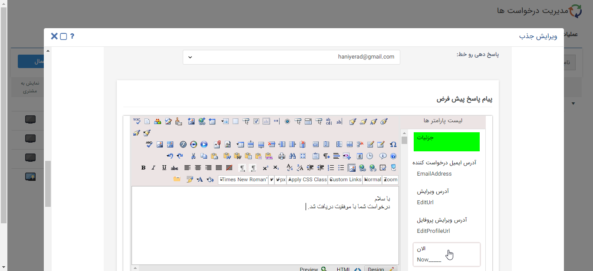

# تعریف خط برای ثبت درخواست 

در فیلد پاسخ دهی روی خط می‌توان تعیین کرد این درخواست بر روی کدام خط ایمیل فعال باشد، در واقع ایمیل های دریافتی روی کدام خط به صورت خودکار پاسخ داده شود و شماره پیگیری دریافت نمایند.

> **نکته:** در این قسمت امکان انتخاب ایمیل‌های پرتال اول وجود ندارد.

**پیام پاسخ پیش‌فرض:** در صورت دریافت هر ایمیل بر روی خط مشخص شده، این پیام تنظیم شده به صورت خودکار برای فرستنده ایمیل ارسال می شود.

