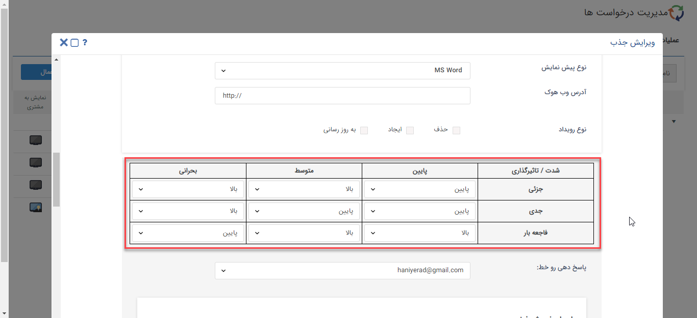

## تنظیمات اولویت درخواست 

>  مسیر دسترسی:  **تنظیمات** >**شخصی سازی crm** > **مدیریت درخواست‌ها** > **ماتریس اولویت** 

درخواست‌های پشتیبانی برای بررسی دارای اولویت می‌باشند، برای تعریف این اولویت می‌توان از ماتریس اولویت استفاده کرد. 

در ماتریس اولویت در سطر اول مقادیر فیلد تاثیر گذاری و در ستون اول مقادیر فیلد شدت  نمایش داده می شود، در این ماتریس می‌توان به ازای هر مقدار شدت و تاثیر گذاری یک اولویت را تعیین کرد.

**برای نمونه:** طبق تصویر اگر شدت درخواست ،در وضعیت جزئی  و تاثیرگذاری درخواست در وضعیت پایین باشد طبق تعریف انجام شده در این بخش، اولویت آن درخواست  پایین در نظر گرفته می شود . 

مقدار فیلدهای شدت،تاثیرگذاری و اولویت در مدیریت آیتم های سیستم قابل مشاهده می باشد.

