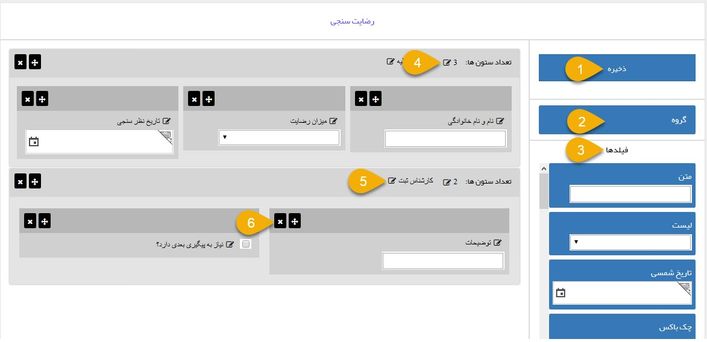

## طراح فرم

> مسیر دسترسی: **تنظیمات** < **شخصی سازی** < **نمای کلی**  < **ویرایش نوع/افزودن زیر نوع**

این ابزار اجازه ویرایش و طراحی فرم یا سایر آیتم ها را به صورت شماتیک (تصویری) در اختیار کاربر قرار می دهد.

میتوانید گروه فیلدی و فیلدهای مورد نظر را با کشیدن و جایگذاری (Drag&Drop) کردن در صفحه  به صورت دلخواه بچینید.

1. ذخیره: فیلدهای تغییر یافته و اضافه شده را ذخیره می کند.

2. گروه فیلد: برای اضافه کردن فیلد باید ابتدا گروه آن را ایجاد کنید، بر روی گروه کلیک کرده و آن را به داخل صفحه طراحی بکشید. برای هر گروه باید عنوان و تعداد ستونی که فیلدهای اضافه شده در کنار هم باید به نمایش درآیند را مشخص کنید.

3. فیلدها: انواع فیلدها در این قسمت وجود دارد که میتوانید آنها را به داخل صفحه بکشید. برای هر فیلد باید عنوان آن را وارد کنید.
 
> نکته: در نظر داشته باشید که فیلدهایی که حاوی مقادیر و تنظیمات بیشتر هستند (مانند لیست، عدد و ...) باید پس از ساختن آنها به قسمت ویرایش آیتم رفته و مقادیر را در آنها درج کنید

> نکته: برای آشنایی بیشتر با انواع فیلدهای موجود و کاربرد آنها، قسمت [ افزودن مشخصه](https://github.com/1stco/PayamGostarDocs/blob/master/help%202.5.4/Settings/Personalization-crm/Overview/General-information/Add-features/Add-features.md) را مطالعه کنید.

4. تعداد ستون ها: با کلیک بر روی علامت ویرایش، تعداد ستون هر گروه فیلد را مشخص کنید.

5. عنوان: با کلیک بر روی علامت ویرایش، نام فیلد یا گروه فیلد مورد نظر را وارد کنید.

6. حذف: هر فیلد را در صورت نیاز می توانید حذف کنید

