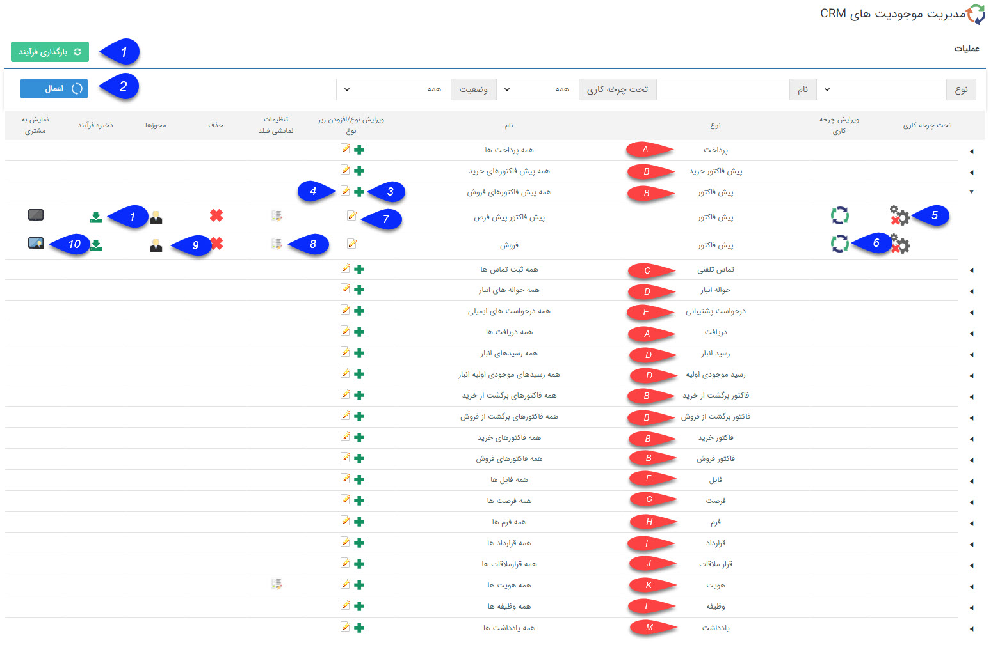

## اطلاعات کلی 

> مسیر دسترسی : **تنظیمات** > **شخصی سازی crm** < **نمای کلی**

شخصی سازی CRM

از این صفحه می توانید تمام موجودیت های ( آیتم های ) پیام گستر را شخصی سازی کنید.

منظور از شخصی سازی امکان ایجاد و یا ویرایش آیتم ها ، طراحی ،فعالسازی، ذخیره و بارگزاری چرخه،تنظیمات نمایشی فیلد های آیتم هاو تنظیمات مجوز های مربوط به هر آیتم می باشد.

در این صفحه لیست موجودیت ها(فرم) و زیر نوع موجودیت ها(فرم مرخصی ) نمایش داده می شود .

برای شخصی سازی موجودیت ها، کاربر نیازمند مجوز مدیریت شخصی سازی crm  می باشد (برای تعریف این مجوز از قسمت مدیریت مجوز ها بخش مجوز های عمومی اقدام کنید) و برای شخصی سازی زیر نوع موجودیت ها کاربر نیاز مند مجوز شخصی سازی روی آن زیر نوع می باشد( از قسمت مدیریت مجوز ها بخش دسترسی موجودیت ها اقدام کنید)

1. **ذخیره و بارگذاری فرآیند:** اجازه وارد کردن یک آیتم همراه با فرآیند آن را در نرم افزار می دهد. برای اطلاعات بیشتر، قسمت ذخیره و بارگذاری فرآیند را مطالعه کنید. 

2. **اعمال فیلتر:** می توانید انواع آیتم ها را فیلتر کنید. این فیلترها شامل نوع آیتم، نام آن ها، وضعیت فعال/غیرفعال بودن آیتم و اینکه چرخه فعال کاری دارند یا خیر، می شود.

3. اضافه کردن: با انتخاب آیکون + می توانید زیرنوع جدیدی را اضافه نماید. به طور مثال برای فاکتور امکان ساختن زیر نوع های مختلف فراهم شده است. زیر نوع هایی با مشخصات کاملاً متفاوت در درصد مالیات، شماره شروع فاکتور، مجوز تأیید و حتی قالب پیش نمایش آنها.

4. ویرایش فیلد های اضافه به موجودیت اصلی: امکان تعریف فیلد اضافه  را در اختیار شما قرار می دهد. هر فیلدی که در این قسمت اضافه شود. در تمامی زیرنوع های آن آیتم اضافه خواهد شد. (برای مثال اگر شما یک فیلد به نام "محل تحویل" از نوع لیست در آیتم فاکتورها اضافه کنید، در تمامی انواع فاکتورهایی که دارید، این فیلد نمایش داده می شود.)

این امکان برای تعریف کردن فیلدهای مشترک بین آیتم های مختلف بسیار مفید است.

5. فعال/غیرفعال کردن چرخه: با کلیک بر روی آیکون تحت چرخه کاری، فرآیند طراحی شده بر روی آیتم انتخاب شده فعال می گردد. تیک سبز رنگ در کنار آیکون چرخه به معنی فعال بودن چرخه کاری بر روی آیتم است و ضربدر قرمز رنگ به معنی غیر فعال بودن چرخه کاری برروی آیتم است.                         

6. ویرایش چرخه کاری: با کلیک بر روی آیکون ویرایش چرخه کاری پنجره ای باز می شود و امکان طراحی فرآیند بر روی آیتم انتخاب شده فراهم می گردد.

(برای اطلاعات بیشتر به لینک طراحی چرخه کاری مراجعه نمایید.)

7. ویرایش یک موجودیت: با کلیک بر روی این آیکون میتوانید موجودیت مورد نظر را ویرایش کنید.

8. تنظیمات نمایش فیلد: برای هر آیتم می توانید مشخص کنید که کدامیک از فیلدها جهت نمایش در لیست انتخاب شوند و یا اینکه در خلاصه نمایش داده شوند.

> نکته: امکان تغییر ترتیب قرار گرفتن ستون فیلدها در جداول از تب "ترتیب نمایش" امکان پذیر است.

9. مجوزها: مجوزهای هر آیتم را میتوانید تعیین کنید. برای اطلاعات بیشتر در این خصوص قسمت های دسترسی های موجودیت ها و تعریف مجوزهای آیتم  را مطالعه کنید.

10. نمایش به مشتری: در صورتی فعال یودن ماژول باشگاه مشتریان و انتخاب آیکون نمایش به مشتری، مشتریان شما با مراجعه به داشبورد خود، در صورت داشتن این نوع آیتم می توانند آن را در پروفایل خود مشاهده نمایند.

 
