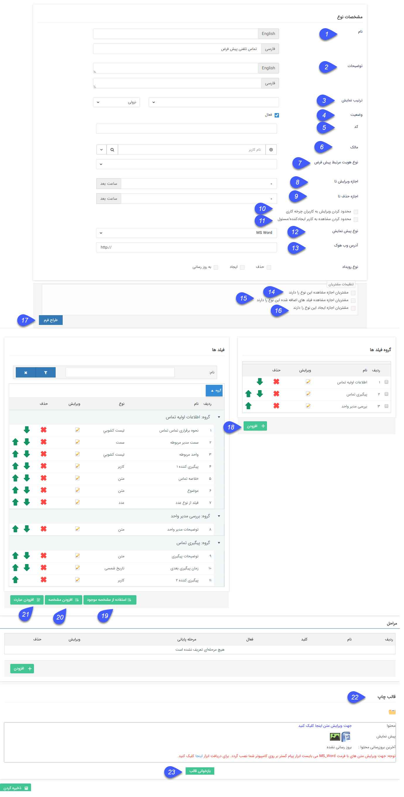

## تنظیمات مشترک آیتم های سیستم

> مسیر دسترسی: **تنظیمات** < **شخصی سازی** < **نمای کلی**  < **ویرایش نوع/افزودن زیر نوع**

در این قسمت تنظیماتی که در ویرایش تمامی آیتم های نرم افزار پیام گستر مشترک است را مشاهده می کنید، توجه داشته باشید که علاوه بر این قسمت باید آیتم های حقوقی/مالی/حواله انبار را نیز مطالعه کنید، یادگیری این قسمت در طراحی چرخه حائز اهمیت است.

موارد زیر در تمامی آیتم های سیستم به صورت مشترک وجود دارد:    
       
1. نام: می توانید نام آیتم را به دلخواه خود تعیین کنید.
 
2. توضیحات: می توانید توضیحات مرتبط با آیتم را بنویسید.
 
3. ترتیب نمایش : با این امکان، میتوانید لیست آیتم‌ها را براساس فیلد مورد نظر خود مرتب‌سازی کنید.
فیلدهایی که امکان مرتب سازی آیتم ها براساس آن ها وجود دارد تنها فیلد های اضافه شده ی از نوع عدد ،شناسه خودکار،تاریخ شمسی و تاریخ میلادی که دارای الزام می باشند که 
 به موجودیت های اصلی و زیر نوع موجودیت ها افزوده گردیده است.

> نکته :  اگر مقادیر فیلد انتخاب شده برای مرتب سازی، در بین آیتم ها یکسان باشد، حالت نمایش این آیتم ها در لیست، براساس تاریخ ایجاد و به صورت نزولی خواهد بود . 

برای نمونه فرض کنید به آیتم فرم یک فیلد با عنوان تاریخ مرخصی اضافه کرده ایم و ترتیب نمایش فرم را براساس این فیلد تنظیم کرده ایم.

 اگر فرم هایی با یک تاریخ مرخصی یکسان وجود داشته باشند، ترتیب نمایش بین این چند فرم در لیست براساس تاریخ ایجاد و به صورت نزولی میباشد.
 
 > نکته :  قابل ذکر است تنها لیست آیتم ها براساس این ترتیب نمایش تعریف شده، مرتب سازی میگردد، و در سایر بخش ها مانند بانک یکپارچه و تب سوابق هویت و ... چینش آیتم ها به صورت قبل است.

> نکته :  قابل ذکر است که ترتیب نمایش آیتم ها در لیست ها بصورت پیش فرض براساس تاریخ ایجاد آیتم و نزولی است

4. وضعیت : با غیر فعال کردن هر آیتم، اجازه ذخیره آن را از کاربران خواهید گرفت. به این معنی که کاربران دیگر نمیتوانند مورد جدیدی از آن آیتم را ذخیره کنند. (برای مثال اکر یک فرم را غیرفعال کنید، کاربران نمیتوانند از آن فرم مورد جدیدی را ذخیره کنند.)

در نظر داشته باشید که اگر آیتم مورد نظر دارای فرآیند باشد، فرآیند همچنان به کار خود ادامه خواهد داد. (برای غیر فعال کردن فرآیند آن به مورد 6 در قسمت  [اطلاعات کلی ](https://github.com/1stco/PayamGostarDocs/blob/master/help%202.5.4/Settings/Personalization-crm/Overview/General-information/General-information.md)مراجعه کنید.)

5. کد: می توانید کد دلخواه (برای مثال کد ایزو (ISO) سازمانی را) در این قسمت وارد کنید. این کد فقط شامل اعداد و حروف می تواند باشد و همچنین این کد قابلیت استفاده در وب سرویس را دارد.

6 مالک: به قسمت[ مالک آیتم](https://github.com/1stco/PayamGostarDocs/blob/master/help%202.5.4/Settings/Personalization-crm/Overview/General-information/Item-owner/Item-owner.md)  مراجعه کنید.

7. نوع هویت مرتبط پیش فرض: در این قسمت می توانید نوع هویت پیش فرض برای ایجاد هویت مرتبط با آیتم را که که از قسمت مرتبط با هر آیتم ایجاد میشود را انتخاب کرد. 
 
8. اجازه ویرایش تا: در صورتی که فیلد "اجازه ویرایش تا" را با یک مقدار عددی به ساعت پر نمایید. تنها تا مدت زمان عددی قبل از این  مقدار اجازه ویرایش به ایجاد کننده آیتم داده خواهد شد
(حتی در صورت دارا بودن مجوز ویرایش آیتم، باز هم کاربر امکان ویرایش بعد از این زمان را ندارد).در صورت خالی بودن فیلد، اجازه ویرایش برای کاربر ایجادکننده آیتم آزاد است.
 
9. اجازه حذف تا: در صورتی که فیلد " اجازه حذف تا" را با یک مقدار عددی به ساعت پر نمایید. تنها تا مدت زمان عددی قبل از این  مقدار اجازه حذف به ایجادکننده آیتم داده خواهد شد.
 (این محدودیت برای کاربرانی که اجازه حذف آن آیتم را دارند صدق نمی کند). در صورت خالی بودن فیلد، اجازه حذف برای کاربر ایجادکننده آیتم آزاد است.
 
 
10. محدود کردن ویرایش به کاربران چرخه کاری: زمانی معنی پیدا می کند که بر روی این آیتم، فرآیند تعریف و فعال شده باشد و در غیر این صورت تاثیری نخواهد داشت. 
فقط کاربری که مسئول کارتابل است می تواند آیتم را ویرایش کند،اگر مسئول یکی از مراحل دیگر باشد هم امکان ویرایش ندارد، بافعال کردن این گزینه حتی اگر کاربر ایجاد کننده باشد و یا مجوز ویرایش هم داشته باشد ، نمی تواند آیتم را ویرایش کند .
 
11. محدود کردن مشاهده به کاربر ایجاد کننده/ مسئول:  با فعال کردن این گزینه تنها کاربر ایجاد کننده و یا مسئول آیتم (مثلا در فرصت کاربری که در فیلد "تخصیص داده شده یه" وارد می شود به عنوان مسئول فرصت شناخته می شود) می توانند آیتم را مشاهده کنند. 
 
12. نوع پیش نمایش: می توان فرمت پیش نمایش مرتبط با این آیتم را به صورت ورد (قابل ویرایش پس از پیش نمایش گرفتن) یا عکس یا pdf تنظیم کرد.
 
13. وب هوک: به عنوان یکی از امکانات نرم افزار، شما از این قسمت می توانید تعیین کنید که پس از هر بار ایجاد، به روز رسانی و ویرایش این آیتم یک آی دی مبنی بر تغییر آیتم به آدرسی که در این قسمت تعیین می کنید فرستاده شود.
 این امکان برای ارتباط این آیتم با یک وب سرویس بیرونی در نظر گرفته شده و قابل استفاده توسط برنامه نویسان است. (برای مثال ارتباط با نرم افزار حسابداری یا یک وب سایت و ...)
 
14. مشتریان اجازه مشاهده این نوع را دارند: با فعال کردن این گزینه مشتریان با ورود به صفحه تاریخچه من[ باشگاه مشتریان](https://github.com/1stco/PayamGostarDocs/blob/master/help%202.5.4/Supplementary-modules/customer-club/Customer-dashboard/Customer-dashboard.md) خود می توانند آیتم هایی از این نوع را که در سوابق خود دارند مشاهده کنند. 
(برای مثال بتوانند پرداخت های خود را مشاهده کنند.)
 
15. مشتریان اجازه مشاهده فیلدهای اضافه شده به این نوع را دارند: با فعال بودن این گزینه مشتریان با باز کردن آیتم مربوطه در صفحه تاریخچه من [باشگاه مشتریان ](https://github.com/1stco/PayamGostarDocs/blob/master/help%202.5.4/Supplementary-modules/customer-club/customer-club.md)خود می توانند فیلد های اضافه شده
(جهت مشاهده تنظیمات اضافه کردن فیلد مورد 14 را مشاهده نمایید) در آیتم مربوطه را مشاهده کنند.  (برای مثال فیلد های اضافه شده به پیش فاکتور خود را مشاهده کنند.)
 
16. مشتریان اجازه ایجاد این نوع را دارند: با فعال بودن این گزینه مشتریان با ورود به صفحه   باشگاه مشتریان خود می توانند این نوع آیتم را ایجاد کنند. (برای مثال می توان اجازه ایجاد فرم نظر سنجی را به مشتریان عضو باشگاه مشتریان تخصیص داد.) 
 
نکته: برای اطلاعات بیشتر در این خصوص، قسمت [داشبورد مشتریان  ](https://github.com/1stco/PayamGostarDocs/blob/master/help%202.5.4/Supplementary-modules/customer-club/Customer-dashboard/Customer-dashboard.md)را مطالعه کنید.
 
 
17. طراح فرم: اجازه اضافه کردن فیلدها با استفاده از یک ویرایشگر شماتیک (تصویری) را فراهم می کند. برای اطلاع از جزییات بیشتر قسمت [ طراح فرم ](https://github.com/1stco/PayamGostarDocs/blob/master/help%202.5.4/Settings/Personalization-crm/Overview/General-information/Form-designer/Form-designer.md)را مطالعه کنید.
 
18. گروه فیلد ها: برای فیلدهایی که قصد ساخت آن را دارید نام و تعداد ستون های گروه آن را تعیین کنید.
 این کار به منظور دسته بندی فیلدهای ساخته شده صورت می پذیرد که سهولت استفاده از آن آیتم را در برخواهد داشت.
 
 19. استفاده از مشخصه موجود: برای کپی کردن فیلدهایی که  قبلا در آیتم دیگه ای ساخته شده اند می توانید از این ویژگی استفاده کنید.
 
 

روال کار به این صورت می باشد: 
 
A. آیتمی که فیلد مورد نظرتان در آن قرار دارد را  انتخاب کنید.
 
B. زیرنوع آیتم را انتخاب کنید.
 
C. فیلد مد نظر خود را انتخاب کنید.
 
D. گروه فیلدی که می خواهید فیلد مورد نظر در آن کپی شود را انتخاب کنید.
 
E. عنوانی به فیلد اختصاص دهید.
 
. کلید کاربر : در صورت استفاده از وب سرویس میتوانید به این فیلد کلید تخصیص دهید.

 متن راهنما : متن راهنمایی که با قرار گرفتن ماوس بر روی آن فیلد نمایش داده میشود را میتوانید از این بخش تنظیم کنید.
 
توجه کنید که پس از کپی شدن هیچ وابستگی ای بین فیلد اصلی و فیلد کپی شده وجود ندارد. به این معنی که ویرایش روی هر فیلد، به فیلد دیگر اعمال نمی شود.
 
20. افزودن مشخصه( فیلد ) :  فیلدهای خاص مربوط به آیتم خود را می توانید از قسمت فیلدها و دکمه افزودن مشخصه بسازید. 

  همچنین فیلد اضافه شده در قسمت پارامترهای هوشمند، به عنوان فیلدهای آیتم نمایش داده می شود. .برای ساخت فیلدها فقط کافیست نام فیلد، نوع فیلد( یکی از انواع متن، لیست، چک باکس و ...) و گروه فیلدی مربوطه را انتخاب نمایید.
(برای اطلاعات تکمیلی در خصوص انواع فیلدها به  [افزودن مشخصه](https://github.com/1stco/PayamGostarDocs/blob/master/help%202.5.4/Settings/Personalization-crm/Overview/General-information/Add-features/Add-features.md)  مراجعه کنید.) 

21. افزودن عبارت: در این قسمت می توانید یک عبارت ثابت وارد کرده و از آن در تنظیم قالب چاپی استفاده نمایید. این عبارت به عنوان یکی از فیلدهای آیتم نمایش داده نخواهد شد و تنها می توانید از پارامتر هوشمند آن برای تنظیم قالب چاپی (پیش نمایش) آیتم ها استفاده کنید. (به طور مثال اگر در پیش نمایش تعداد زیادی از فرم ها و سوابق دیگر، آدرس شرکت را درج میکنید، می توانید آدرس را به عنوان یک عبارت در قسمت سوپرفیلدهای هویت تعریف نموده و از آن در تنظیم قالب چاپی تمامی آیتم ها استفاده کنید)

22.  قالب چاپ: در این قسمت می توانید قالب چاپ (پیش نمایش) آیتم را تنظیم کنید. برای اطلاع از چگونگی انجام این کار به قسمت  [تنظیم قالب چاپ ](https://github.com/1stco/PayamGostarDocs/blob/master/help%202.5.4/Settings/Personalization-crm/Overview/General-information/Set%20the-print-template/Set%20the-print-template.md)مراجعه کنید.

23. بازخوانی از قالب: برای برخی از آیتم های (مانند پیش فاکتور یا فاکتور فروش) یک قالب چاپی پیشفرض در نرم افزار پیام گستر طراحی شده است، با استفاده از این دکمه می توان قالب پیشفرض نرم افزار را جایگزین قالب چاپ فعلی کرد.

24. مراحل : برای مطالعه بیشتر به [بخش مرحله بندی](https://github.com/1stco/PayamGostarDocs/blob/master/help2.5.4/Settings/Personalization-crm/Overview/General-information/leveling/leveling.md) مراجعه کنید .

تنظیمات نمایشی فیلد در لیست

در این قسمت میتوانید تنظیمات نمایشی فیلد های آن آیتم برای نمایش در لیست و درقسمت خلاصه را تنظیم کنید.

> نکته : برای دسترسی به این بخش بایستی کاربر مجوز مدیریت شخصی سازی crm را داشته باشد.

> نکته: امکان انجام این تنظیمات روی کلیه موجودیت های اصلی و زیر نوع های آنها وجود دارد.

با انتخاب این گزینه، میتوان تعیین کرد که چه فیلد هایی برای کاربر در لیست نمایش داده شود، کاربر میتواند از بخش تنظیمات لیست، از بین فیلد های مشخص شده در این بخش فیلد های مورد نظرش را برای نمایش در لیست و گزارش گیری از آن انتخاب کند.

لازم به ذکر است کاربر امکان مشخص کردن ترتیب نمایش ستون های لیست را خواهد داشت.

همچنین کاربر دارای مجوز می تواند مشخص کند که چه فیلدهایی در خلاصه سوابق نمایش داده شود.

> نکته : قابل ذکر است از طریق بخش تنظیمات نمایشی فیلدها بر روی موجودیت های اصلی نرم افزار تنها امکان انتخاب فیلد ها برای نمایش در لیست وجود دارد و نمیتوان تنظیمات نمایشی فیلدها در خلاصه را بر روی خود موجودیت اصلی تعریف کرد. زیرا در لیست آیتم ها برای هر آیتم بسته به نوع زیر نوع آن و مطابق تنظیمات صورت گرفته برای نمایش در خلاصه که برای همان زیر نوع خاص تعریف شده است، برخورد میشود.

1. وضعیت: در این قسمت می توانیم فیلدها را جهت نمایش در لیست آیتم ها انتخاب کنیم.

2. ترتیب نمایش:  در این قسمت می توانیم ترتیب قرار گرفتن فیلدها را در لیست آیتم ها مشخص کنیم.

> نکته: ترتیب قرار گرفتن محل قرار گرفتن فیلدها روی لیست برای کاربرانی که لیست ها را مشاهده می کنند، توسط عملیات drag & dropقابل ویرایش است.

با استفاده از اشاره گر ها می توانید ترتیب قرار گرفتن فیلد را تغییر دهید.

امکان جابجا کردن ستون ها لیست

کاربرانی که به لیست آیتم ها دسترسی دارند می توانند با عملیات   drag & drop محل قرار گرفتن ستون های جدول را جابجا کنند.

 برای مثال در شکل بالا با کلیک روی ستون"مبلغ باقیمانده" و کشیدن به یک ردیف عقبتر، اشاره گر آبی رنگی نمایش داده می شود که به محل جدید قرارگرفتن ستون "مبلغ باقیمانده" اشاره می کند.

