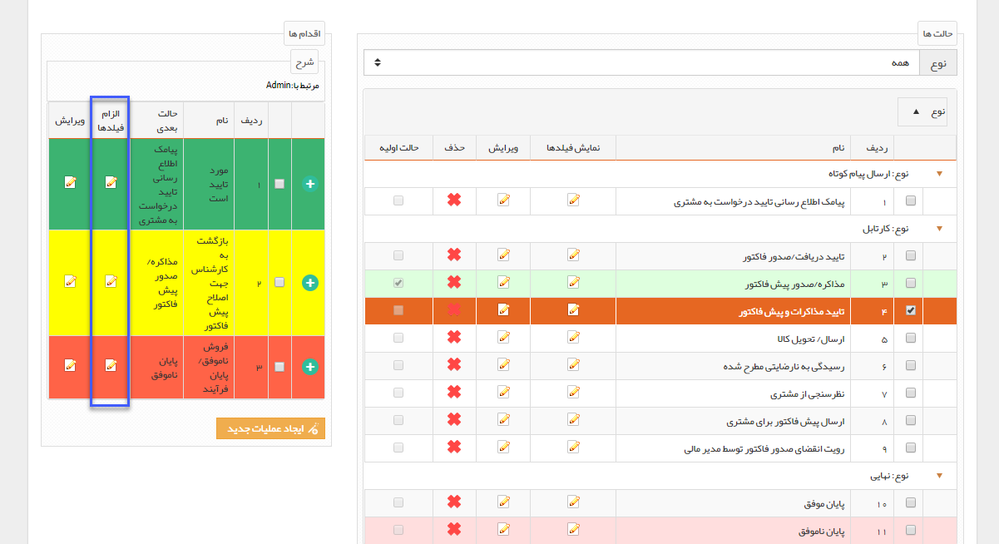
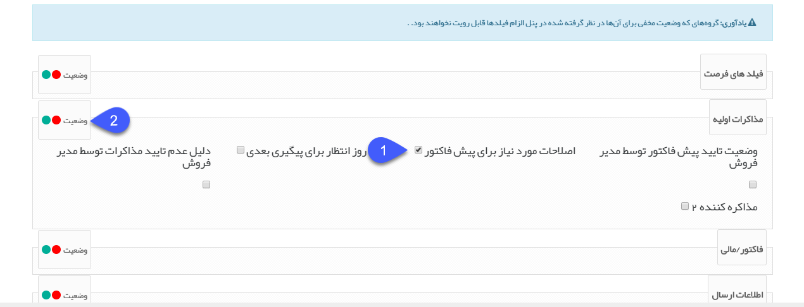

## الزام فیلدها

> مسیر دسترسی:  **تنظیمات** >**شخصی سازی crm** > **نمای کلی** > **کلید ویرایش چرخه کاری در هر موجودیت** > **کلیک بر روی کارتابل‌ها** > **اقدام‌ها** >**الزام فیلدها**

با استفاده از این قابلیت می توانید تکمیل برخی از فیلدها را برای استفاده از اقدام الزامی (ستاره دار) کنید، یعنی کاربر تا زمانی که فیلدهای مربوطه را پر نکند، نتواند فرآیند را به مرحله بعدی مشخص شده در این اقدام هدایت کند.

مثال: در گردش کار مثال بالا در صورتی که مدیر فروش بخواهد دکمه بازگشت به کارشناس جهت اصلاح پیش فاکتور را بزند، باید توضیحاتی برای نحوه اصلاح برای کارشناس وارد کند. برای ملزم کردن مدیر فروش به وارد کردن این توضیحات، می توانید به سادگی با الزامی کردن فیلد "اصلاحات مورد نیاز" برای این اقدام، از خطای کاربری منجر به خالی گذاشتن فیلد اجتناب کنید.

برای تنظیم فیلدهای الزامی هر اقدام، روی دکمه الزام فیلدهای مربوط به آن اقدام کلیک کنید.

با کلیک بر روی دکمه الزام فیلدها، لیست تمامی فیلدهایی که درکارتابل مربوط به این اقدام روی حالت نمایش قرار گرفته اند، نمایش داده خواهد شد و می توانید فیلدهای الزامی را تعیین کنید. توجه داشته باشید که در هر مرحله از فرآیند، تنها فیلدهایی قابل ویرایش هستند که روی حالت "نمایش" تنظیم شده باشند. برای اطلاع از چگونگی تنظیم حالت نمایش فیلدها، به توضیحات کارتابل مراجعه کنید.

1. لیست فیلدهایی که در کارتابل مربوط به این اقدام روی حالت نمایش تنظیم شده اند به تفکیک گروه فیلدها در این قسمت نمایش داده می شوند و می توانید به راحتی با فعال کردن چک باکس مربوط به هریک از فیلدها، آن را برای این اقدام الزامی کنید.

> نکته : در صورتی که فیلد در شخصی سازی الزامی شده باشد، در این قسمت هم بصورت الزام دار نمایش داده می شود و قابل ویرایش نمی باشد .

2. می توانید با استفاده از دکمه های موجود در این قسمت، تمامی فیلدهای یک گروه فیلد را به حالت الزام دار (رنگ سبز) یا بدون الزام (رنگ قرمز) تغییر دهید.

> نکته مهم: فیلدهای از نوع چک باکس قابلیت الزامی شدن را ندارند.

