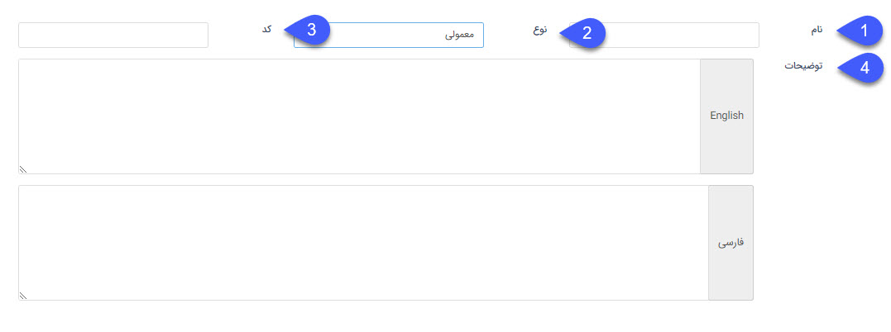
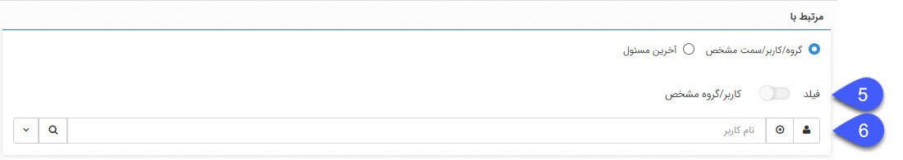
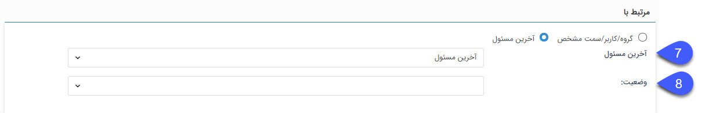
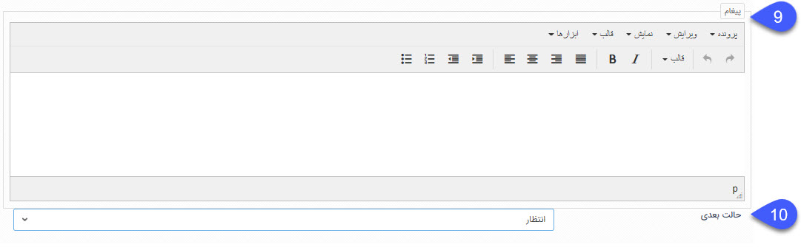

فعالیت اطلاع رسانی به کاربر
در فرآیندهای کاری، فعالیت جدیدی به نام اطلاع رسانی به کاربر اضافه شده است که با استفاده از فعالیت اطلاع رسانی به کاربر، می‌توان بصورت خودکار نظری را بر روی آن آیتم به کاربر یا گروه کاربری ارسال نمود.

 

1. نام: نام فعالیت را مشخص کنید.

2. نوع: نوع فعالیت را مشخص کنید. در صورتی که فعالیت ابتدای فرآیند باشد نوع فعالیت را اولیه گذاشته و در غیر اینصورت نوع  معمولی را انتخاب کرده.

3. کد: در این قسمت یک کد برای فعالیت مربوطه مشخص کنید. کاربرد فیلد کد بمنظور استفاده در وب سرویس است.

4. توضیحات: توضیحات تکمیلی را در این قسمت وارد نمایید.

 

می‌توان از بین گروه/کاربر/سمت مشخص و آخرین مسؤل مشخص کرد کارتابل بدست چه کاربری برسد.

در صورت انتخاب گروه/کاربر/ سمت مشخص:

5. فیلد: می‌توان از بین فیلدهای اضافه شده به آیتم، فیلدی را انتخاب کرد. آخرین مسئول کارتابل، مدیر آخرین مسئو کارتابل و رده بالایی آخرین مسئول کارتابل را انتخاب نمود.

6. می‌توان کاربر را از بین کاربر، گروه و سمت مشخص کرد.

 

در صورت انتخاب آخرین مسؤل:

7. می‌توان از بین آخرین مسؤل، مدیر آخرین مسؤل و رده بالایی آخرین مسؤل مشخص کرد کار وارد کارتابل چه سمتی شود.
8. وضعیت: مشخص کردن کارتابل مورد نظر.

 

9. پیغام: در این قسمت متن نظر خود را وارد نمایید.
10. حالت بعدی: مرحله بعد از فعالیت اطلاع رسانی به کاربر را از بین فعالیت‌ها و کارتابل‌های موجود در فرآیند مشخص کنید. 
