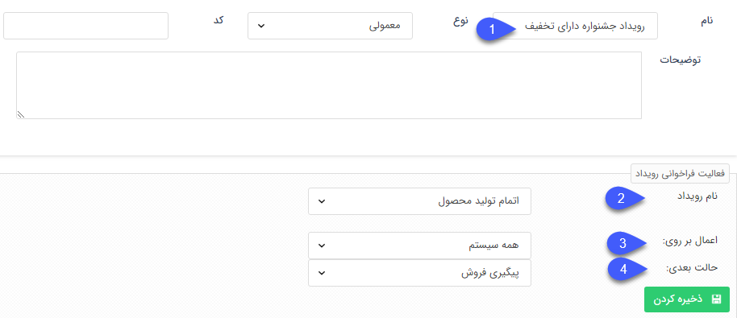
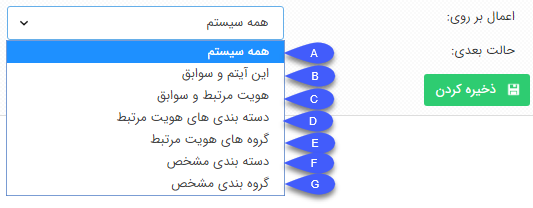

#  فعالیت فراخوانی رویداد  

با استفاده از این فعالیت  می توانید بین چرخه های کاری ارتباط برقرار کنید. به این صورت که بااستفاده از فعالیت  فراخوانی رویداد در یک فرآیند، یک یا چند فرآیند دیگر را از حالت انتظار خارج کنید. در واقع این فعالیت به صورت مجزا کاربردی ندارد مگر این که با فعالیت انتظاری ارتباط داشته باشد .

به طور مثال فرض کنید فرآیند فرصت فروش تمامی مخاطبانی که خواهان تخفیف هستند را با استفاده از یک فعالیت انتظار  تا زمان شروع جشنواره به حالت تعلیق در می آورید. در صورتی که یک فرآیند برای شروع کمپین های تبلیغاتی داشته باشید می توانید پس از پذیرش اجرای کمپین با فراخوانی یک رویداد تمامی فرصت های فروشی که در حالت انتظار از این نوع هستند را به صورت یکجا از حالت انتظار خارج کرده و به کارتابل کارشناس فروش جهت پیگیری هدایت کنید.

**1**.  نامی به فعالیت اختصاص دهید.

**2**.  از بین رویدادهای تعریف شده درلیست رویدادها تعریف کرده اید رویداد مورد نظر خود را انتخاب کنید.

**3**. گستره اعمال رویداد را مشخص کنید.
 
 
 
**A-** فعالیت فراخوانی رویداد  در صورت انتخاب این گزینه تمامی فرآیندهایی که در حالت انتظار قرار دارند و شرط شکستن آنها بروز این رویداد می باشد، از حالت انتظار خارج خواهند شد.

**B-**در صورت انتخاب این گزینه، رویداد فقط روی فرآیندهای سوابق آیتم جاری (آیتمی که رویداد در فرآیند آن فراخوانی می شود) اعمال خواهد شد.

**C-** در صورت انتخاب این گزینه، رویداد فقط روی فرآیندهای هویت مرتبط با آیتم جاری اعمال خواهد شد.

**D-**در صورت انتخاب این گزینه، رویداد روی فرآیندهای تمامی هویت هایی که در دسته بندی بانک اطلاعاتی مشترک با هویت مرتبط با آیتم جاری قرار دارند اعمال خواهد شد.

**E-** در صورت انتخاب این گزینه، رویداد روی فرآیندهای تمامی هویت هایی که درگروه های هدف مشترک با هویت مرتبط با آیتم جاری قرار دارند اعمال خواهد شد.

**F-** در صورت انتخاب این گزینه، می توانید مشخص کنید که رویداد روی فرآیندهای هویت های موجود در یک دسته بندی مشخص از یک بانک اطلاعاتی اعمال شود. پس از انتخاب این گزینه دسته بندی بانک مورد نظر خود را نیز تعیین کنید.

**G-** در صورت انتخاب این گزینه، می توانید مشخص کنید که رویداد روی فرآیندهای هویت های عضو یک گروه هدف مشخص اعمال شود. پس از انتخاب این گزینه گروه هدف مورد نظر خود را نیز تعیین کنید.

**4**.  حالت بعدی فرآیند را مشخص کنید.
