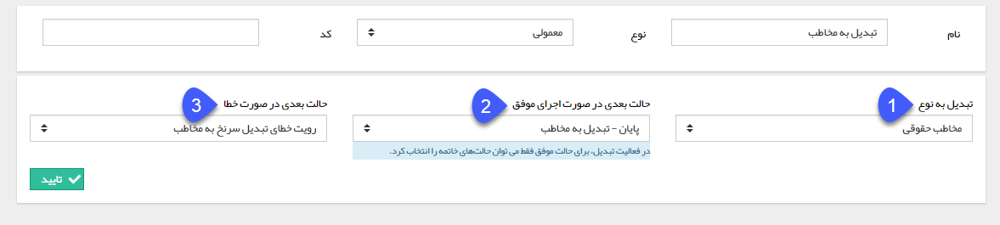

## تبدیل نوع

> مسیر دسترسی:  **تنظیمات** >**شخصی سازی crm** > **نمای کلی** > **کلید ویرایش چرخه کاری در هر موجودیت** > **ایجاد فعالیت** > **تبدیل نوع**

با استفاده از این فعالیت می توانید زیرنوع یک آیتم تحت چرخه را تغییر دهید. برای مثال، با استفاده از فعالیت تبدیل نوع، می توان فرصت فروش کالا را طی فرآیند کاری، به زیر نوع دیگری از آیتم فرصت مانند فرصت پروژه ( فروش کالا + خدمات ) تبدیل کرد. توجه داشته باشید این فعالیت، تنها قابلیت تبدیل یک زیرنوع از موجودیت های crm  را به سایر زیرنوع های همان موجودیت دارد. برای مثال آیتم فرم را فقط میتوانید به زیرنوع های فرم تبدیل کنید.
> نکته: با تبدیل یک آیتم به زیرنوع دیگر با استفاده از این فعالیت، مقادیر وارد شده در فیلدهای همنام به آیتم مقصد انتقال پیدا می کند و مقادیر وارد شده در فیلدهایی که فیلد همنامی در آیتم مقصد ندارند را از دست خواهید داد.

> نکته: توجه داشته باشید در صورتی که تبدیل نوع را برای هویت انجام می دهید، اگر نوع پروفایل(مشتری، اپراتور، تامین کننده، نماینده، رقیب) و نوع عملکرد( سرنخ، مخاطب) هویت های مبداء و مقصد یکسان باشد، موارد زیر در تبدیل هویت ها صدق می کند:
-تبدیل مخاطب حقوقی به مخاطب حقیقی و حقوقی
 -تبدیل مخاطب حقیقی به مخاطب حقیقی و حقوقی
 -تبدیل سرنخ حقیقی به سرنخ حقیقی و حقوقی
 -تبدیل سرنخ حقوقی به سرنخ حقیقی و حقوقی
برای مثال اگر نوع پروفایل هویت مبداء "مشتری" و نوع عملکرد "مخاطب" باشد، برای تبدیل نوع هویت آن به حقیقی یا حقوقی، می بایست نوع پروفایل هویت مقصد نیز، مشتری و نوع عملکرد آن مخاطب باشد.

> نکته: با تبدیل یک آیتم به زیرنوع دیگر با استفاده از این فعالیت، در صورتیکه کلید کاربر فیلد‌های اضافه‌ی آیتم مبداء و مقصد یکسان باشند،مقادیر وارد شده در داخل آن فیلد‌ها نیز انتقال پیدامی‌کنند.

برای ایجاد این فعالیت، پس از تعیین نام و نوع فعالیت، سایر تنظیمات را مطابق با توضیحات زیر انجام دهید.

1. در این قسمت لیست زیرنوع های ایجاد شده در شخصی سازی  برای آیتم تحت چرخه نمایش داده می شود و باید مشخص کنید که این آیتم به کدام زیرنوع تبدیل شود.

>  

2. حالت بعدی در صورت اجرای موفق تبدیل نوع را مشخص کنید، توجه داشته باشید با توجه به اینکه پس از اجرای این فعالیت، این آیتم به زیرنوع دیگری تغییر می کند، در این قسمت تنها میتوانید یکی از حالت های نهایی فرآیند را انتخاب کنید.

3. حالت بعدی فرآیند در صورت بروز خطا در تبدیل نوع را مشخص کنید.

