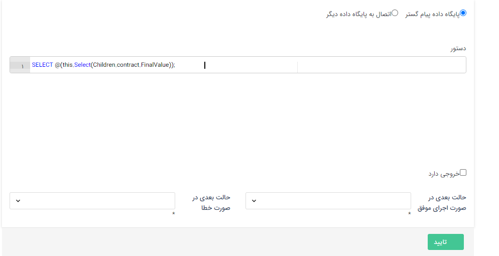
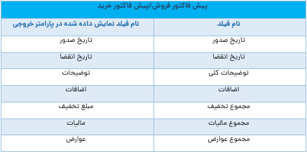
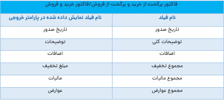
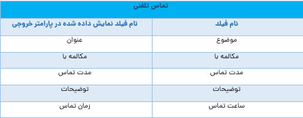
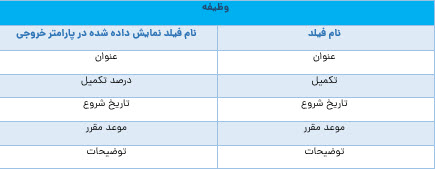
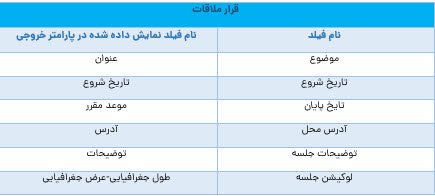
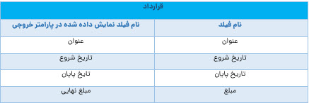
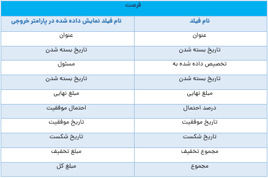
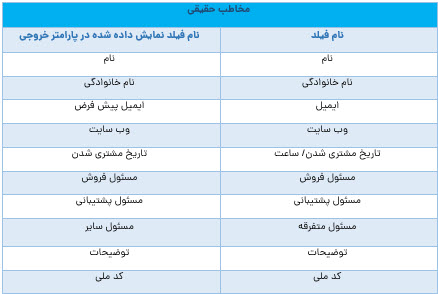

## فعالیت اجرای دستورات پایگاه‌داده

هدف از استفاده‌ی فعالیت اجرای دستورات پایگاه‌داده، انتقال اطلاعات موردنیاز از پیام‌گستر به بانک‌های اطلاعاتی موردنظر و بلعکس، می‌باشد. این کار از طریق نوشتن کوئری در این فعالیت انجام می‌شود.

برای استفاده از این فعالیت از مسیر تنظیمات، شخصی‌سازی CRM، نمای کلی، ویرایش چرخه کاری اقدام نمایید. در این بخش با  انتخاب فعالیت جدید می‌توانید، از فعالیت اجرای دستورات پایگاه‌داده(SQL Activity) در فرایند استفاده کنید.

 
در این فعالیت می‌بایست در ابتدا تعیین کنید در نظر دارید از پایگاه‌داده پیام‌گستر استفاده کنید یا می‌خواهید به پایگاه‌داده‌های دیگر متصل شوید. درصورتی‌که می‌خواهید از سایر پایگاه‌داده‌ها استفاده نمایید با انتخاب نوع پایگاه‌داده(در حال حاضر فقط SQL server پشتیبانی می‌گردد) و تعریف رشته اتصال (اطلاعات موردنیاز برای دسترسی به پایگاه اطلاعاتی) می‌توانید به آن پایگاه دسترسی داشته باشید.

 
 توجه کنید درصورتی‌که در نظر داشته باشید از پایگاه‌داده پیام‌گستر استفاده کنید، نیازی به تعریف رشته اتصال نمی‌باشد و صرفاً می‌بایست دستور مدنظر را در بخش مربوطه وارد نمایید.
 
 
 
برای نوشتن دستور در این فعالیت، علاوه بر دستورات SQL می‌توان از Custom Expression که به‌صورت مجزا در فایل پیوست شماره 5 توضیح داده شده است، استفاده نمایید. 

> نکته: Custom Expression در حال حاضر فقط بر روی آیتم‌هایی از نوع فرم، هویت، وظیفه، درخواست پشتیبانی و انواع فاکتور، پیش‌فاکتور و فاکتورهای برگشت از خریدوفروش قابل‌استفاده می‌باشد؛ به‌عنوان‌مثال، درصورتی‌که می‌خواهید از این فعالیت در آیتم "تماس تلفنی"، برای مقداردهی فیلدهای همین موجودیت استفاده کنید، صرفاً باید از دستورات SQL استفاده کنید.

توسعه می‌شود برای استفاده از فعالیت Sql  از ورژن 2017 به بالا sql استفاده شود.

### نحوه نوشتن Expression در این فعالیت:

#### Expression باید به صورت Select @(Expression); نوشته شود.

با فعال‌کردن چک باکس "خروجی دارد" و انتخاب فیلد موردنظر در قسمت پارامتر خروجی می‌توانید اطلاعات مدنظر را از بانک اطلاعاتی دیگر یا بانک اطلاعاتی پیام‌گستر دریافت کرده و در این فیلد مشاهده کنید.

لازم به ذکر است در صورت عدم فعال‌بودن چک باکس "خروجی دارد"، فیلدی از آیتم جاری (تحت فرایند) مقداردهی نمی‌شود و اطلاعات به آیتم دیگر در پیام‌گستر یا به بانک اطلاعاتی موردنظر مطابق کوئری تعریف شده، منتقل می‌شود. 

لیست فیلدهای پیش‌فرض موجودیت‌ها که امکان انتخاب آنها به‌عنوان پارامتر خروجی وجود دارد، به شرح زیر است:

### لیست فیلدهای اضافه‌ی قابل پشتیبانی جهت انتخاب در پارامتر خروجی: 

•	Html

•	پول

•	تاریخ شمسی

•	تاریخ میلادی

•	چک باکس

•	ساعت 

•	عدد

•	کاربر

•	گروه

•	لینک

•	متن 

•	شرکت/شخص

### نمونه دستورات در فعالیت SQL: 

نمونه‌ای از دستورات برای دریافت اطلاعات از بانک اطلاعاتی پیام‌گستر به شرح ذیل می‌باشد: 

	SELECT @(this.Select(Subject));

با این دستور فیلد انتخاب شده در قسمت پارامتر خروجی، با مقدار عنوان آیتم جاری (آیتم تحت فرایند) مقداردهی می‌شود.

	SELECT @(this.Identity.Select(Email));

با این دستور فیلد انتخاب شده در قسمت پارامتر خروجی، با ایمیل هویت مرتبط با آیتم جاری (آیتم تحت فرایند) مقداردهی می‌شود.

	SELECT @(this.Select(mtn)(;
 
در آیتم جاری فیلدی با کلید کاربر "mtn"وجود دارد، با این دستور فیلد انتخاب شده با مقدار آن فیلد متنی، مقداردهی می‌شود.

	SELECT @(this.Select(Children.Contract.FinalValue));

با این دستور فیلد انتخاب شده در قسمت پارامتر خروجی، با مبلغ نهایی اولین قرارداد موجود در سوابق آیتم جاری (آیتم تحت فرایند) مقداردهی می‌شود.

	SELECT @(this.Where(Children.Ticket.Subject=="ایمپورت").Select(Children.Ticket.EmailAddress));

با این دستور فیلد انتخاب شده در قسمت خروجی، با ایمیل اولین تیکت موجود در سوابق آیتم جاری با این شرط که عنوان آن "ایمپورت" می‌باشد، مقداردهی می‌شود.

	update [Products] set [ProductName] =
	@(this.Select(Subject));
	Where productId='9DC87DFA-0F80-49BE-956B-70D974FB1F77'

برای مثال فرض کنید دیتابیس دیگری وجود دارد که جدولی به نام products دارد.  این جدول شامل ستونی با نام  ProductName می‌باشد، درصورتی‌که بخواهید ستون نام محصول را با شرط این که productid آن برابر'9DC87DFA-0F80-49BE-956B-70D974FB1F77' باشد، با عنوان آیتم جاری مقداردهی کنید، می‌توانید از این دستور استفاده کنید. 
 
