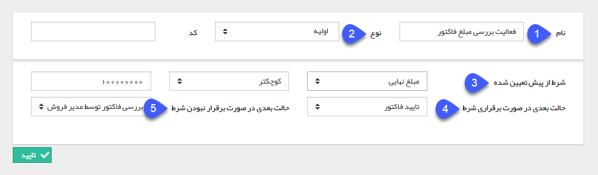

## تصمیم

> مسیر دسترسی:  **تنظیمات** >**شخصی سازی crm** > **نمای کلی** > **کلید ویرایش چرخه کاری در هر موجودیت** > **ایجاد فعالیت** > **تصمیم**

این فعالیت یکی از پرکاربردترین فعالیت هاست که با استفاده از آن میتوانید بر اساس یک شرط،چرخه کاری را به دو مسیر متفاوت هدایت کنید. این شرط می تواند بر اساس هرکدام از فیلدهای آیتم تحت چرخه یا فیلدهای هویت مرتبط با آیتم (مثلا رنگ تخیص داده شده به هویت) باشد .

به طور مثال فرض کنید میخواهیم یک چرخه کاری روی فاکتور فروش داشته باشیم، با استفاده از یک فعالیت تصمیم می توانیم مبلغ نهایی فاکتور را بررسی کنیم و این شرط را اعمال کنیم که اگر مبلغ کمتر از 10 میلیون باشد فاکتور به صورت خودکار توسط سیستم (با استفاده از یک فعالیت تایید آیتم مالی) تایید شود و در غیر اینصورت برای تایید وارد کارتابل مدیر فروش شود .

تنظیمات این فعالیت به شرح زیر می باشد:

1. نام مناسبی برای فعالیت برگزینید.

2. نوع فعالیت (معمولی یا اولیه) را مشخص کنید. ( هر فرآیند تنها نیاز به یک حالت اولیه دارد.)

نکته: توجه داشته باشید وضعیت اولیه یک فرآیند می تواند یک کارتابل یا یک فعالیت باشد و تعیین وضعیت اولیه به این دلیل است که گردش کار آیتم، پس از ذخیره از این وضعیت شروع می شود و ادامه آن با استفاده از اقدام ها و حالت بعدی فعالیت ها تعیین می گردد، به طور مثال در شکل بالا این فعالیت به عنوان وضعیت اولیه فرآیند تعیین شده است، زیرا می خواهیم به محض ثبت فاکتور، مبلغ آن مورد بررسی قرار گیرد و بر اساس آن حالت بعدی فرآیند تعیین گردد.

3. شرط: در این قسمت مشخص می کنید که مقدار چه فیلدی مورد بررسی قرار گیرد. ابتدا فیلد مورد نظر خود را انتخاب کرده، سپس یک از مقادیر مساوی، بزرگتر، کوچکتر و ... را انتخاب کنید و در انتها مقدار مورد نظر خود را وارد کنید. به طور مثال در شکل بالا شرط به این صورت می باشد: اگر مبلغ نهایی فاکتور کوچکتر از 100,000,000 باشد.

> نکته: مقادیر بزرگتر، بزرگتر مساوی، کوچکتر و کوچک تر مساوی تنها برای مقادیر عددی قابل استفاده است.

4. حالت بعدی در صورت برقراری شرط را تعیین کنید.

5. حالت بعدی در صورت برقرار نشدن شرط را تعیین کنید.   

