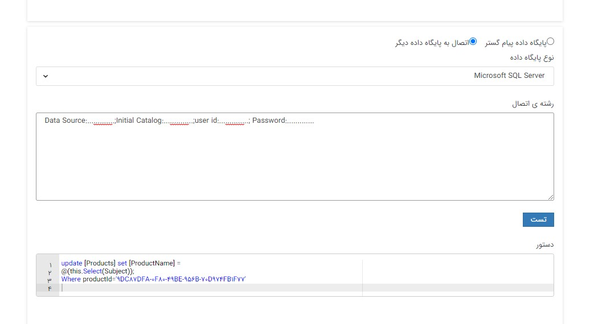
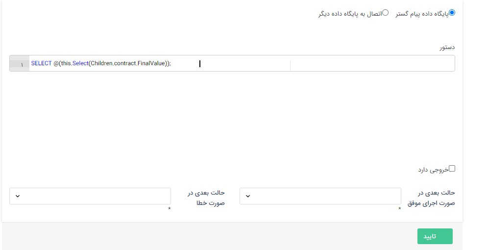

## فعالیت اجرای دستورات پایگاه داده

مسیر دسترسی: تنظیمات >شخصی سازی crm > نمای کلی > کلید ویرایش چرخه کاری در هر موجودیت > ایجاد فعالیت > فعالیت اجرای دستورات پایگاه داده

هدف از استفاده‌ی فعالیت اجرای دستورات پایگاه داده، انتقال اطلاعات مورد نیاز از پیام‌گستر به بانک‌های اطلاعاتی موردنظر و بلعکس، می باشد. این کار از طریق نوشتن کوئری یا همان Expression در این فعالیت انجام می شود.

در این فعالیت می بایست در ابتدا تعیین کنید در نظر دارید از پایگاه داده پیام گستر استفاده کنید یا می خواهید به پایگاه داده های دیگر متصل شوید. در صورتیکه می خواهید از سایر پایگاه داده ها استفاده نمایید با انتخاب نوع پایگاه داده(در حال حاضر فقط SQL server  پشتیبانی می گردد) و تعریف رشته اتصال (اطلاعات مورد نیاز برای دسترسی به پایگاه اطلاعاتی) می توانید به آن پایگاه دسترسی داشته باشید.

توجه کنید درصورتیکه در نظر داشته باشید از پایگاه داده پیام گستر استفاده کنید، نیازی به تعریف رشته اتصال نمی باشد و صرفا می بایست دستور مدنظر را در بخش مربوطه وارد نمایید.

برای اطلاعات به قسمت دستورات [Experssion](https://github.com/1stco/PayamGostarDocs/blob/master/help2.5.4/Settings/Personalization-crm/Overview/Process-design/Create-a-work-cycle/Activity/SQL/Custom%20Expression.md)  مراجعه کنید.

نکته: Custom Expression در حال حاضر فقط بر روی آیتم‌هایی از نوع فرم، هویت، وظیفه، درخواست پشتیبانی و انواع فاکتور، پیش فاکتور و فاکتورهای برگشت از خرید و فروش قابل استفاده می باشد. لذا به عنوان مثال، در صورتیکه می خواهید از این فعالیت در آیتم "تماس تلفنی"، برای مقداردهی فیلدهای همین موجودیت استفاده کنید، صرفا باید از دستورات SQL استفاده کنید.

نحوه نوشتن Expression در این فعالیت:

Expression باید به صورت select ; (Expression)@ نوشته شود.

با فعال کردن چک‌باکس "خروجی دارد" و انتخاب فیلد موردنظر در قسمت پارامتر خروجی می‌توانید اطلاعات مدنظر را از بانک اطلاعاتی دیگر یا بانک اطلاعاتی پیام‌گستر دریافت کرده و در این فیلد مشاهده کنید.
لازم به ذکر است در صورت عدم فعال بودن چک باکس "خروجی دارد"، فیلدی از آیتم جاری(تحت فرآیند) مقداردهی نمی شود و اطلاعات به آیتم دیگر در پیام‌گستر یا به بانک اطلاعاتی موردنظر مطابق کوئری تعریف شده، منتقل می‌شود. 
