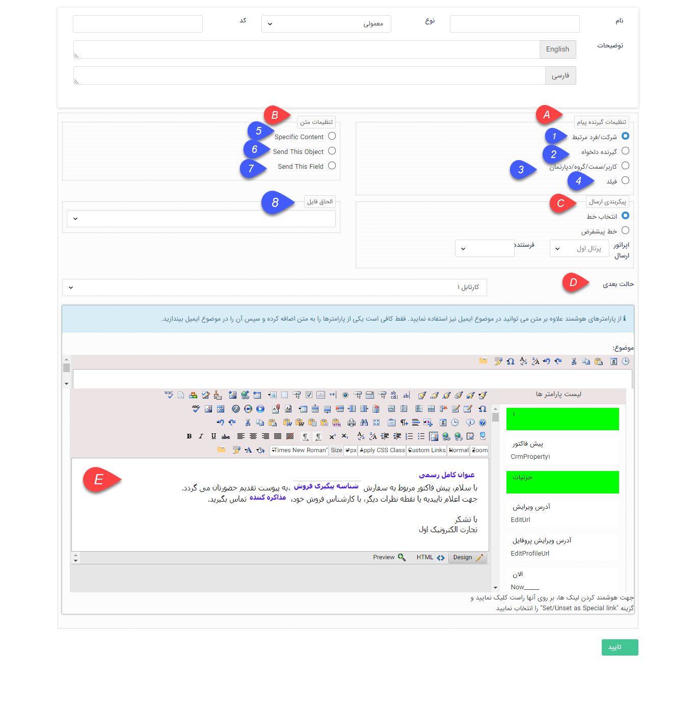

## ارسال پیام کوتاه، ایمیل، فکس،چاپ

> مسیر دسترسی:  **تنظیمات** >**شخصی سازی crm** > **نمای کلی** > **کلید ویرایش چرخه کاری در هر موجودیت** > **ایجاد فعالیت** > **ارسال پیام‌کوتاه/ایمیل/فکس/چاپ**

با انتخاب این نوع از فعالیت ها، پیام کوتاه، فکس، ایمیل که در این مرحله تعیین می شود به صورت اتوماتیک به گیرنده ای که مشخص می کنید ارسال می شود. در این فعالیت ها می توانید در

 قسمت تنظیمات گیرنده، گیرنده مورد نظر را مشخص کنید و در قسمت تنظیمات متن، نوع پیام ارسالی (که می تواند یک متن مشخص، پیش نمایش همین آیتم یا پیش نمایش یکی از

فیلدهای رفرنسی آیتم باشد) را مشخص کنید.

A. تنظیمات گیرنده پیام:

در این قسمت باید گیرنده پیام را مشخص کنید:

1. شرکت/ فرد مرتبط: با انتخاب این حالت پیام برای مخاطبی که به عنوان مرتبط با انتخاب شده است، ارسال می گردد.

2. گیرنده دلخواه: میتوانید یک شماره را برای ارسال پیام به دلخواه وارد کنید.

3. کاربر/سمت/گروه/دپارتمان: میتوانید یکی از کاربران/گروه ها/سمت ها/دپارتمان های تعریف شده در نرم افزار را به عنوان دریافت کننده پیام ارسالی انتخاب کنید.

4. فیلد: می توانید یک فیلد از نوع لیست کاربر/لیست گروه ها و یا فیلد شخص شرکت که در آیتم ایجاد کرده اید را به عنوان دریافت کننده پیام انتخاب کنید. در این حالت زمانی که نرم افزار به این مرحله می رسد، پیام را به کاربر/گروه انتخاب شده در این فیلد ارسال میکند.

B. تنظیمات متن:

5. محتوای مشخص (Specific Content): می توانید یک محتوای مشخص را برای ارسال تعیین کنید.

6. فرستادن این آیتم (Send This Object): با انتخاب این گزینه، پیش نمایش (قالب چاپی تنظیم شده) همین آیتم، یعنی آیتمی که بر روی آن چرخه کاری طراحی شده است، برای ارسال انتخاب می شود. (در فعالیت های ارسال پیام کوتاه و ارسال پیام شبکه اجتماعی قابل انتخاب نیست)

7. فرستادن یک فیلد (Send This Field): با انتخاب این گزینه می توانید قالب چاپ یکی از فیلدهای پیوست شده به این آیتم (فیلدهایی مانند فرم، فاکتور، حواله انبار و ...) را برای ارسال در نظر بگیرید. (در فعالیت های ارسال پیام کوتاه و ارسال پیام شبکه اجتماعی قابل انتخاب نیست)

> نکته: برای تنظیم قالب چاپ یک آیتم به قسمت [تنظیم قالب چاپ](https://github.com/1stco/PayamGostarDocs/blob/master/help%202.5.4/Settings/Personalization-crm/Overview/General-information/Set%20the-print-template/Set%20the-print-template.md) مراجعه کنید.

8. با استفاده از این بخش امکان انتخاب فیلدهای از نوع فایل که به آیتم اضافه شده است وجود دارد و فایل پیوست شده به آن فیلد ارسال خواهد شد.

 

C. خط ارسال:

بر اساس نوع رسانه، خط ارسال را در این قسمت تعیین کنید. در صورت انتخاب خط پیشفرض، خط تنظیم شده در قسمت[ خطوط پیش فرض ](https://github.com/1stco/PayamGostarDocs/blob/master/help%202.5.4/Settings/General-settings/Default-lines/Default-lines.md)ارسال کننده پیام خواهد بود.

D. حالت بعدی:

حالت بعدی فرآیند (وضعیتی که پس از اجرای این فعالیت، فرآیند باید وارد آن شود) را مشخص کنید.

E. محتوای پیام:

در این قسمت، محتوای پیام ارسالی را مشخص کنید. در صورتی که در قسمت تنظیمات متن، SpecificContent را انتخاب کرده باشید، تنها همین متن برای گیرنده پیام ارسال خواهد شد و در  غیر این صورت، این متن به همراه پیش نمایش انتخاب شده ارسال خواهد شد. می توانید در تنظیم متن پیام، از [پارامتر هوشمند](https://github.com/1stco/PayamGostarDocs/blob/master/help%202.5.4/Marketing/matn-hoshmand/matn-hoshmand.md) استفاده کن