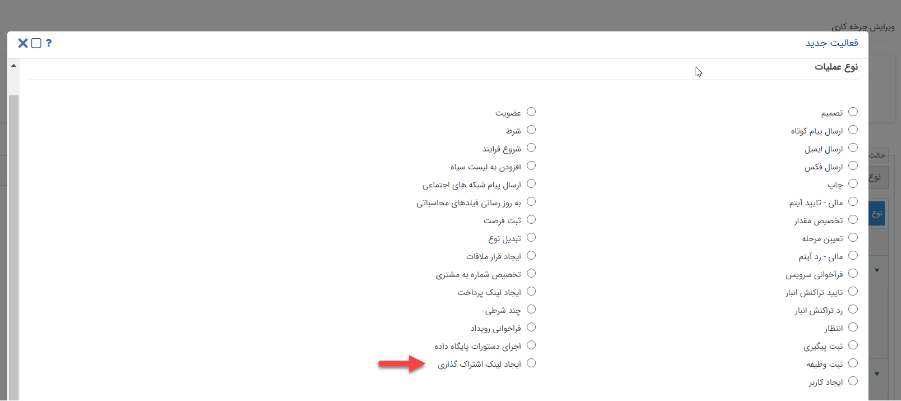

## فعالیت ایجاد لینک اشتراک گذاری

> مسیر دسترسی:  **تنظیمات** >**شخصی سازی crm** > **نمای کلی** > **کلید ویرایش چرخه کاری در هر موجودیت** > **ایجاد فعالیت** > **ایجاد لینک اشتراک گذاری**

این فعالیت، لینک مربوط به قالب چاپ (پیش نمایش) آیتم تحت چرخه را به صورت خودکار ایجاد می کند تا برای اشتراک گذاری استفاده شود.

با استفاده از این لینک در مرورگر، قالب چاپ(پیش نمایش) آیتم مورد نظر قابل مشاهده است و امکان خروجی گرفتن از آن با فرمت PDF وجود دارد.

نکته:در نظر داشته باشید، لینک ایجاد شده در این قسمت مدت انقضا دارد و تا 2 ماه قابل استفاده است و بعد از اتمام مدت انقضا، آن لینک اعتباری ندارد و می بایست لینک اشتراک گذاری جدید ایجاد کنید.
