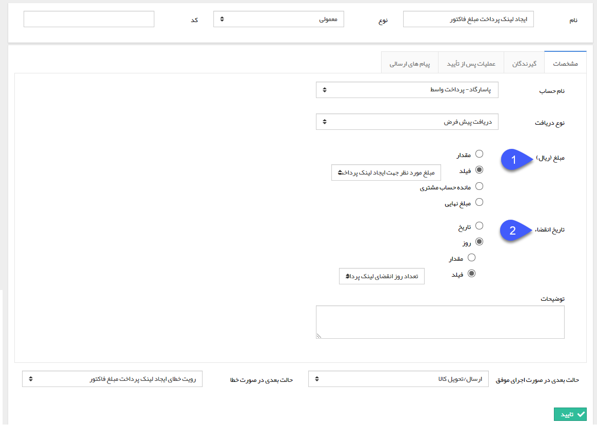
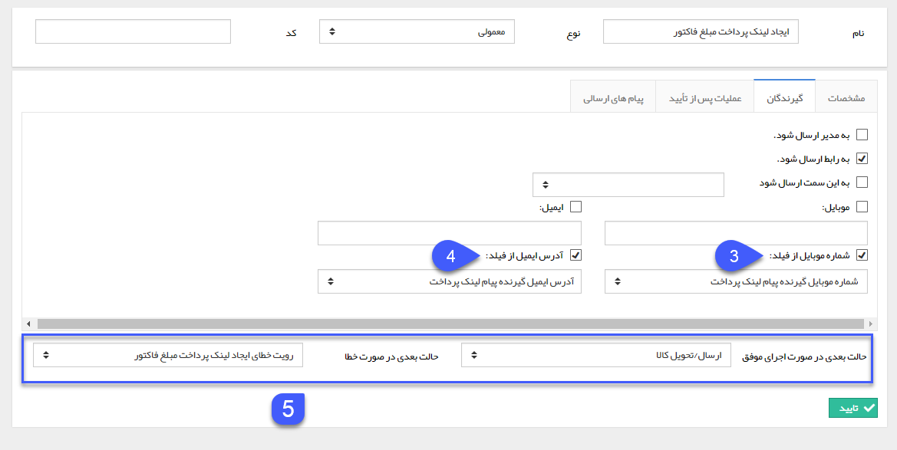

## ایجاد لینک پرداخت 

> مسیر دسترسی:  **تنظیمات** >**شخصی سازی crm** > **نمای کلی** > **کلید ویرایش چرخه کاری در هر موجودیت** > **ایجاد فعالیت** > **ایجاد لینک پرداخت**

با استفاده از این فعالیت می توانید یک لینک پرداخت برای مشتری ایجاد و ارسال کنید، به طور مثال در فرایند فرصت فروش بعد از صدور و تایید فاکتور، لینک پرداخت را برای مشتری به صورت خودکار توسط سیستم با استفاده از این فعالیت ایجاد و ارسال کرد و یا برای فاکتور فروش فرایندی طراحی کرد که پس از تایید فاکتور، لینک پرداختی با مبلغ نهایی فاکتور برای مشتری به صورت خودکار ارسال گردد. مزیت استفاده از این فعالیت نسبت به ایجاد لینک پرداخت به صورت دستی این است که می توانید مبلغ لینک پرداخت، زمان انقضای آن و شماره گیرندگان پیام حاوی لینک پرداخت را از فیلدهای آیتم تحت چرخه وارد کنید.

برای ایجاد این فعالیت، پس از تعیین نام و نوع فعالیت، سایر تنظیمات را مطابق با توضیحات زیر انجام دهید. توجه داشته باشید که این توضیحات شامل تفاوت های ایجاد لینک پرداخت با استفاده از این فعالیت و ایجاد آن به صورت دستی می باشد. برای آشنایی با سایر تنظیمات، [ایجاد لینک پرداخت ](https://github.com/1stco/PayamGostarDocs/blob/master/help%202.5.4/Integrated-bank/Database/Payment-links/Create-payment-link/Create-payment-link.md)را مطالعه کنید.

1. برای تعیین مبلغ لینک پرداخت ایجاد شده از طریق این فعالیت، 4 روش وجود دارد:

مقدار: می توانید یک مقدار ثابت (برای همه لینک های پرداخت ایجاد شده از طریق این فعالیت) وارد کنید.

فیلد: مقدار وارد شده در یکی از فیلدهای از نوع پول آیتم تحت چرخه به عنوان مبلغ لینک پرداخت در نظر گرفته خواهد شد. در صورت انتخاب گزینه، فیلد مورد نظر را نیز تعیین کنید.
مانده حساب مشتری: در صورت انتخاب این گزینه، مبلغ مانده حساب هویت مرتبط با آیتم تحت چرخه به عنوان مبلغ لینک پرداخت در نظر گرفته خواهد شد.

مبلغ نهایی: این گزینه در صورتی کاربرد دارد که آیتم تحت چرخه مالی/حقوقی باشد (پیش فاکتور، فاکتور، دریافت/پرداخت و قرارداد) و مبلغ نهایی آیتم به عنوان مبلغ لینک پرداخت در نظر گرفته خواهد شد.

2. برای تعیین زمان انقضای لینک پرداخت ایجاد شده از طریق این فعالیت، در صورت انتخاب هریک از گزینه های تاریخ یا روز، می توانید یک مقدار ثابت (برای همه لینک های پرداخت ایجاد شده از طریق این فعالیت) یا یکی از فیلدهای آیتم تحت چرخه را به عنوان زمان انقضای لینک پرداخت در نظر بگیرید. (فیلد عدد در صورت انتخاب روز و فیلد تاریخ شمسی در صورت انتخاب تاریخ)

3. درصورتی که پیام حاوی لینک پرداخت از طریق پیام کوتاه ارسال می گردد، با استفاده از فعالیت لینک پرداخت، علاوه بر امکان ارسال پیام به مدیر، رابط، سمت مشخص و یک شماره مشخص (مشابه با ایجاد لینک پرداخت به صورت دستی) می توانید شماره وارد شده در یکی از فیلدهای از نوع متن آیتم تحت چرخه را به عنوان گیرنده پیام کوتاه در نظر بگیرید.

4. درصورتی که پیام حاوی لینک پرداخت از طریق ایمیل ارسال می گردد، با استفاده از فعالیت لینک پرداخت، علاوه بر امکان ارسال پیام به مدیر، رابط، سمت مشخص و یک شماره مشخص (مشابه با ایجاد لینک پرداخت به صورت دستی) می توانید آدرس ایمیل وارد شده در یکی از فیلدهای از نوع متن آیتم تحت چرخه را به عنوان گیرنده ایمیل در نظر بگیرید.

5. حالت بعدی فرآیند در صورت اجرای موفق این فعالیت (ایجاد موفق لینک پرداخت) و حالت بعدی در صورت بروز خطا در ایجاد لینک را تعیین نمایید.

