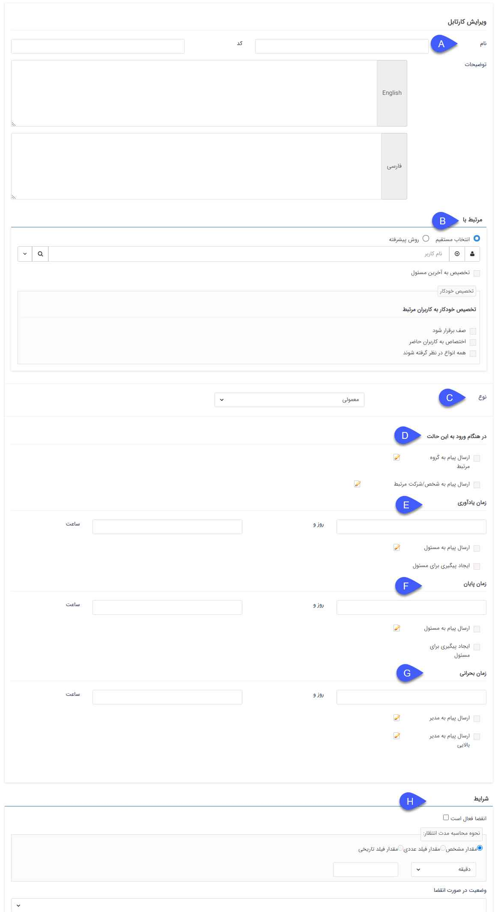
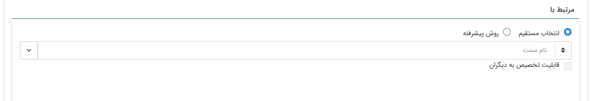
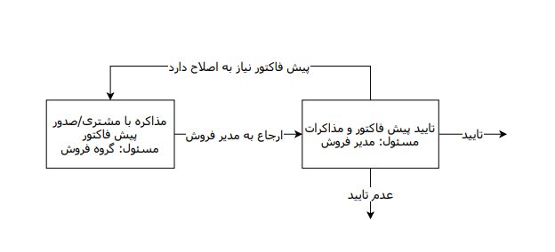
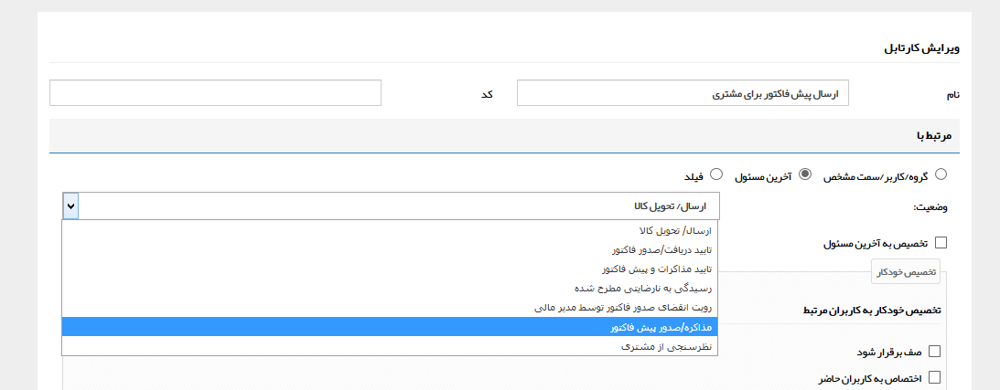
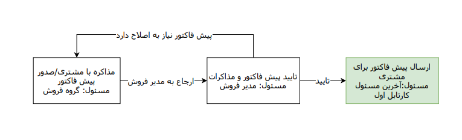
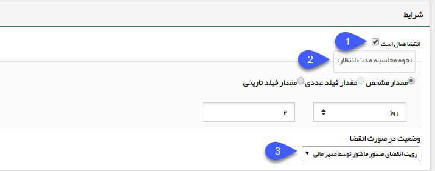
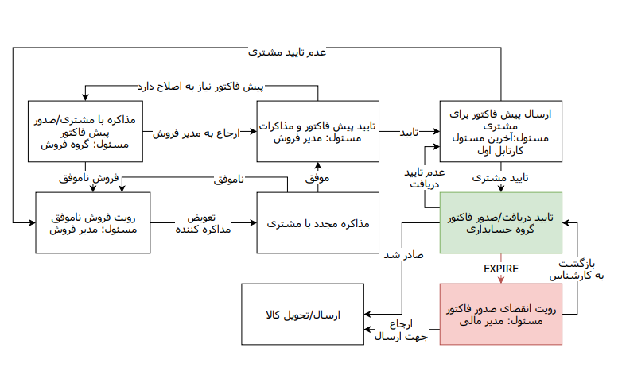

## ایجاد کارتابل

**A. نام:**

 نام کارتابل (مرحله گردش کار) مورد نظر را تعیین کنید. در واقع نام کارتابل، کاری است که باید در آن مرحله از گردش کار توسط کاربر انجام شود، بنابراین این نام را طوری برگزینید که کاربر هنگام مشاهده آن در کارتابل فرآیندها، مسئولیت خود در این مرحله را بداند.

**B. مرتبط با:**

در این قسمت باید شخص و یا گروهی که مسئول رسیدگی به این کارتابل هستند را بر اساس یکی از سه روش کاربر / گروه / سمت / دپارتمان مشخص، آخرین مسئول یا فیلد تعیین کنید.

#### انتخاب مستقیم 

**کاربر /گروه /سمت / دپارتمان مشخص:** کاربر/ گروه/ سمت/ دپارتمان مرتبط را با انتخاب از لیست انتخاب می نمایید. ( برای ساخت کاربران و گروه های کاربری به مدیریت گروه ها و کاربران و برای ساخت سمت های جدید به قسمت [مدیریت شعب، دپارتمان و سمت](https://github.com/1stco/PayamGostarDocs/blob/master/help2.5.4/Basic-Information/branches-department/branches-department.md) مراجعه کنید.

**قابلیت تخصیص به دیگران:** در صورت فعال بودن این گزینه، کاربر مسئول کارتابل می تواند کار را در همین مرحله به سایر کاربران عضو در گروه مسئول کارتابل تخصیص دهد.

#### روش پیشرفته

برای انتخاب آخرین مسؤل کارتابل می‌توانید مشخص کنید که کارتابل به آخرین مسؤل یا مدیر آخرین مسؤل یا رده بالایی آخرین مسؤل تخصیص یابد. لازم بذکر است تشخیص مدیر آخرین مسؤل و رده بالایی آخرین مسؤل بر اساس سمت می‌باشد.

**در صورت غیر فعال بودن فیلد آخرین مسئول** :

**انتخاب یکی از روابط:** می‌توان از بین آخرین مسؤل، مدیر آخرین مسؤل و رده بالایی آخرین مسؤل مشخص کرد کار وارد کارتابل چه کسی شود.

**وضعیت:** مشخص کردن کارتابل مورد نظر

**در صورت فعال بودن فیلد آخرین مسئول** :

**انتخاب یکی از روابط:** می‌توان از بین فیلد، مدیر فیلد و رده بالایی فیلد مشخص کرد کار وارد کارتابل چه کسی شود.

 
**فیلد:** می‌توان از بین فیلدهای اضافه شده به آیتم، فیلدی را انتخاب کنید تا با توجه به روابط مشخص شده در فیلد قبلی مسئول کارتابل انتخاب شود.

**کاربر/گروه مرتبط در صورت خالی بودن فیلد:** در صورتی که فیلد مشخص شده خالی باشد، کاربر یا گروهی که در این قسمت مشخص شده به عنوان مسئول کارتابل  انتخاب می‌شود 

> در صورت انتخاب مدیر آخرین مسؤل یا رده بالایی آخرین مسؤل، اگر کارتابل به  چند سمت (کاربر) تخصیص داده شود همانند منطق گروه عمل می‌کند و وارد کارتابل همه در آن رده می‌شود که یک کابر باید کار را به خود اختصاص دهد. همچنین در صورت فعال بودن چک باکس اختصاص به صورت صف و کاربران حاضر، عملکرد سیستم همانند منطق گروه خواهد بود. لازم بذکر است بمنظور استفاده از مدیر آخرین مسؤل و رده بالایی آخرین مسؤل لازم است برای کاربرانی که چند حکم سازمانی فعال دارند، در مدیریت حکم‌های سازمانی، حکم پیش‌فرض را مشخص کرد تا اگر آخرین مسؤل دارای چند حکم سازمانی بود با توجه به حکم پیشفرض وی کار وارد کارتابل مدیر آخرین مسؤل یا رده بالایی آخرین مسؤل شود. واضح است در صورت منقضی یا غیر فعال شدن حکم پیش‌فرض، فرآیند با خطا مواجه شده و لازم است حکم پیش‌فرض جدید تعیین شود.

**تخصیص به آخرین مسئول:** در صورتی که این آیتم در گردش کار، دوباره به این کارتابل بازگردد، مسئولیت آن به آخرین کاربری که به عنوان مسئول این آیتم بوده است، تخصیص داده خواهد شد.

**مثال:** فرض کنید بخشی از گردش کار فروش به صورت شکل زیر باشد، مسئول کارتابل اول گروه فروش می باشد، بنابراینهریک از کارشناسان فروش می توانند مسئول این کارتابل باشند، در صورتی که یکی از کارشناسان پیش فاکتور را صادر کند و آن را به مرحله بعد ارجاع دهد و مدیر فروش آیتم را جهت اصلاح پیش فاکتور به این کارتابل برگرداند، کار باید به آخرین مسئول این کارتابل (کارشناس صادرکننده پیش فاکتور) ارجاع داده شود و نباید در کل گروه فروش پخش شود، به همین دلیل در این کارتابل از قابلیت تخصیص به آخرین مسئول استفاده می کنیم

**تخصیص خودکار:** به صورت پیشفرض در صورتی که مسئول کارتابل یک گروه یا سمتی که به بیش از یک کاربر تخصیص داده شده است باشد، با وارد شدن گردش کار به این مرحله، آیتم در کارتابل تمامی کاربران آن گروه یا دارنده آن سمت مشاهده خواهد شد و یکی از کاربران باید کار را به خود اختصاص دهد و پس از آن، آیتم از کارتابل سایر کاربران خارج خواهد شد، با استفاده از قابلیت تخصیص خودکار می توانید تنظیماتی اعمال کنید که کار به صورت خودکار توسط سیستم به یکی از کاربران عضو در گروه (یا دارنده سمت) اختصاص پیدا کند. برای تخصیص خودکار سه معیار وجود دارد که شرح زیر می باشند:

**صف برقرار شود:**  با فعال کردن این گزینه نرم افزار به صورت خودکار کاربری که کمترین کار را در این کارتابل دارد(بر اساس آیتم های موجود در کارتابل فرآیندها)، به عنوان مسئول کارتابل تعیین خواهد کرد.

**اختصاص به کاربران حاضر:** اگر این گزینه فعال باشد، نرم افزار در اختصاص خودکار تنها کاربرانی را در نظر میگیرد که درروز جاری با نام کاربری خود وارد نرم افزار شده باشند.

** همه انواع در نظر گرفته شوند:** اگر این گزینه فعال باشد نرم افزار علاوه بر گردش کار آیتم فعلی، تمامی چرخه های موجود در نرم افزار را که این گزینه برای آنها فعال باشد را برای تخصیص مسئول کارتابل در نظر میگیرد. به زبان ساده هر کاربری که تعداد کارهای موجود در کارتابل فرآیندهای او کمتر باشد به عنوان مسئول کارتابل در نظر گرفته خواهد شد.

> نکته: توجه داشته باشید برای تخصیص خودکار می توانید بیش از یک گزینه را نیز در نظر بگیرید (به طور مثال در صورتی که بخواهید بین کاربران حاضر صف برقرار شود می توانید 2 گزینه اول را انتخاب کنید) 

**آخرین مسئول:**  در مواقعی استفاده می شود که در وسط چرخه می خواهید مسئول یک کارتابل کسی باشد که مسئول کارتابل دیگری قبل از این کارتابل در چرخه بوده است. با انتخاب این گزینه لیست کارتابل های تعریف شده نمایش داده می شود و باید از بین آنها کارتابل مورد نظر را انتخاب نمایید و آخرین مسئول آن کارتابل، به عنوان مسئول این کارتابل نیز در نظر گرفته میشود.

**مثال:** گردش کار مثال قبل را در نظر بگیرید و تصور کنید که بعد از صدور پیش فاکتور و تایید آن توسط مدیر فروش، پیش فاکتور باید برای مشتری ارسال گردد و تایید آن از مشتری اخذ گردد و بخواهید مسئول ارسال پیش فاکتور، کارشناس صادرکننده آن باشد(مانند شکل پایین). در این صورت می توانید مسئول کارتابل ارسال پیش فاکتور را روی آخرین مسئول کارتابل مذاکره/صدور پیش فاکتور تنظیم نمایید. (مانند شکل بالا)

> نکته مهم: توجه داشته باشید در صورتی که مسئول کارتابل را روی آخرین مسئول می گذارید، حتما چرخه کاری باید از کارتابل مربوطه رد شده باشد تا لاگ مسئول کارتابل ثبت شود.

**فیلد:** در مواقعی استفاده می شود که در طول چرخه بخواهید کاربر ، مسئول یکی از کارتابل های بعدی را مشخص کند. که با اضافه کردن فیلدی از نوع لیست کاربران/ لیست گروه ها برای آیتم مورد نظر و پر کردن آن توسط کاربر، مالک کارتابل مقصد همان فرد/گروه مشخص شده می شود. کافی است مسئول مرتبط با کارتابل مقصد را فیلد مربوطه بگذارید . یا می توان یکی از مسئولین مشخص شده در پروفایل مخاطب (کارشناسان فروش، پشتیبانی و متفرقه) را به عنوان مسئول کارتابل در نظر گرفت.

شایان ذکر است می توان مسئول جایگزین را در صورت پر نشدن این فیلدها مشخص نمود.

**مثال:** گردش کار مثال های قبل را در نظر بگیرید، فرض کنید در صورت ناموفق شدن فروش، کار به کارتابل مدیر فروش برای رویت ارجاع شود، اگر بخواهیم این امکان را برای مدیر فروش در نظر بگیریم که با توجه به شرایط مشتری و مذاکرات قبلی، کار را به کارشناس فروش دیگری جهت مذاکره مجدد ارجاع دهد(شکل پایین)، می توانیم یک فیلد به نام مذاکره کننده 2 در آیتم بسازیم و مسئول کارتابل مذاکره مجدد را روی فیلد مذاکره کننده2 تنظیم کنیم. (مانند شکل بالا)

> نکته مهم: در صورتی که مسئول کارتابل را روی فیلد تنظیم می کنید، می توانید با استفاده از قابلیت الزام فیلدها روی اقدام از خالی بودن فیلد در زمان وارد شدن گردش کار به این مرحله جلوگیری کنید. اما در صورت خالی بودن نیز، کار وارد کارتابل کاربر/گروهی که در قسمت کاربر/گروه مرتبط در صورت خالی بودن فیلد مشخص کرده اید خواهد شد.

**C. نوع:**  

می توانید تعیین کنید که این کارتابل معمولی و یا اولیه است. ( هر فرآیند تنها نیاز به یک حالت اولیه دارد.)

توجه داشته باشید وضعیت اولیه یک فرآیند می تواند یک کارتابل یا یک فعالیت باشد و تعیین وضعیت اولیه به این دلیل است که گردش کار آیتم، پس از ذخیره از این وضعیت شروع می شود و ادامه آن با استفاده از اقدام ها و حالت بعدی فعالیت ها تعیین می گردد.

**موارد D تا G شامل چند پیام سیستم هستند که در زمان های مختلف برای مسئول کارتابل یا هویت مرتبط با آیتم ارسال می شوند. توجه داشته باشید که متن تنظیم شده برای این پیام ها برای همه کارتابل های تمامی فرآیندهای پیاده سازی شده مشترک هستند. (برای اطلاعات بیشتر[مدیریت پیام‌های سیستم]( https://github.com/1stco/PayamGostarDocs/blob/master/help2.5.4/Basic-Information/Manage-system-messages/Manage-system-messages.md) را مطالعه فرمایید.) **

**D. در هنگام ورود به این حالت:**

میتوانید تعیین کنید که زمانی که گردش کار به این کارتابل وارد شد، نرم افزار به صورت خودکار، پیامی (از طریق پیامک، ایمیل، پیام سیستمی) برای کاربر/گروه مسئول کارتابل و یا شرکت/شخص مربوطه ارسال کند. دکمه ویرایش نمایش داده شده در کنار هریک از موارد، میانبر به صفحه ویرایش متن پیام سیستمی مربوطه می باشد.

**E. زمان یادآوری:**

با استفاده از این گزینه می توانید تعیین کنید که پس از گذشتن مدت زمان مشخصی از ورود کار به کارتابل، یک پیام به کاربر مسئول آن ارسال گردد و یا روی آیتم مربوطه یک پیگیری برای او ایجاد گردد.

**F. زمان پایان:**

با استفاده از این گزینه می توانید تعیین کنید که پس از گذشتن مدت زمان مشخصی از ورود کار به کارتابل، یک پیام به کاربر مسئول آن ارسال گردد و یا روی آیتم مربوطه یک پیگیری برای او ایجاد گردد. در واقع با استفاده از این قابلیت، به پایان رسیدن زمان انجام کار را به مسئول آن یادآوری خواهید کرد.

> نکته: در گزارشات فرآیندی، قسمت نمایش کانبان، می توانید با استفاده از فیلترهای موجود کارتابل هایی که زمان پایان آن ها فرا رسیده است را جستجو کنید.

**G  . زمان بحرانی:**

با استفاده از این گزینه می توانید یک پیام و/یا یادآوری برای مدیر کاربر/گروه مرتبط (مدیر دپارتمان) و/یا مدیر بالایی (مدیر شعبه) تعیین کنید. ( برای اطلاعات بیشتر در خصوص نحوه تعیین این مدیران به مدیریت شعب، دپارتمان و سمت مراجعه کنید.)

> نکته مهم: زمان ارسال پیام به مدیر بالایی دو برابر زمان ارسال به پیام مدیر است. ( برای مثال در تصویر زیر بعد از 5 روز از ورود این چرخه به این کارتابل پیامی برای مدیر دپارتمان و پس از 10 روز پیامی برای مدیر شعبه ارسال می گردد.)

**H. شرایط انقضای کارتابل:**

با استفاده از این قابلیت می توانید تنظیماتی اعمال کنید که کارتابل بر اساس شرایطی که مشخص می کنید منقضی شود و با فرا رسیدن زمان انقضاء، فرآیند به صورت خودکار از این کارتابل خارج شده و به وضعیت دیگری از فرآیند هدایت شود. شرایط انقضاء می تواند مدت زمان مشخص باشد یا بر اساس مقادیر وارد شده در فیلدهای از نوع عدد یا تاریخ آیتم در طی فرآیند مشخص شود.

**1**. برای فعال شدن انقضاء برای این کارتابل این گزینه را فعال کنید.

**2**. مدت زمانی که باید از ورود کار به کارتابل بگذرد تا کارتابل منقضی شود را مشخص کنید. این مدت زمان را می توانید به صورت ثابت و یا بر اساس فیلدهای عددی یا تاریخی آیتم تنظیم نمایید.

**3**. در این قسمت مشخص کنید که پس از منقضی شدن کارتابل، فرآیند به کدام وضعیت هدایت شود ( می توانید یکی از کارتابل ها یا فعالیت ها را انتخاب کنید)

مثال4: گردش کار زیر که در مثال های قبلی نیز از آن استفاده شده بود را در نظر بگیرید. برای جلوگیری از توقف کار در کارتابل تایید دریافت/صدور فاکتور و تاخیر در تحویل کالا به مشتری، شرایط انقضاء برای این کارتابل فعال شده است و پس از دو روز به کارتابل مدیر مالی ارجاع داده می شود(نحوه تنظیم در شکل بالا). در واقع انقضاء یک خروجی از کارتابل(مانند اقدام ها) است، با این تفاوت که اختیار آن دست کاربر مسئول کارتابل نیست و در صورت فرا رسیدن زمان انقضاء به صورت خودکار توسط سیستم اعمال خواهد شد.

