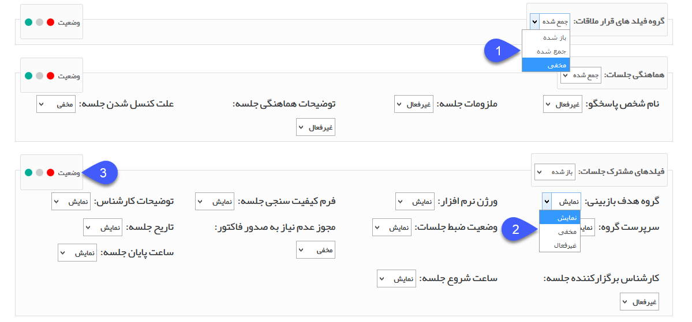

# نمایش فیلد
**مسیر دسترسی: نمای کلی > کلید ویرایش چرخه کاری در هر موجودیت > ستون نمایش فیلدها** 

 روبروی هر یک از کارتابل‌هاو فعالیت‌ها آیکون نمایش فیلدها قرار دارد که اگر روی آن کلیک کنیم پنجره ای باز می شود که تمامی گروه فیلدها و فیلدهای آیتم تحت چرخه در آن نمایش داده می شود.

در کنار هر فیلد لیستی قرار دارد که از طریق آن می توانید وضعیت نمایش هریک از فیلدها و وضعیت بسته/باز بودن هریک از گروه فیلدها را در آن تعیین کنید.

در واقع با استفاده از این قابلیت می توانید در هر مرحله، فیلدهای مورد نظر را به کاربر نمایش دهید و از نمایش دادن فیلدهای غیرضروری به او جلوگیری کنید و فیلدهایی که کاربر اجازه ویرایش آن ها را در آن مرحله ندارد و صرفاً باید برای تصمیم گیری در ارتباط با چگونگی انجام کار، مقادیر وارد شده در آن ها را مشاهده کند، را غیر فعال کنید. علاوه بر این برای راحتی کار می توانید گروه فیلدهایی که کاربر باید فیلدهای مربوط به آن را تکمیل کند را در آن مرحله به صورت باز شده و سایر گروه فیلدها را به صورت جمع شده تنظیم نمایید.

  نکته. نمایش فیلدها در هر مرحله‌ای که فرآیند باقی بماند نیز کاربرد دارد، مثل فعالیت انتظار که کار در مرحله مشخص شده باقی می‌ماند و می‌توان مشخص کرد که در این حالت انتظار چه فیلدهایی برای کاربر قابل نمایش باشند.
    

با کلیک بر روی نمایش فیلدهای هر یک از کارتابل‌ها و فعالیت‌ها می توانید وضعیت نمایش هریک از فیلدها در آن مرحله را مشاهده کرده و آن ها را ویرایش کنید.

1. برای هریک از گروه فیلدها مشخص کنید که در این مرحله به صورت باز شده، جمع شده و یا مخفی نمایش داده شود. توجه داشته باشید در صورتی که تمامی فیلدهای یک گروه فیلد، روی حالت مخفی باشند، گروه فیلد نیز به صورت خودکار مخفی خواهد شد.

2. برای هریک از فیلدها وضعیت نمایش در این مرحله را مشخص کنید. سه حالت نمایش فیلد به شرح زیر می باشد:

نمایش: به این معناست که این فیلد در این مرحله توسط مسئول کارتابل می تواند مشاهده و ویرایش شود.

مخفی: به این معناست که این فیلد در این مرحله توسط مسئول کارتابل نمی تواند مشاهده شود.

غیر فعال: به این معناست که این فیلد در این مرحله توسط مسئول کارتابل تنها می تواند مشاهده گردد و غیر قابل ویرایش است.

3. با استفاده از دکمه های موجود در این قسمت، می توانید وضعیت کلیه فیلدهای یک گروه فیلد را به حالت نمایش، غیرفعال و مخفی تغییر دهید.    

