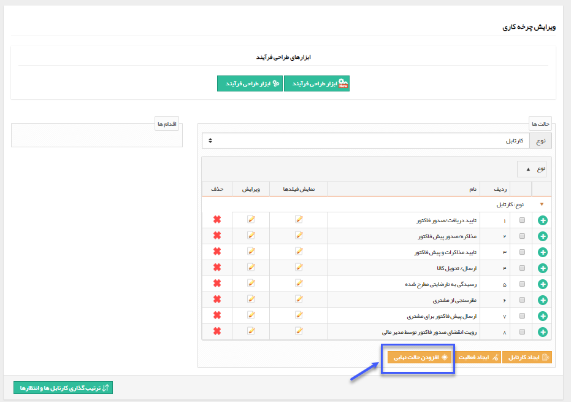
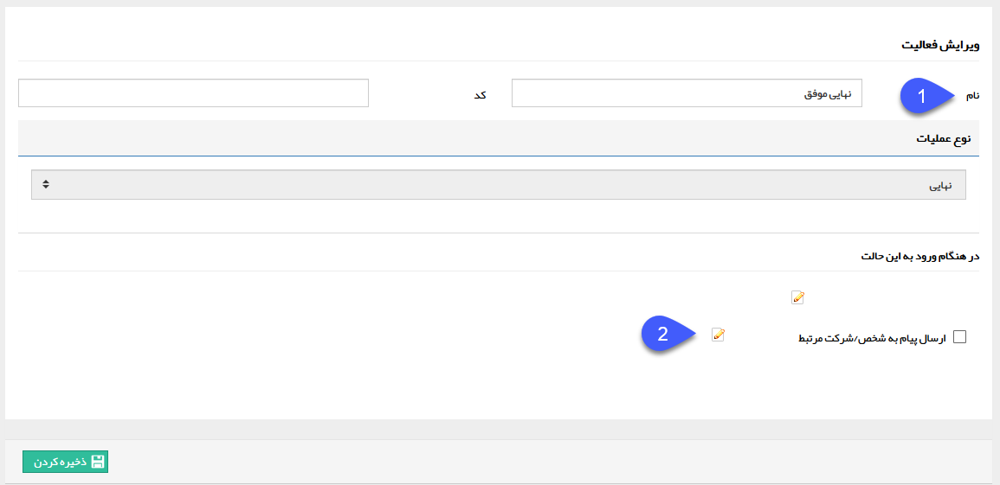

## حالت نهایی

> مسیر دسترسی:  **تنظیمات** >**شخصی سازی crm** > **نمای کلی** > **کلید ویرایش چرخه کاری در هر موجودیت** > **افزودن حالت نهایی** 

برای هر فرآیند باید حداقل یک حالت نهایی ایجاد کنید. رسیدن فرآیند به حالت نهایی به معنی پایان یافتن فرآیند می باشد. پس از پایان فرآیند، آیتم در سوابق در جریان و کارتابل هیچ کاربری مشاهده نمی شود و تنها در سوابق هویت ها قابل مشاهده است. می توانید برای فرآیند چند حالت پایان نیز ایجاد کنید. (مثلاً در فرایند کاری درخواست مرخصی، دو حالت نهایی با نام های پایان تایید شده و پایان رد شده داشته باشید، تا هر زمان که سابقه مربوطه را پس از اتمام فرایند آن باز کنید، با یک نگاه نحوه به پایان رسیدن آن را مشاهده کنید

با کلیک بر روی دکمه افزودن حالت نهایی، پنجره زیر را مشاهده خواهید کرد.

1. نام مناسبی برای حالت نهایی فرآیند، برگزینید.

2. می توانید پیام سیستمی مربوط به پایان فرآیند را جهت ارسال به هویت مرتبط با آیتم در این وضعیت نهایی فعال کنید. دکمه ویرایش موجود در این قسمت، میانبری برای ویرایش متن مرتبط با این پیام در قسمت[ مدیریت پیام های سیستم](https://github.com/1stco/PayamGostarDocs/blob/master/help%202.5.4/Basic-Information/Manage-system-messages/Manage-system-messages.md) می باشد.

