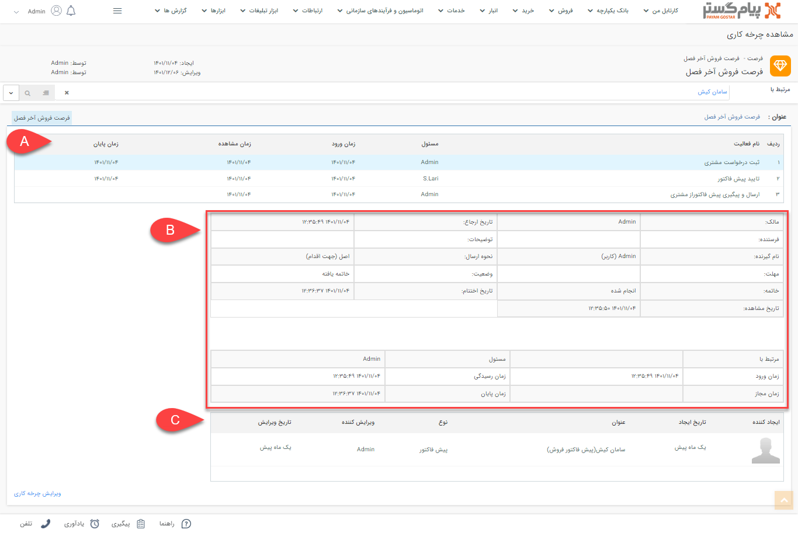

# مشاهده چرخه‌کاری آیتم‌های جاری
هر آیتمی که دارای چرخه‌کاری فعال بوده و فرآیند آن در نرم‌افزار 
شروع شده باشد، تاریخچه‌ای از مراحل گذشته در طی فرآیند را دارد که در قسمت **مشاهده چرخه‌کاری**، لیست کارتابل‌ها و انتظارهایی که فرآیند  طی کرده در اختیار شما قرار داده شده است.

> **نکته** 
> برای مشاهده گردش کار یک آیتم، کاربر باید علاوه بر مجوز **مشاهده آیتم**، مجوز **مشاهده گردش‌کاری** را روی آیتم تحت چرخه داشته باشد.

بخش مشاهده چرخه‌کاری، هم برای آیتم وظیفه (برای مشاهده لیست جزئیات ارجاع‌های انجام شده به کاربران) و هم آیتم‌هایی که فرآیند آن‌‌ها در نرم‌افزار اجرا شده، کاربرد دارد.  
در این قسمت اطلاعات دقیق مربوط به هر مرحله را در جداول مختلفی می‌توانید مشاهده کنید که در ادامه شرح داده شده است. 
برای مشاهده گردش کار آیتم طبق مراحل زیر اقدام نمایید:
1. آیتم مورد نظر خود را از لیست انتخاب و با دابل کلیک به صفحه مشخصات آن بروید.
2. در تب **مشخصات** آیتم، روی **مشاهده چرخه‌کاری** کلیک کنید. صفحه‌ی پیش روی شما گردش کاری که آیتم تاکنون داشته را نشان می‌دهد که تنها لیست **کارتابل‌ها** و **فعالیت‌های انتظار** در این قسمت نمایش داده می‌شود.

> **نکته** 
> برخی از اطلاعات ثبت شده مربوط به مراحل فرآیند با ارجاعات آیتم وظیفه باهم تفاوت دارند. جزئیات گردش کار آیتم وظیفه را در بخش مشاهده [گردش کار وظیفه]()، مطالعه نمایید.
<!-- باید این قسمت رو به داکیومنت مشاهده گردش کار وظیفه لینک کنم -->

  **A.** در این قسمت لیست کارتابل و فعالیت‌های انتظار گذشته طی فرآیند را مشاهده خواهید کرد. 

 | نــام فیلـد | توضیحات|
 | -----| ----|
 | مسئول| نام کاربر مسئول در کارتابل و فعالیت انتظار (برای شکستن انتظار) را در این ستون نمایش می‌دهد. |
 | تاریخ ورود| تاریخ و ساعت ورود به کارتابل یا فعالیت انتظار را نشان می‌دهد.| 
 | تاریخ مشاهده| تاریخ و ساعتی که آیتم در آن کارتابل/انتظار توسط کاربری مشاهده شده باشد را نشان می‌دهد.|
 | تاریخ پایان| تاریخ و ساعتی است که کاربر آیتم را از کارتابل خود خارج کرده یا فعالیت انتظار پایان یافته است.

  **B.** زمانی که روی هرکدام از ردیف‌های کارتابل یا فعالیت انتظار از جدول بالا کلیک کنید، جزئیات اطلاعات آن در این دو جدول نمایش داده می‌شود. 

  | نام فیلد| توضیحات|
  |----| ----|
  | مالک| نام **کاربر ایجاد کننده** آیتم تحت چرخه در این فیلد قرار می‌گیرد.|
  | تاریخ ارجاع| تاریخ و ساعتی که آیتم به کاربر تخصیص داده شده است. یعنی زمان **تخصیص کارتابل** به کاربر.|
  |فرستنده| نام **کاربر ارجاع دهنده‌ی کارتابل** انتخاب شده را نمایش می‌دهد.|
  |نام گیرنده| نام کاربری که آیتم تحت چرخه به کارتابل او ارجاع داده شده است را نمایش می‌دهد.|
  |نحوه ارسال| به دلیل اینکه کارتابل‌ها به وسیله دکمه‌های اقدام ارجاع داده می‌شوند، در این قسمت برای همه موارد **اصل (جهت اقدام)** نمایش داده می‌شود.|
  | مهلت| تاریخ تعیین شده در تنظیمات کارتابل (کارتابل انتخاب شده از جدول بالا) در قسمت **تاریخ پایان کارتابل**، در این فیلد نمایش داده می‌شود یعنی تعداد روز یا ساعت تعیین شده در تاریخ پایان کارتابل را با تاریخ ایجاد جمع کرده و مقدار **تاریخ** و **ساعت** دقیق آن را در فیلد مهلت ثبت می‌کند.|
  | وضعیت| وضعیت کارتابل انتخاب شده را نشان می‌دهد. اگر فرآیند کارتابل را طی کرده باشد، وضعیت **خاتمه یافته** خواهد بود ولی اگر فرآیند همچنان در آن کارتابل قرار داشته باشد و هنوز ارجاعی انجام نشده باشد وضعیت **در کارتابل** خواهد بود.|
  | خاتمه| در این قسمت برای کارتابل‌هایی بسته شده‌اند، مقدار **انجام شده** را نشان داده و برای اخرین کارتابل که فرآیند در آن متوقف شده و به اصطلاح همچنان باز است، مقداری را گزارش نمی‌دهد.|
  | تاریخ مشاهده| تاریخ و ساعتی است که کاربر آیتم موجود در کارتابل خود را مشاهده می‌کند.|
  | تاریخ اختتام| تاریخ و ساعت **خروج** فرآیند از کارتابل انتخاب شده را نشان می‌دهد.|
  | مرتبط با| نام هویت مرتبط با آیتم را نمایش می‌دهد.| 
  | مسئول| نام کاربری است که این کارتابل به او تخصیص داده شده است.|
  | تاریخ ورود| زمان دقیق (تاریخ و ساعت) ورود فرآیند به این کارتابل را نشان می‌دهد.|
  | زمان رسیدگی| مثل تاریخ ارجاع، زمان دقیق تخصیص به کاربر را نشان می‌دهد.|
  | زمان مجاز| زمان تعیین شده در تنظیمات کارتابل در قسمت **تاریخ پایان کارتابل**، در این فیلد نمایش داده می‌شود یعنی تعداد روز یا ساعت تعیین شده در تاریخ پایان کارتابل را با تاریخ ایجاد جمع کرده و مقدار **تاریخ** و **ساعت** دقیق آن را در فیلد «تاریخ مجاز» ثبت می‌کند|
  | زمان پایان| زمان دقیق خروج فرآیند از کارتابل کاربر است.|

> **نکته** 
> - تاریخ ورود و تاریخ ارجاع در برخی مراحل می‌تواند متفاوت باشد و دلیل آن هم نوع مسئول انتخاب شده در تنظیمات چرخه‌کاری است. یعنی اگر مسئول کارتابل بیش از یک نفر باشد (گروه، سمت و دپارتمان) فرآیند به کارتابل همه افراد وارد می‌شود و زمانی که یکی از کاربران آن را به خود اختصاص دهد، در آن زمان تاریخ ارجاع تغییر خواهد کرد. بنابراین گاهی این دو تاریخ باهم تفاوت خواهند داشت.
> - تاریخ مجاز در جزئیات آیتم تحت چرخه، همان «مهلت» است که زمان تعیین شدن در **تاریخ پایان کارتابل** تنظیمات کارتابل ثبت شده است.
