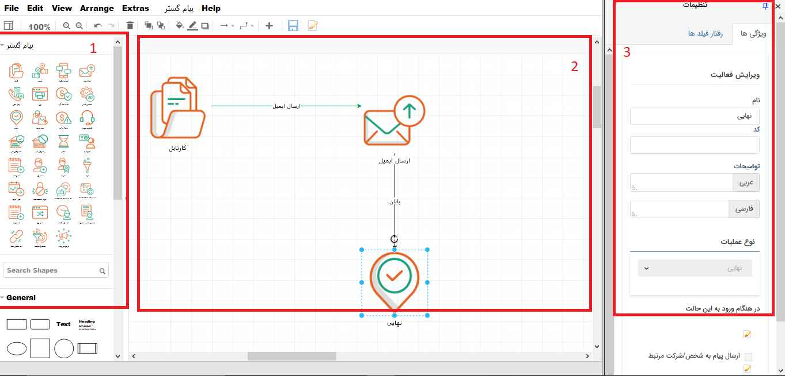
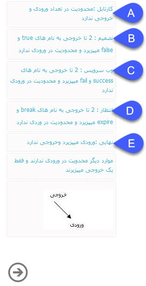
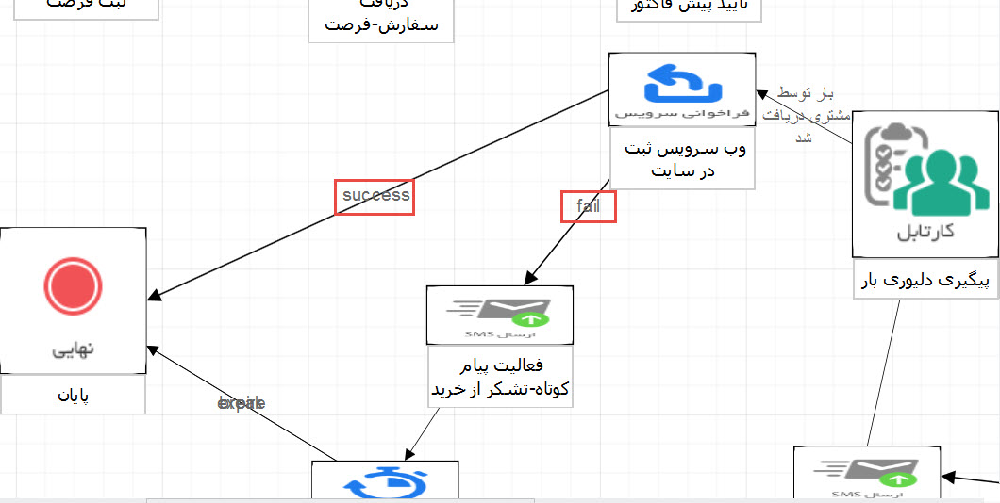
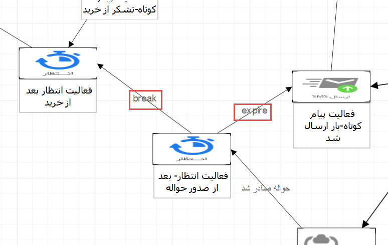

## طراحی فرآیند به صورت شماتیک با ابزار پیام گستر

> مسیر دسترسی:  **تنظیمات** >**شخصی سازی crm** > **نمای کلی** > **ویرایش چرخه کاری** > **ابزار طراحی فرآیند** 

با استفاده از این ابزار می توانید گردش کاری دلخواه را به صورت شماتیک ایجاد کرده و یا گردش کاری که در نرم افزار ایجاد کرده اید را مشاهده و بازبینی کنید .

  با کلیک بر روی این گزینه یک صفحه ابزار طراحی فرآیند باز می شود.

1. ابزار طراحی فرآیند :  در این بخش شما می توانید لیست انواع فعالیت ها و کارتابل را مشاهده و برای طراحی فرآیند استفاده کنید . 

2. صفحه طراحی فرآیند : در این صفحه می توانید فعالیت ها و کارتابل ها به این بخش اضافه کنید و فعالیت مورد نظر خود را طراحی کنید .

با کلیک بر روی فعالیت ها ، کارتابل و اقدام ها می توان نامی برای آن ها تعریف کرد .  

3. تنظیمات : پس از ذخیره ی طراحی انجام شده ،از این بخش می توان تنظمیات مربوط به هر کارتابل، فعالیت و اقدام ها را انجام داد .

تنظمیات شامل دو بخش است :

3.1 . ویژگی ها :  در این بخش می توان تنظیمات مربوط به هر کارتابل(انتخاب مسئول،انقضاو...) ، فعالیت  و اقدام  را انجام داد 

3.2 . رفتار فیلد ها : برای کارتابل ها از این بخش می توان تنظیمات نمایشی فیلد ها ( مخفی،غیرفعال و نمایش) را مشخص کرد و همچنین می توان الزام فیلد ها بر روی اقدام ها را تعریف کرد .

با دوبار کلیک کردن و یا drag&drop  کردن کارتابل و یا فعالیت ها از قسمت ابزار طراحی فرآیند می توان آن ها را به فرآیند اضافه کرد . با نگهداشتن ماوس بر روی هر فعالیت و یا کارتابل می توان اقدام های آن را تعریف کرد .

نکات :

1. کارتابل :  محدودیت در تعداد ورودی و خروجی ندارد .

2. تصمیم : برای ذخیره این فعالیت باید دو   خروجی با نام های true   و false تعریف شده باشد اما محدودیتی در تعداد ورودی ندارد .

3. وب سرویس : برای ذخیره این فعالیت باید  دو خروجی با نام های successو fail تعریف شده باشد اما محدودیتی در تعداد ورودی ندارد .

4. انتظار : برای ذخیره این فعالیت باید  دوخروجی با نام های breakو  expireتعریف شده باشد اما محدودیتی در تعداد ورودی ندارد .

5. ارسال پیامک/ایمیل/چاپ/فکس : این فعالیت ها تنها می توانند یک اقدام داشته باشند .

6. برخی فعالیت ها مانند ایجاد کاربر،قرارملاقات و ... که حالت موفق بودن و خطا دارد باید دو اقدام تعریف شود .

7. تصمیم چند شرطی : زمانی که از فعالیت چند شرطی استفاده می شود ،در طراحی فرآیند با توجه به شرط های تعریف شده اقدام ها شماره گذاری میشوند و نمی توان شماره های اختصاص داده شده به این اقدام ها را ویرایش کرد و اگر اقدامی حذف شود کلا آن شرط از ن فعالیت حذف می شود حذف می شود .

8. نهایی : محدودیتی در ورودی ندارد اما خروجی نمیپذیرد .

> * نکته: به محل اتصال ورود و خروج اقدام توجه گردد

A. به این معنی است که تعداد نامحدودی از اقدامات می تواند به کارتابل ختم شود و یا از آن آغاز گردد. (برای مثال در تصویر زیر یک اقدام به کارتابل "تایید پیش فاکتور" می رود و دو اقدام از آن خارج می شود.)

B. تعداد نامحدودی اقدام می تواند به یک فعالیت از نوع تصمیم برسد اما تنها دو خروجی با نام های true (حالت بعدی در صورتی که شرط تصمیم برقرار باشد) و false (حالت بعدی در صورتی که شرط تصمیم برقرار نباشد) میتواند از آن خارج شود.

C. تعداد نامحدودی اقدام می تواند به یک فعالیت از نوع وب سرویس برسد اما تنها دو خروجی با نام های success (حالت بعدی در صورت اجرای موفق وب سرویس) و fail (حالت بعدی در صورت خطای وب سرویس) می تواند از آن خارج شود. (برای مثال در تصویر زیر اگر وب سرویس "ثبت در سایت" به درستی عمل کند، گردش کاری آیتم به مرحله ی "پایان" و در صورت خطای وب سرویس به مرحله "فعالیت پیام کوتاه" می رود.)

D. تعداد نامحدودی اقدام می تواند به یک فعالیت از نوع انتظار برسد اما تنها دو خروجی با نام های break (حالت بعدی در صورت برقرار شدن شرط انتظار) و expire (حالت بعدی در صورت منقضی شدن زمان انتظار) می تواند از آن خارج شود. (برای مثال در صورتی که شرط انتظار برقرار شود، گردش کار آیتم به مرحله "فعالیت انتظار بعد از خرید" و در صورت برقرار نشدن شرط انتظار، پس از پایان زمان انتظار به مرحله ی "فعالیت پیام کوتاه" می رود.)

E. حالت نهایی به تعداد نامحدودی ورودی می پذیرد اما هیچ اقدامی از آن خارج نمیشود.

> * نکته: به محل اتصال ورود و خروج اقدام توجه گردد.

