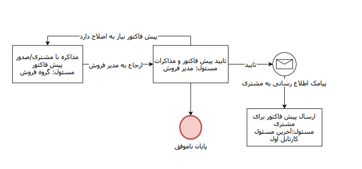

# اجزای فرآیند

## مفهوم کارتابل

به مراحلی از گردش کار که توسط نیروی انسانی (کاربران سیستم) انجام می شوند، کارتابل گفته می‌شود. آیتم تحت فرآیند به محض رسیدن به یک کارتابل، به مسئول مشخص شده برای آن ارجاع می¬شود و او با استفاده از اقدام های تعیین شده در آن مرحله می تواند فرآیند را به مراحل بعدی هدایت کند.

## فعالیت‌ها

فعالیت ها مراحلی از گردش کار هستند که به صورت خودکار توسط سیستم انجام می شوند. مثل ارسال پیام کوتاه به مشتری جهت اطلاع رسانی در مراحل مختلف انجام کار. 
می‌توانید با استفاده از فعالیت ها اقداماتی مانند ارسال پیام به مشتری،  ایجاد قرارملاقات، تعیین مسیر فرآیند با استفاده از تصمیم، ثبت وظیفه برای کاربر، ثبت وظیفه برای یک کاربر، ایجاد لینک پرداخت برای مشتری و ... را به سیستم واگذار کنید.

## اقدام

منظور از اقدام، خروجی کارتابل های فرآیند یا اقدامات مجاز مسئول کارتابل در آن مرحله می باشد. در واقع از طریق اقدام مشخص می¬شود، فرآیند پس از این کارتابل به کدام مرحله (سایر کارتابل ها، فعالیت ها و حالت های نهایی) ارجاع خواهد شد.

 به طور مثال در شکل زیر، کارتابل تایید پیش فاکتور و مذاکرات سه اقدام دارد، به این معنی که مدیر فروش در این مرحله سه اقدام مجاز دارد که می تواند فرآیند را جهت ارسال پیش فاکتور به مشتری به مرحله بعد هدایت کند که در این صورت یک فعالیت ارسال پیام کوتاه برای اطلاع رسانی به مشتری اجرا شده و پس از آن وارد کارتابل ارسال پیش فاکتور خواهد شد، همچنین می تواند کار را جهت انجام اصلاحات به کارتابل قبلی بازگرداند یا به دلیل عدم تایید مذاکرات، فرآیند را به حالت نهایی بفرستد.
 
 
 
 