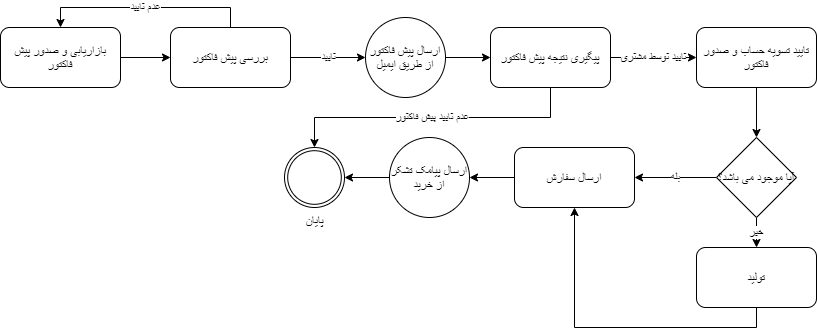

## مفهوم طراحی فرآیند

منظور از طراحی فرآیند رسم آن در ابزارهای طراحی بصورت شماتیک می‌باشد. بدین منظور ابتدا باید هدف فرآیند تعیین گردد ، سپس می توان از اجزای فرآیند که شامل کارتابل، فعالیت و اقدام می‌باشد، جهت تعیین مراحل و ارتباط بین آن‌ها استفاده نمود. همچنین می بایست مسئول هر مرحله نیز تعیین گردد. (برای مطالعه بیشتر به بخش طراحی فرآیند مراجعه کنید.)

برای نمونه فرآیند فروش در ابزار draw.io  به این صورت طراحی گردیده است:

