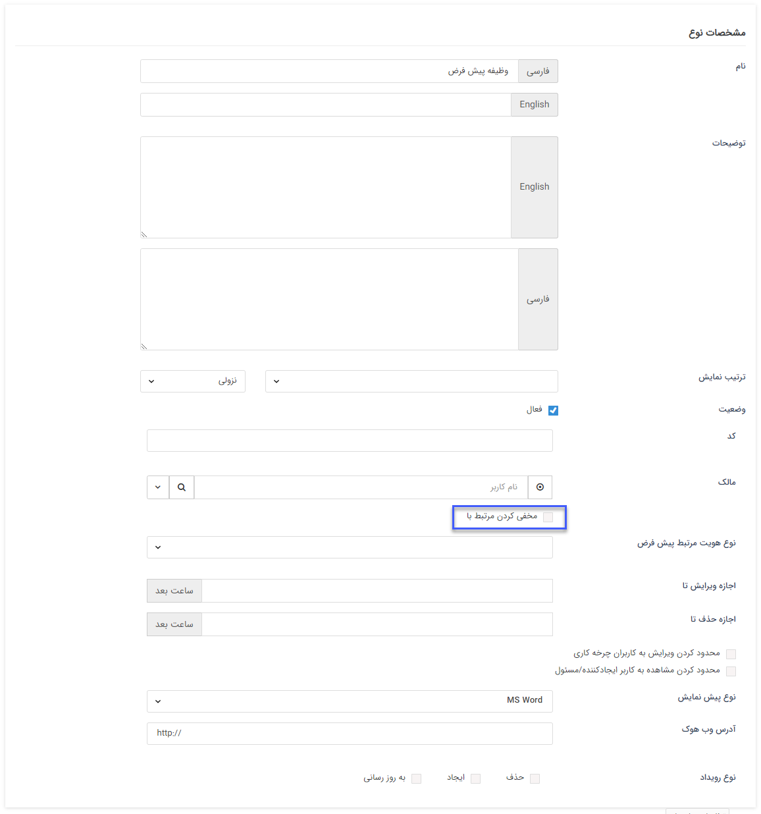

## شخصی سازی وظیفه‌ها

در صفحه شخصی سازی وظیفه‌ها می‌توانید وظیفه جدیدی را تنظیم و وظیفه‌های ساخته شده را ویرایش نمایید.
 
 لطفا ابتدا قسمت[ اطلاعات کلی ](https://github.com/1stco/PayamGostarDocs/blob/master/help2.5.4/Settings/Personalization-crm/Overview/General-information/General-information.md) را در این خصوص مطالعه فرمایید.

#### وظیفه جدید

با ایجاد یک وظیفه جدید علاوه بر[ تنظیمات مشترک آیتم های سیستم  ](https://github.com/1stco/PayamGostarDocs/blob/master/help%202.5.4/Settings/Personalization-crm/Overview/General-information/Shared-information-of-system%20items/Shared-information-of-system%20items.md)می توانید در صورت فعال کردن چک باکس مخفی کردن مرتبط با،  نمایش هویت در قسمت مرتبط با وظیفه را مخفی کنید.

