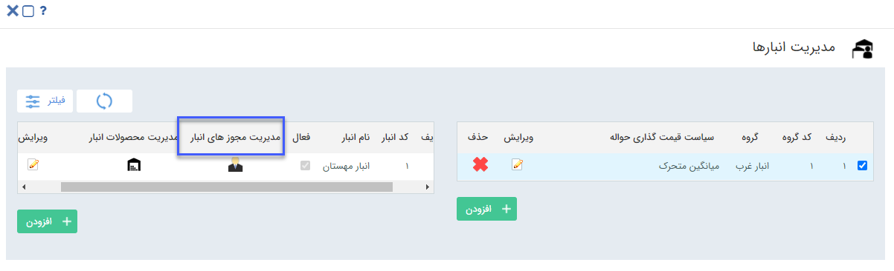

## مدیریت مجوزهای انبار 

> مسیر دسترسی:  **تنظیمات** >**مدیریت انبارها** > **انتخاب گروه انبار** > **برای هر انبار** > **مدیرت مجوزهای انبار** 

با استفاده از کلید مدیریت مجوزهای انبار می‌توان مجوزها کاربران در هر انبار را تعیین کرد.

**نکته مهم:** توجه داشته باشید  هر کاربری که بخواهد عملیات مرتبط با انبار مانند صدور، تایید یا قیمت گذاری تراکنش های انبار را انجام دهد، باید مجوز مربوطه را در آن انبار داشته باشد.

A. افزودن کاربر/گروه: برای تعریف مجوزهای این انبار برای یک کاربر/گروه جدید، ابتدا و یا گروه مورد نظر را انتخاب کنید، مجوز های مورد نظر را انتخاب کرده و آن را اضافه کنید.

#### نکات مربوط به مجوز های انبارداری 

مجوز مدیریت شامل تمامی مجوز های آن انبار می شود.
در نظر داشته باشید مدیر سیستم و کاربر دارنده مجوز "مدیریت انبارداری" در همه انبارها مجوز "مدیریت" خواهند داشت.

کاربر در گزارش موجودی انبار و کاردکس کالا، موجودی و تراکنش‌های انبارهایی را مشاهده می‌کند که در آنها مجوز "مشاهده گزارش" را داشته باشد.

کاربر دارنده مجوز "مشاهده لیست تراکنش اقلام"، در لیست تراکنش‌های انبار، تراکنش هایی را مشاهده می‌کند که بر روی نوع آنها مجوز "مشاهده آیتم" یا "مشاهده لیست" دارد. 

کاربر برای قیمت گذاری تراکنش ها، علاوه بر مجوز "قیمت گذاری تراکنش" در آن انبار، می بایست مجوز "ویرایش آیتم" روی تراکنش مورد نظر را نیز داشته باشد.

 کاربر به منظور ویرایش تراکنش های انبار می‌بایست دو مجوز "ویرایش آیتم" در آن نوع موجودیت و "ویرایش تراکنش موقت" در آن انبار را دارا باشد.
 به علاوه، در صورتیکه تراکنش تایید شده باشد، به مجوز های "ویرایش پس از تایید" در نوع موجودیت و "ویرایش تراکنش تایید شده" در آن انبار نیاز می باشد.
 
به منظور تایید تراکنش‌های انبار، کاربر می‌بایست هر دو مجوز "تایید/رد آیتم" در نوع موجودیت و مجوز "تایید تراکنش" در انبار مربوطه را داشته باشد.

به منظور ایجاد حواله/رسید انبار جدید، کاربر باید حداقل روی یک نوع موجودیت و یک انبار مجوز ذخیره و صدور آیتم داشته باشد.

به منظور انتخاب یک حواله/رسید جدید، کاربر آیتم هایی را مشاهده می کند که روی آنها مجوز "مشاهده آیتم" یا "مشاهده لیست" دارد و در انبار ثبت شده نیز مجوز "مشاهده لیست تراکنش اقلام" داشته باشد.

B. لیست کاربران/گروه انبار: در این قسمت لیست کاربران و گروه های دارای مجوز در این انبار به همراه مجوزهای مربوط به هریک مشاهده می شود، درصورت نیاز می توانید آن ها را ویرایش و یا حذف کنید.

